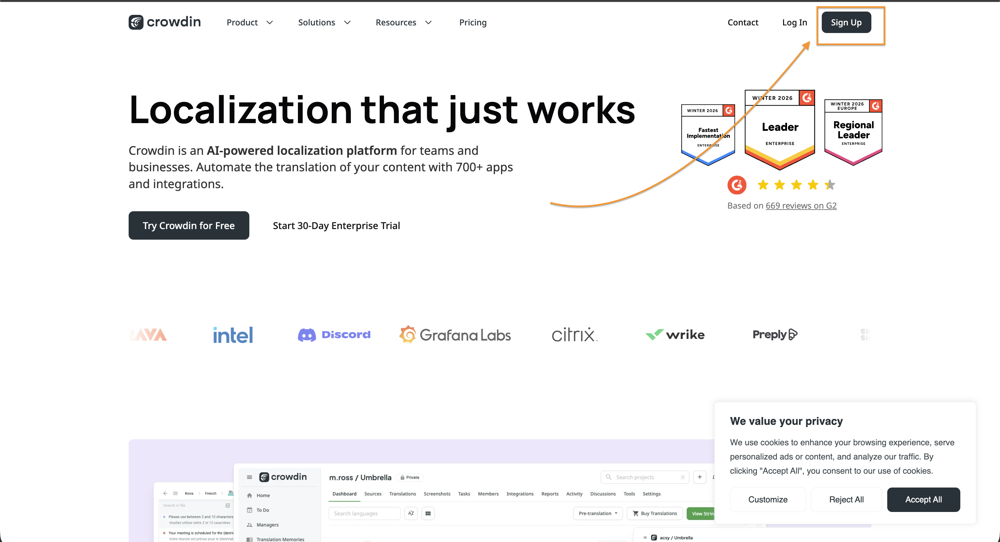
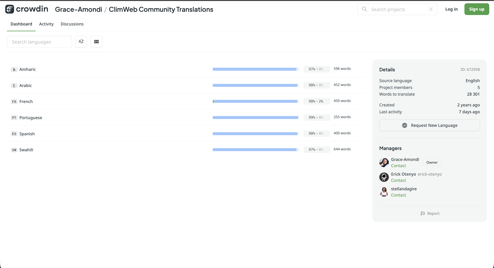
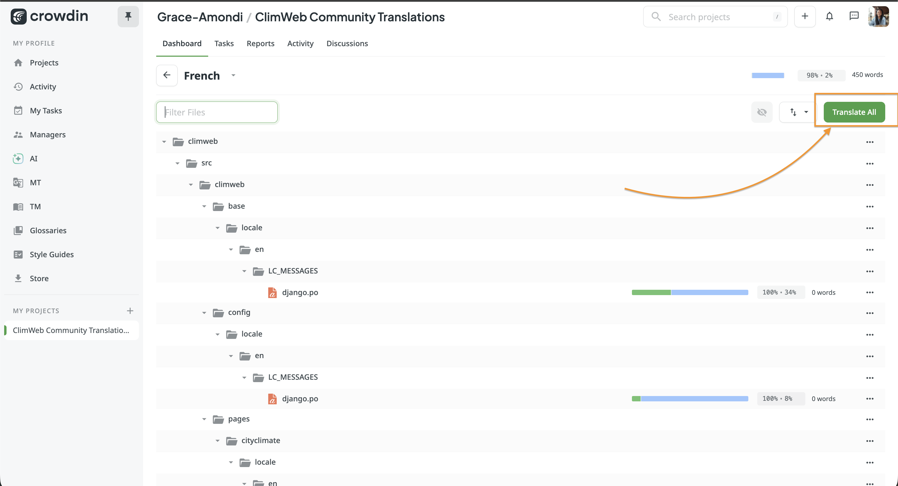
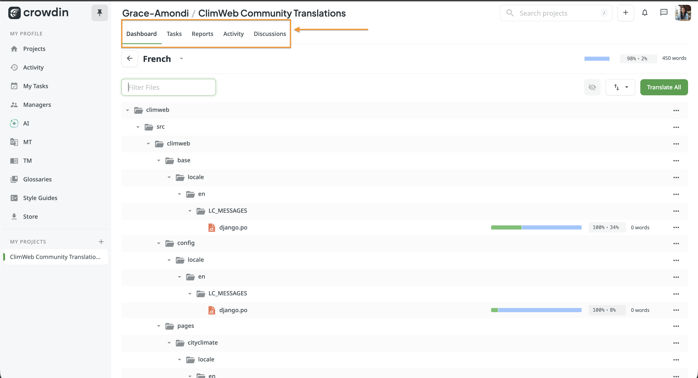

# ClimWeb Community Translation Contribution Guide

> A step-by-step guide for contributors helping make climate information accessible in multiple languages.

🌍 **Project link:** [crowdin.com/project/nmhs-cms](https://crowdin.com/project/nmhs-cms)

---

## Part 1 — Getting Started

### Step 1: Create a GitHub Account

Contributors are encouraged to sign in to Crowdin using GitHub. If you don't have a GitHub account yet, here's how to create one:

1. Go to **github.com** and click **Sign up** in the top-right corner.


2. Enter your **email address** and click **Continue**.
3. Create a **password** and click **Continue**.
4. Choose a **username** — this will be your public identity on GitHub.
5. Complete the short verification puzzle to confirm you're human.
6. Click **Create account**. GitHub will send a **verification code** to your email — enter it to activate your account.


7. On the welcome screen, you can skip the optional setup questions by scrolling down and clicking **Skip personalisation**.

> 💡 **Tip:** Choose a username that represents you professionally — it will be visible to other contributors on the ClimWeb project.

You now have a GitHub account and are ready to sign in to Crowdin!

---

### Step 2: Create a Crowdin Account via GitHub

Go to **crowdin.com** and click **Sign Up**. On the signup page, select **Continue with GitHub** instead of filling in the email form.




GitHub will ask you to authorise Crowdin — click **Authorize crowdin** to allow the connection. You'll be redirected back to Crowdin with your account ready to use.

Once signed in, go to your **Account Settings** (click your profile picture in the top-right corner) to set your preferred languages — this helps Crowdin show you relevant projects.

---

### Step 3: Join the ClimWeb Project

Visit the ClimWeb Community project directly at:
**crowdin.com/project/nmhs-cms**

On the project **Dashboard**, you'll see all available languages and their current translation progress. Click on your language to get started.





> ⚠️ **Note:** Some languages may require you to click **Join** and wait for a project manager to approve your request before you can begin translating.

---

### Step 4: Explore the Project Dashboard

The project Dashboard has several tabs you should know:

| Tab | What it's for |
|---|---|
| **Dashboard** | Overview of languages, progress, and project details |
| **Tasks** | Any specific translation tasks assigned to you |
| **Reports** | Your personal contribution statistics |
| **Activity** | A live feed of what's happening across the project |
| **Discussions** | A space to ask questions and collaborate with other translators |



Click on your language, then select a file or click **Translate All** to open the editor.

---

## Part 2 — Translating in the Editor

The Crowdin editor has three main panels:

```
┌─────────────────┬───────────────────────────┬─────────────────┐
│   String List   │     Translation Area      │   Suggestions   │
│                 │                           │                 │
│ ▶ Welcome msg   │  Source (English):        │  TM Match 95%   │
│   Nav menu      │  "Welcome to ClimWeb"     │  ─────────────  │
│   Error msg     │                           │  Machine Trans. │
│   Submit btn    │  Your translation:        │  ─────────────  │
│                 │  [                    ]   │  Glossary Terms │
│                 │              [Save ↵]    │                 │
└─────────────────┴───────────────────────────┴─────────────────┘
```

---

### Step 5: Understand the Editor Layout

- **Left panel** — The list of strings (phrases or sentences) waiting to be translated. Untranslated strings are shown first.
- **Centre panel** — The active string. You'll see the original English text at the top, and a text field below where you type your translation.
- **Right panel** — Suggestions from Translation Memory (TM), Machine Translation, and the Glossary to help guide you.

---

### Step 6: Translate a String

1. Click on a string in the left panel to select it.
2. Read the English source text carefully in the centre panel.
3. Type your translation in the text field below it.
4. Press **Enter** or click the green **Save** button to submit and move to the next string.

> 💡 **Tip:** Watch for variables like `%1`, `{name}`, or `0` — do **not** translate these. Copy them exactly as-is into the correct position in your translation.

You can also click a **TM suggestion** on the right panel to pre-fill your translation field, then edit as needed.

---

### Step 7: Use Suggestions Wisely

Crowdin offers several aids to help you translate faster and more consistently:

- **Translation Memory (TM)** — Shows how similar strings have been translated before. A 100% match means the exact same string was translated previously. Use these as a starting point but always review them.
- **Machine Translation (MT)** — Automatic suggestions from engines like Google Translate or DeepL. These can be helpful but always need human review and editing.
- **Glossary** — Highlighted key terms with approved translations. Always use glossary terms for consistency across the project (e.g., specific climate or weather terminology).

---

### Step 8: Vote on Others' Translations

If a string already has a translation submitted by another contributor, you can vote on it:

- Click **+** (thumbs up) if the translation is accurate and natural.
- Click **−** (thumbs down) if the translation is incorrect or unclear.

Translations with the most positive votes rise to the top and are more likely to be approved. This peer-review system is at the heart of the community contribution model.

---

### Step 9: Working with Tasks

Project managers may assign you specific **Tasks** — these are focused batches of strings that need to be translated or proofread by a set deadline. Tasks help the team coordinate effort and prioritise what gets done first.

To find your tasks:

1. Go to the **Tasks** tab on the project Dashboard.
2. Click on a task to see its details — the assigned language, deadline, and the specific files or strings included.
3. Click **Open in Editor** to start working on the strings within that task.
4. Your progress is tracked separately per task, so the team can see how much has been completed.

> 💡 **Tip:** Always check the Tasks tab first when you log in. Assigned tasks usually have deadlines and should be prioritised over general open contributions.

If you have not been assigned a task yet, you can still contribute freely by selecting a language and translating any untranslated strings — every contribution counts!

---

## Part 3 — Proofreading

> ⚠️ **Note:** Proofreader access is granted by project managers. If you'd like this role, reach out to the ClimWeb community coordinators.

---

### Step 10: What Proofreaders Do

Proofreaders review translations submitted by translators and give them the final **approval** to be used on the ClimWeb platform. As a proofreader, you:

- Review completed translations for accuracy, grammar, and naturalness.
- Click **Approve** (✓) on strings that are correct.
- Edit and correct strings that are inaccurate before approving.
- Leave **comments** on strings to explain changes or ask the translator a question.

---

### Step 11: Approving & Editing Strings

1. Switch to **Proofreading mode** in the editor using the mode selector at the top.
2. Strings awaiting approval will be highlighted — read each translation carefully against the English source.
3. If correct, click the **Approve** button (✓). The string turns green.
4. If the translation needs a fix, click on the translation text to edit it directly, make your changes, then approve.
5. Use the **Comments** tab on the right to leave notes for translators — this keeps feedback transparent and constructive.

---

## Best Practices

| | Tip |
|---|---|
| 🌡️ | **Keep climate terms consistent.** Always refer to the Glossary for weather and climate-specific vocabulary. |
| 🔤 | **Don't translate variables.** Placeholders like `%1`, `{count}`, or `0` are dynamic values — copy them exactly as-is. |
| 💬 | **Use the Discussion tab.** Not sure how to translate something? Post in Discussions to get input from the community. |
| ✍️ | **Sound natural.** Translate the meaning, not word-for-word. Your translation should read as if it were originally written in your language. |
| 📸 | **Check screenshots.** Screenshots show where a string appears in the UI — use them to understand context before translating. |
| 🔁 | **Review your work.** After saving a translation, re-read it once more. Quality matters more than speed. |

---

> 🎉 **You're all set!** Every string you translate or proofread helps make ClimWeb accessible to more people around the world. Thank you for being a contributor to the community — your language skills make a real difference.

---

*ClimWeb Community · Translators & Proofreaders Training · Wed 8th August, 10:00am UTC*
*Project: [crowdin.com/project/nmhs-cms](https://crowdin.com/project/nmhs-cms)*