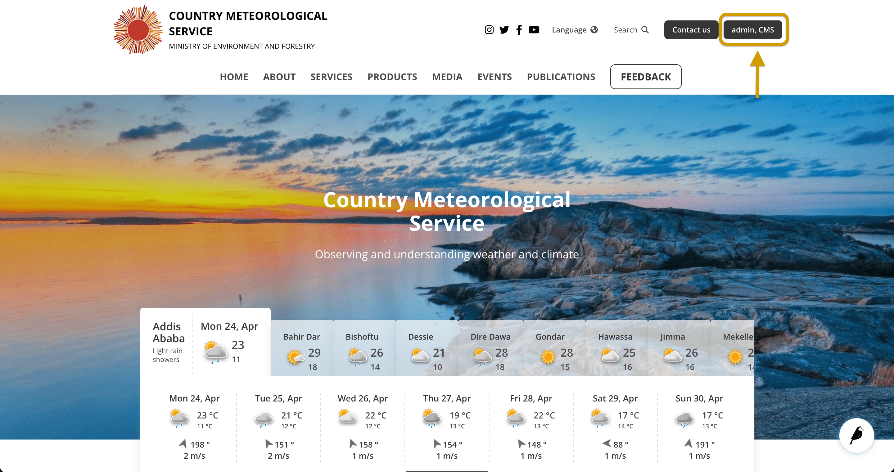
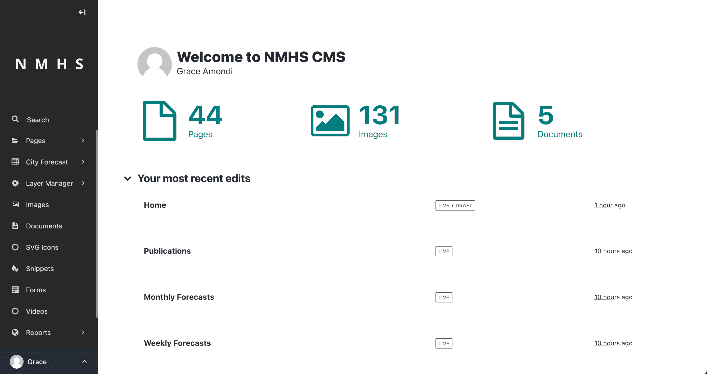
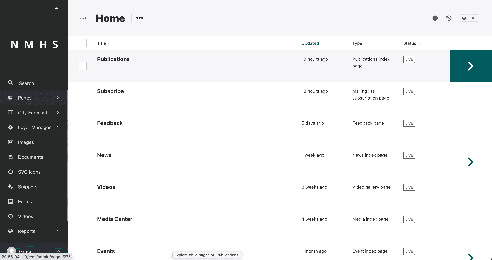
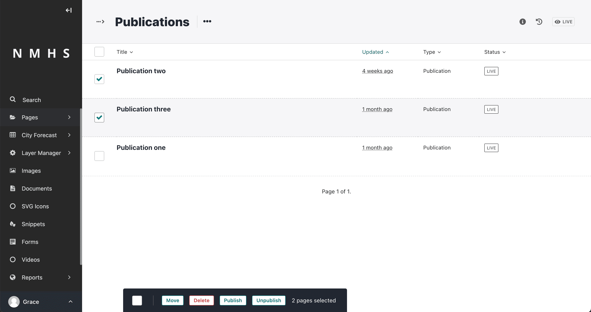
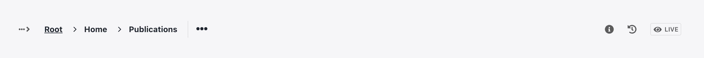
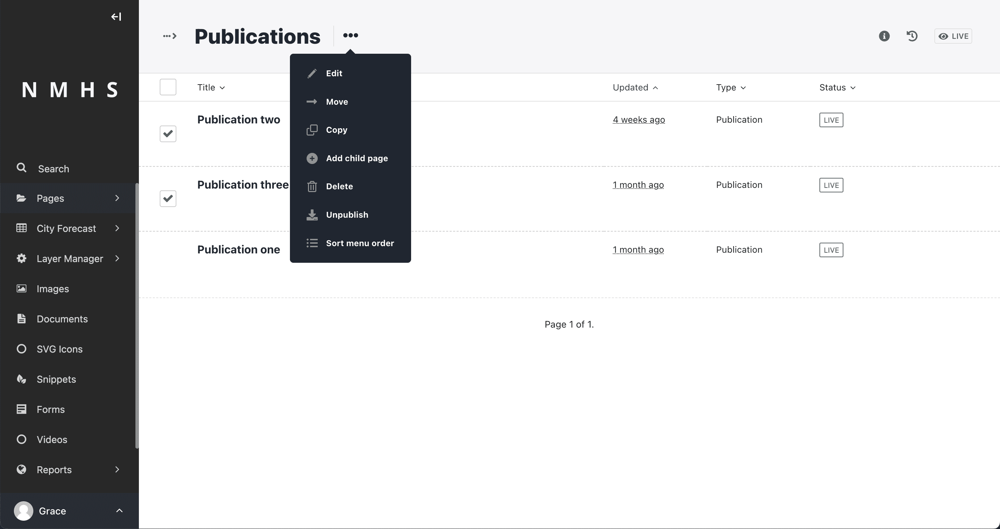
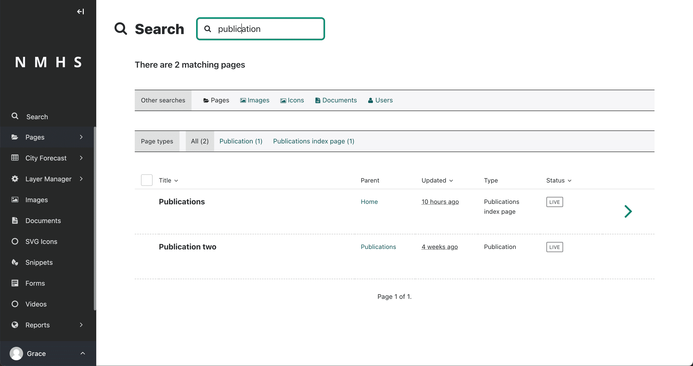

# Find Your Way Around

This section describes the different pages that you are going to see as you navigate around the NMHS Content Management System Admin interface.

## How to reach the Dashboard

The CMS login button can be found at the top left corner of the website.

Logging into the CMS automatically takes you to the Dashboard. If you navigate away from the dashboard, you can return to it at any time by clicking on the NMHS logo in the top-left section of your screen.

---
## The Dashboard

The Dashboard is the main hub of the website. From the dashboard, you can access all of the content you create in the CMS as well as reports, settings, and other content management features.

> What you see in your Dashboard depends on your user role. Common user roles include editors, moderators, composers, approvers, forecasters and administrators.

The following are some of the tools that you can find within the Dashboard:

### The Dashboard Panels

The dashboard panels provide you with an overview of the various states of your pages.

The different panels on your dashboard are as follows:

**1. Your pages in a workflow**

The Your pages in a workflow panel shows you any pages in moderation that you own or have submitted for moderation yourself. It also shows the moderation tasks that are pending and how long the tasks have been open.

**2. Awaiting your review**

If your webmaster or web developer gives you permission to perform moderation actions, your Wagtail dashboard displays the Awaiting your review panel. This panel shows content that's ready for you to review.

From the panel, you can perform the following actions:

Click the name of a page to edit that page.
Use the buttons to move the page to the next stage in your workflow by requesting changes to a page, approving the page, or approving the page with a comment.
Get a quick view of the page status by hovering over the indicator circles to get more information about the pending task. The indicator circles show a tick for a completed task or an empty circle for an incomplete one.
See how long a page has been waiting for review.
Your most recent edits
The Your most recent edits panel displays the five pages you last edited.

The panel also shows the date that you last edited the pages as well as the current status of the pages.

**3. Your locked pages**

The Your locked pages panel shows all of the pages you've locked so that only you can edit them. From this panel, you can quickly view the date you locked a page. To edit a locked page, click the name.

### The Sidebar

On the left-hand side of the dashboard and throughout the CMS is a menu called the Sidebar. You can use the Sidebar to navigate to different parts of the CMS.

The Sidebar helps you quickly access your content as well as CMS features and settings. The items on the Sidebar can vary depending on what you have access to. These features include Search, Documents, Snippets, Forms, Reports, Settings, and Help.

> If you want the Sidebar to take up less space, you can click the white arrow near the top of the Sidebar to switch it into slim mode and give yourself more space for writing.

---
## The Explorer Page

The Explorer page allows you to view a page’s children and perform actions on them. On the Explorer page, you can publish and unpublish pages. You can also move the pages to other sections, drill down into the content tree, or reorder child pages within a parent.

You can see the name of the page whose Explorer page you are on as a heading at the top of the screen. If the page has child pages within it, then you can see a list displaying the child pages below the heading. Clicking the title of a child page takes you to the edit screen, from which you can edit that child page.

If you hover over a child page, you get an arrow on the right-hand side of that child page row. Clicking the arrow displays a further level of child pages.

Additionally, hovering over a child page displays a checkbox at the left-hand side of the child page row. Selecting one or more child pages by clicking their checkboxes gives you an action bar at the bottom of the Explorer page. Clicking on any of the options in the action bar takes you to a confirmation page from which you can confirm the action.

As you drill down through the site, the breadcrumb (the row of pages beginning with the home icon) displays the path you have taken. Clicking on the page titles in the breadcrumb takes you to the Explorer screen for that page.

Clicking on the … Actions dropdown shows a list of actions for the parent page, like Move, Copy, Delete, Unpublish, and History. Also, clicking the Sort menu order option from the dropdown takes you to the ordering page.

---
## Search the CMS

The search feature is the topmost feature in the Sidebar. You can use the search feature to quickly search for content in the CMS.

