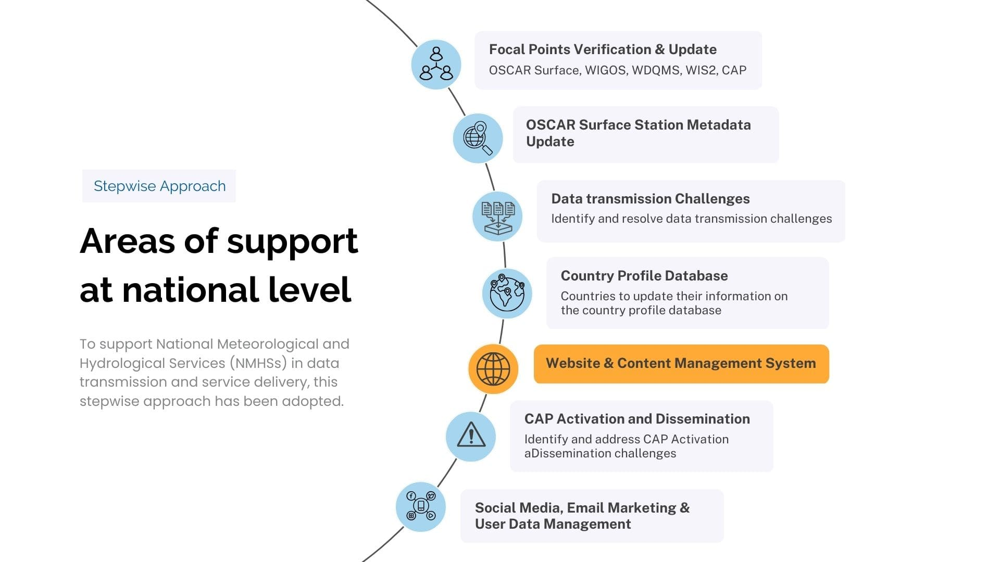

# Introduction

The **template Content Management System** is available for any NMHS wishing to upgrade its website. This initiative was developed as part of targeted support for African NMHSs in their digital transformation journey. The template was presented to technical experts from NMHSs during a [training in early warning communications](https://public.wmo.int/en/resources/meteoworld/building-capacity-africa-achieve-early-warnings-all).

This new template offers:
- a customisable and modern design
- seamless marketing integrations
- a user-friendly CAP editor
- advanced climate data visualization tools for any NMHS seeking to upgrade its website. 

It adopts **best practices in data visualization and hydro meteorological department and climate communications**. All components of the website are built on free and open-source standards allowing for collaboration and contribution.

The CAP editor is expected to **increase the adoption of the Common Alerting Protocol in Africa**, key to increasing the reach of alerts, and their connectivity to broadcast, web and mobile networks. Africa remains one of the world's most vulnerable regions to climate change and increasing extremes. Increasing the protection of the population through improved climate and early warning communications is crucial. 

---

## Considerations during the design & development phase

During the design and development phase, fundamental factors were taken into consideration to ensure the delivery of a Content Management System that would improve the efficiency of management. 

It factored in:
- Well **defined content structure** and pages management, 
- **User-friendly interface** with a modern look and feel
- Great **user experience and ease** in locating content
- A **decentralized CMS architecture** was adopted to allow management of departmental sections by different user roles and allow for content moderation and publishing **workflows**. 

---

## Delivery and support

For a smooth and efficient delivery of the CMS and customization of the website template to the NMHS, a step by step process will be adopted. The quality and interactivity of the website is first assessed followed by approaching and presenting the CMS and integrating feedback. Thereafter, willing/potential members for support are identified together with a focal point for coordination. The CMS is then installed and training on the configuration of CMS and customization of the website conducted. Additionally, learning materials, documentations and guides are provided alongside follow-up support in troubleshooting

---

## Core Components and Integrations

-   **User friendly website Content Management System**

    -   Modern look and design, mobile friendly.
    -   Adopts best practices and designs benchmarked for weather and climate information dissemination for NMHSs in Africa.
    -   Easy to use and customise without technical skills.
    -   Decentralised content management. Different staff can be assigned and manage different sections of the website.
    -   Defined content publishing workflows. Editors and moderators can be defined for every section of the website.
    -   Embedding Multimedia Content - Youtube etc.

-   **Cap Alerts Publishing**

    -   Modern Cap Editor with simple user friendly and mobile friendly CAP alert creation and management.
    -   Moderated Publishing Workflow from CAP composer to approver, including commenting and email notification support.
    -   Conforms to CAP Version 1.2 Standards.
    -   Search Engine Optimisation support to increase visibility and attract targeted traffic to an alert.
    -   Support for Approval Workflow from composer to approver, including commenting and email notification support.
    -   Interoperable XML API of Alert List and Detail for integration with CAP Aggregators 
    -   Live CAP creation and editing preview.
    -   Draw / Upload Polygon Functionality for Alert Area/Areas.
    -   Alert to Alert/Alerts Reference Linkage.

-   **Events registrations and Integration with Online Meeting Platforms (Zoom)**

    -   Create event registration forms hosted on the website.
    -   Automatically send invitation emails to users as they register to events from the website.
    -   Keep record of all your registrants for internal analysis.
    -   Allow users registering to events to also subscribe to your products.

-   **Interactive Georeferenced data visualisation**

    -   Upload and visualise own gridded data (forecasts, advisories, climate data products) on a map.
    -   Upload and visualise vector data (Point, areas) on a map.
    -   Visualise own CAP alerts.
    -   Visualise thematic/sectorial data products interactively.
    -   Integrate external data sources ( from Regional Centers, Global Producing Centers, Satellite, Google Earth Engine etc).
    -   Provide a platform to support impact based forecasts, analysis and advisories.

-   **Email Marketing integration and user analytics**

    -   Sign Up forms for users to subscribe to NMHSs products (using Mautic or Mailchimp).
    -   Analyse your email marketing users data.

-   **Survey creation and results analysis**

    -   Create custom surveys hosted on own website.
    -   Analyse results on interactive dashboards.

-   **User analytics**

    -   User base breakdown (eg. by sectors, gender, geographic area, etc, from user database - email marketing software).
    -   User satisfaction (from surveys) data and trends .
    -   Website traffic analytics (eg. google analytics) .
    -   System traffic analytics (eg. hazards watch) .
    -   Social media analytics 
        -   Twitter
        -   Facebook 
        -   Instagram
        -   Youtube