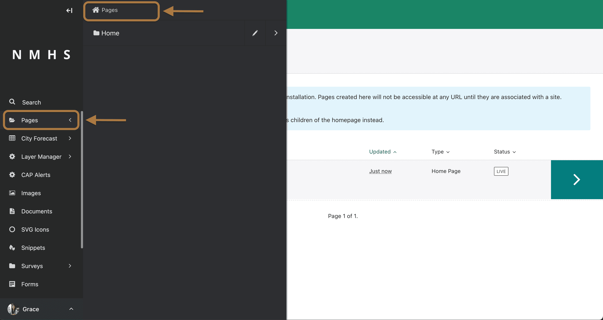

# Mailing Integrations

## Mautic

Mautic is an open-source alternative to Mailchimp. 

The aim of this package is to render a given Mautic Form on a Wagtail page, and send the submitted data to Mautic.
Other Mautic functionalities might be added later as need arises.

For package developer guide visit [Wagtail Mautic Developer Guide](https://github.com/wmo-raf/wagtailmautic)

### Settings

`NOTE`: This instructions assume you have knowledge of setting up Wagtail and configuring Mautic, as we don't cover the specifics.

Mautic Settings will be added to the Wagtail Admin Menu as below

Add in the URL for your Mautic instance (including the https://) to the Mautic Url field.

You can use two methods for authentication:

- OAuth2 that requires client id and client secret from Mautic
- Basic Authentication that needs username and password. To use Basic Auth, you must enable this on Mautic Configuration

#### OAth2

#### Basic 

### Usage

To create a subscription page based on mautic integration, navigate to `Pages` on the left side panel, select Pages and click on add a child page to the home page by hovering over the homepage.

Select `Mautic mailing list subsrciption page` from the list. Note that, if this page was already created then this option will not appear as only one instance of this page is allowed.

Fill in the form with necessary input. Example below. The Mautic form ID is retrieved from the subscription form created on Mautic's software. Refer to [Mautic User Guide](https://docs.mautic.org/en)

Once the page is published, this page will render all fields created in Mautic.

## Mailchimp

In progress ...
