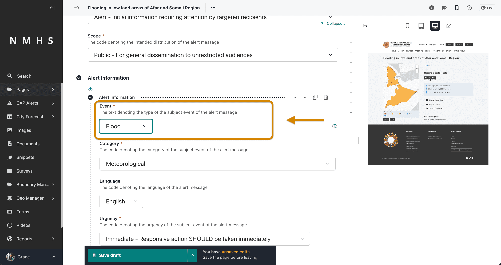

# CAP Composer

The **Common Alerting Protocol (CAP)** provides an open, non-proprietary digital message format for all types of alerts
and notifications. It does not address any particular application or telecommunications method. The CAP format is
compatible with emerging techniques, such as Web services, as well as existing formats including the Specific Area
Message Encoding (SAME) used for the United States' National Oceanic and Atmospheric Administration (NOAA) Weather Radio
and the Emergency Alert System (EAS)

The CAP xml response follows the structure of the schema provided at
http://docs.oasis-open.org/emergency/cap/v1.2/CAP-v1.2-os.html

## CAP Warning Composer Features


The CAP composer tool is a solution that provides a range of functionalities to support the NMHS in seamlessly issuing
CAP. It has been developed with an aim of increasing the adoption of CAP by NMHS in Africa. Some of the key features of
the tool include:

- Possibility to run as standalone composer or integrate into Wagtail-CMS-based website
- Search Engine Optimization support to increase visibility and attract targeted traffic to an alert
- Support for Approval Workflow from composer to approver, including commenting and email notification support
- Interoperable XML API of Alert List and Detail for integration with CAP Aggregators - Live CAP creation and editing
  preview
- Draw / Upload Polygon Functionality for Alert Area/Areas
- User-friendly and mobile friendly CAP alert creation and management
- Alert to Alert/Alerts Reference Linkage
- Published python package with version management and changelogs https://github.com/wmo-raf/cap-editor
- Related Setup/Installation and Usage instructions

## Creating a CAP Alert

To create a CAP Alert access the CAP composing interface from the explorer menu as below and add a new cap alert page:


------------------------------------------------------------------------

## Sections in the Alert Page and corresponding XML

The overall Document Object Model of an alert is as below:


### Alert Identification

It contains the following entities required for a valid CAP message:

- Sender ID(sender),
- Sent Dat/Time (sent),
- Message Status (status),
- Message Type (msgType),
- Scope(scope),
- Restriction (restriction),
- Addresses (addresses),
- Note (note),
- Reference IDs (references) and
- Incident ids (incidents).

The alert identifier is generated automatically and is not editable.

```{note}
Some fields are visible based on selection of different parameters.
```


### Alert Information

Corresponds to the `<info>` element in the CAP message. The <info> entity specifies the alert's details. At least
one <info> block is required for an alert. If you support multiple languages, it is recommended that you use one <info>
block for each language for the same <alert> entity.:

A CAP message expects at least one `<info>` element to be present. Multiple `<info>` blocks should all have the
same `<category>` and `<event>` element values.

Each `Information` block contains the following elements:

- Langauge (langauge
- Event Category/Categories (category)
- Event Type (event)
- Response Type/Types (responseType)
- Urgency (urgency)
- Severity (severity)
- Certainty (certainty)
- Audience (audience)
- Event Code/Codes (eventCode)
- Effective Date/Time (effective)
- Onset Date/Time (onset)
- Expiration Date/Time (expires)
- Sender Name (senderName)
- Headline(headline)
- Event description (description)
- Instructions (instruction)
- Information URL (web),
- Contact Info (contact) and
- Parameter/Parameters(parameter)


#### Alert Area

Information Entity that defines the geographic area to be notified. Multiple areas can be defined in the alert. Each
area contains the following elements:

- Area Description (areaDesc),
- Area Polygon/Polygons (polygon),
- Area Circle/Circles (circle),
- Area Geocode/Geocodes (geocode),
- Altitude (altitude),
- Ceiling (ceiling)


The Alert area input has 4 selector options:

- Admin Boundary (area is picked from predefined boundaries). To use this option, ensure that admin boundaries are
  initially loaded. Refer to [Setting up boundaries](#setting-up-boundaries) section.


- Polygon (drawing a polygon)


- Circle (drawing a circle which specifies the latitude, longitude and radius)


- Geocode (specifying area geocode name and value). Using this option presumes knowleged of the coding system


#### Alert Resource

Entity that defines supplemental information related to an <info> object Multiple instances of this section are allowed.
It contains:

- Description (resourceDesc), MIME Type (mimeType), File Size (size), URI (uri), Dereferenced URI (derefUri) and
  Digest (digest)**

The Alert resource input has 2 selector options:

- File resource (takes in a file and description)


- External resource


#### Additional CAP Inputs

Addition alert information elements include parameters and event codes

### Incidents

This defines the reference incident to the current alert, if any.


---

## CAP Settings

CAP Settings include sender name, sender identifier, contact details, hazard types and audience types.


```{note}
The creation of Hazard types will change the event input under alert information to a dropdown.
```




## Setting up boundaries

The boundary manager allows for the addition of boundaries to be used in the creation of an alert area using the admin
boundary option.

To access it, click on the boundary manager in the explorer menu as below and select Admin boundary settings to select
the boundary data source and country/countries of interest. You will then need to add boundary data for the countries
selected:


Select the 'boundary data source' where you will download the boundaries. The current options are:

- OCHA Administrative Boundary common Operational Datasets (COD-ABS) (*default*) https://data.humdata.org/
- Global Administrative Areas 4.1 (GADM) https://gadm.org/download_country.html

Add one or more countries

To add boundary data, access the menu as below and click on 'Add Boundary' button:


Load country boundaries at each of different levels (level 0 to 4) in zipped shapefile format


```{note}
Zip shapefiles seperately by Admin level before upload. 
```