# City Forecasts

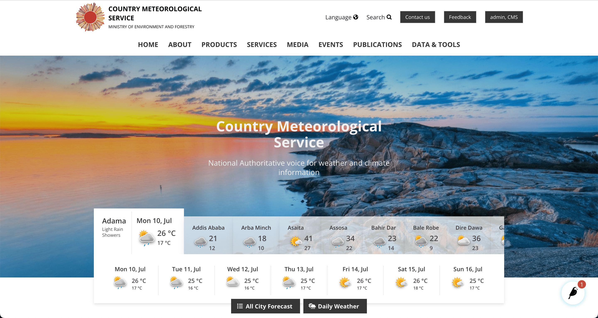

City forecasts displayed on the homepage, and forecasts page can be added through the ClimWeb in two ways:
1. Manually adding daily forecasts
2. Fetching city forecasts from an external source i.e YR Meteo Norway's location forecast API https://developer.yr.no/featured-products/forecast/

```{note}
The forecast manager comes with predefined weather conditions and icons. Please refer to YR Weather symbols documentation for guidance on icons and naming convention. https://api.met.no/weatherapi/weathericon/2.0/documentation
```

## Manually Adding Forecasts

The city forecast explorer menu can be accessed on the left sidebar. 

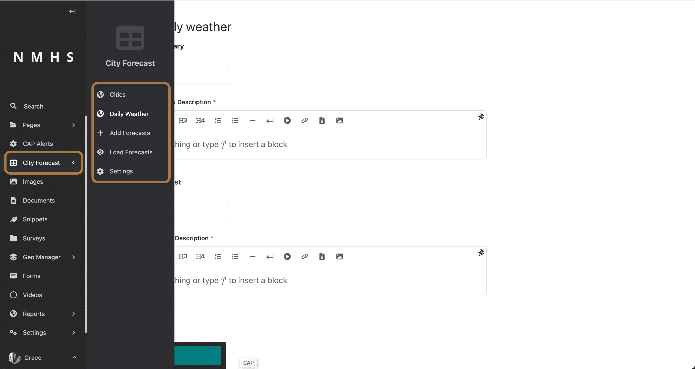

Here you have the ability to:
- Add/Edit/Delete a city (city name and location)

    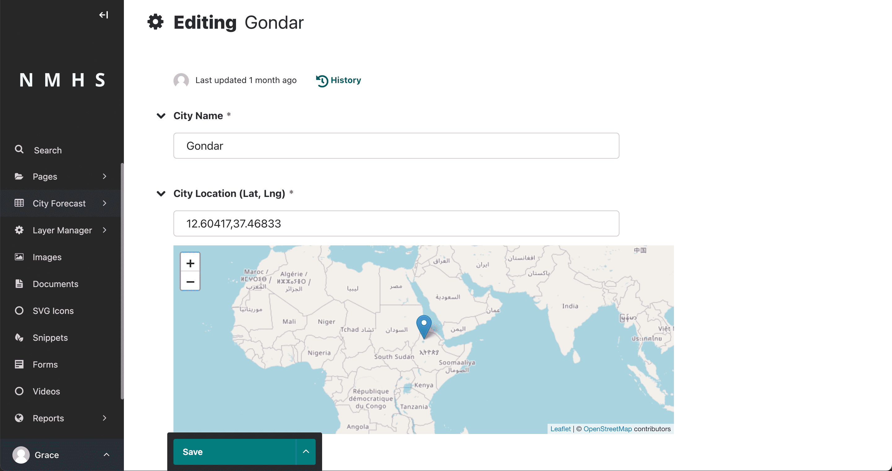

---

- Import city forecasts in CSV format.

    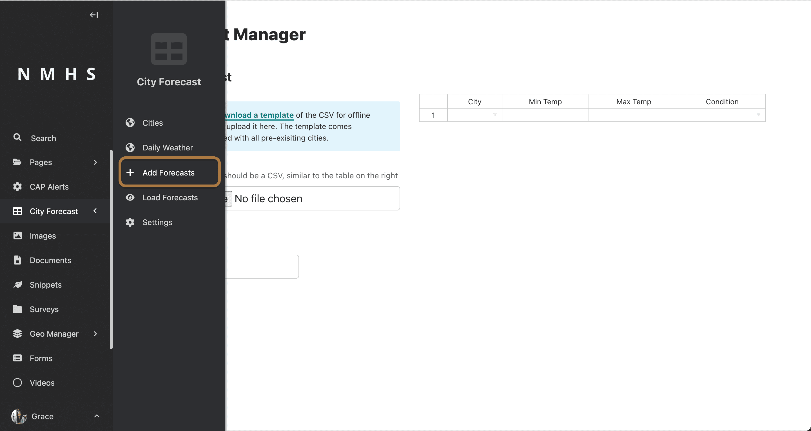


    Using the forecast manager, it is possible to load city forecasts in CSV format created offline or alternatively populate the table on the right with data. A template of the standard CSV structure is provided prepopulated with a list of all cities listed in the database. However, the forecast manager can accept a different structure and allow for correct matching of each of the columns. A forecast date must be provided for the data being uploaded before publishing.

    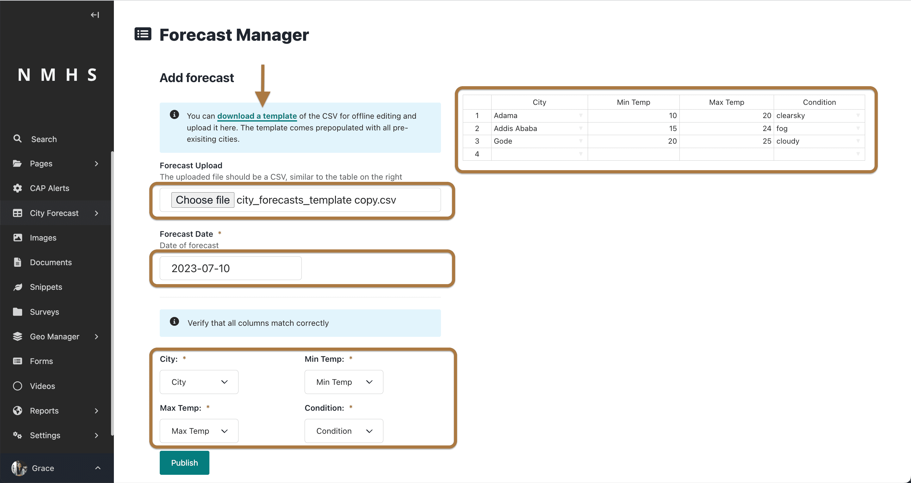

---

- Preview previously added city forecasts (last 7 days)

    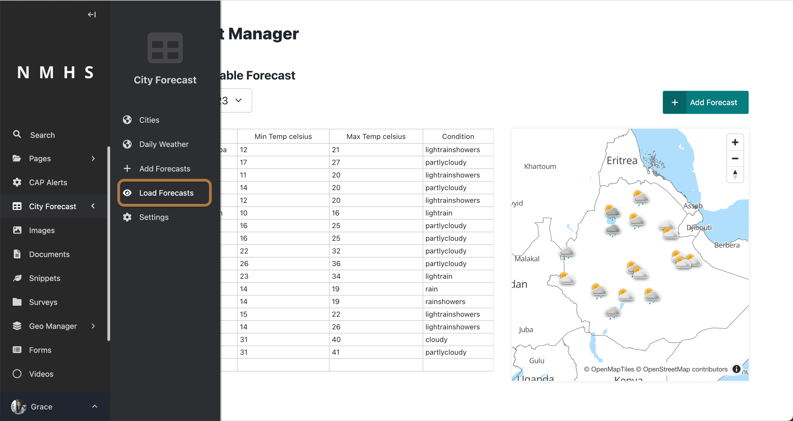

    It is also possible to fetch and preview the last 7 day city forecasts. The forecast manager allows for switching between each of the avilable dates and preview both in tabular and georeferenced formats.

    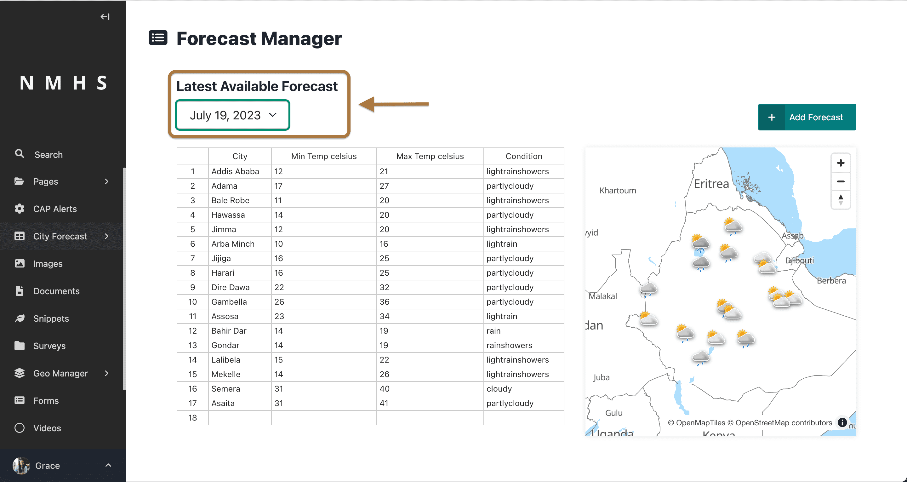

- Add Daily Weather Summary

    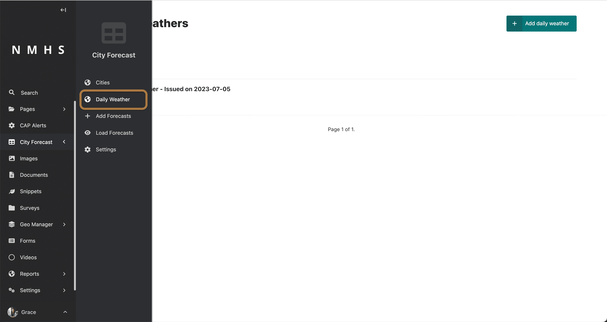

    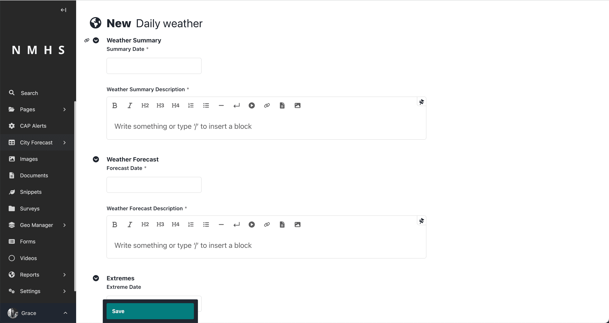

    Additionally, a daily weather summary containing descriptive information about the observed conditions, weather forecast and extreme station readings is also provided. A preview of this information would appear as below on the website:

    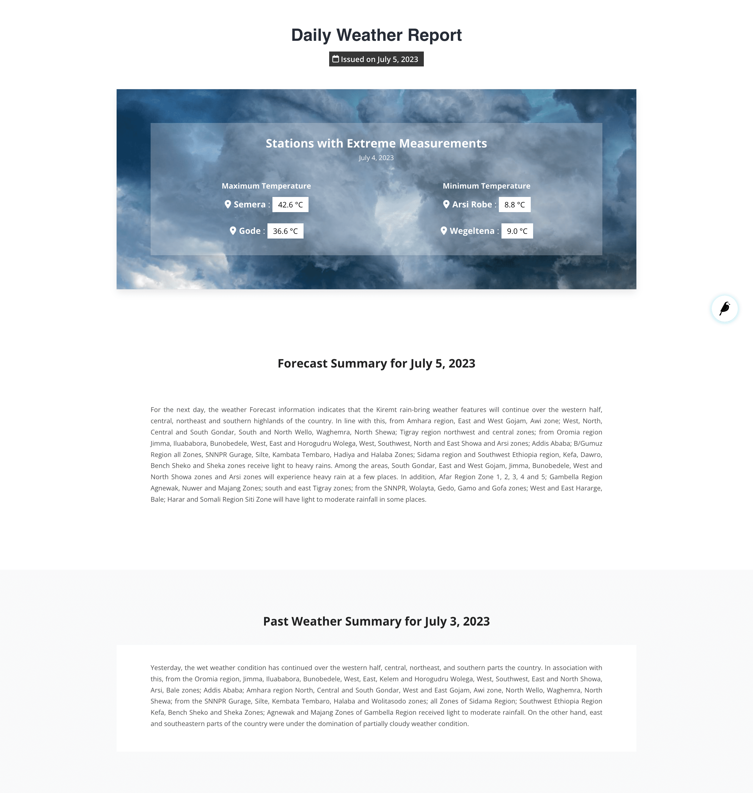


## Fetching from an external source

To enable automated fetching of city forecasts from an external source i.e YR Meteo Norway's location forecast API https://developer.yr.no/featured-products/forecast/, this option needs to be set to true.

The forecast will be fetched every three hours and get updated accordingly.

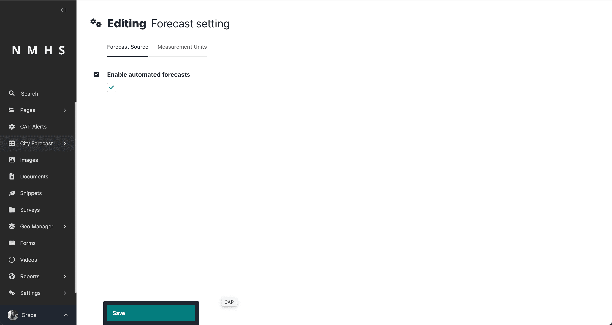