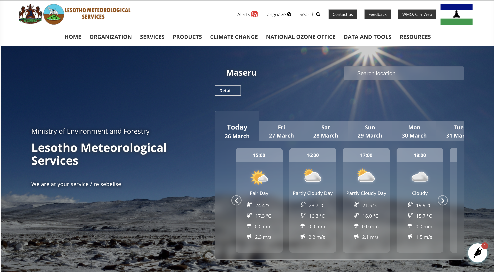

# City Forecasts



City forecasts displayed on the homepage, and forecasts page can be added through the ClimWeb in two ways:
1. Manually adding daily forecasts
2. Fetching city forecasts from an external source i.e YR Meteo Norway's location forecast API https://developer.yr.no/featured-products/forecast/

```{note}
The forecast manager comes with predefined weather conditions and icons. Please refer to YR Weather symbols documentation for guidance on icons and naming convention. https://api.met.no/weatherapi/weathericon/2.0/documentation
```

## Manually Adding Forecasts

The city forecast explorer menu can be accessed on the left sidebar. 


Here you have the ability to:
- Add/Edit/Delete a city (city name and location).

    

---

- Import city forecasts in CSV format.

    


    Using the forecast manager, it is possible to load city forecasts in CSV format created offline or alternatively populate the table on the right with data. A template of the standard CSV structure is provided prepopulated with a list of all cities listed in the database. However, the forecast manager can accept a different structure and allow for correct matching of each of the columns. A forecast date must be provided for the data being uploaded before publishing.

    

---

- Preview previously added city forecasts (last 7 days)

    

    It is also possible to fetch and preview the last 7 day city forecasts. The forecast manager allows for switching between each of the avilable dates and preview both in tabular and georeferenced formats.

    

- Add Daily Weather Summary

    

    

    Additionally, a daily weather summary containing descriptive information about the observed conditions, weather forecast and extreme station readings is also provided. A preview of this information would appear as below on the website:

    


## Fetching from an external source

To enable automated fetching of city forecasts from an external source i.e YR Meteo Norway's location forecast API https://developer.yr.no/featured-products/forecast/, this option needs to be set to true.

The forecast will be fetched every three hours and get updated accordingly.


## Using the City Forecast API

This section details how to connect ClimWeb to a third-party weather provider using **Open-Meteo** as a test source. Connecting an external API automates 7-day city forecasts without requiring manual data entry.

- Configure the API Endpoint & Authentication

  Real-world weather APIs require a web address (**endpoint**) and a secret credential (**API key or token**). 

  To secure these credentials and prevent accidental exposure in the admin panel, store them in the server's environment configuration file (`.env`):

  1. Open the `.env` file on your server.
  2. Add your API provider's endpoint URL and authentication token:
  ```env
  FORECAST_API_URL=[https://api.open-meteo.com/v1/forecast](https://api.open-meteo.com/v1/forecast)
  FORECAST_API_TOKEN=your_api_key_here (leave blank for Open-Meteo)```

3. In the ClimWeb admin panel, navigate to **City Forecast** to **Settings** to **Forecast Source**.
4. Check **Enable automated forecasts** and save changes.


---

* Field Mapping & Internal Schema
ClimWeb maps external API JSON fields to its internal database schema using **Forecast Data Parameters** and **Weather Conditions**.
* **Data Parameters**
1. Navigate to **City Forecast** → **Settings** → **Forecast Data Parameters**.
2. Ensure the internal names match your incoming API payload. Visitors will see the customized labels and units defined here.


* **Weather Conditions & Aliases**
1. Navigate to **City Forecast** → **Settings** → **Forecast Weather Conditions**.
2. If using a provider other than Open-Meteo, map the API's weather codes to ClimWeb icons by entering the API's raw code into the **Alias** field (e.g., mapping an API code `HVY_RN` to the "Heavy Rain" condition).


---

* Test and Run the Connection
You can fetch data manually or test your connection mapping via the command line using the Django management command wrapper.
* **Dry Run (Test Connection):** Validate the API payload and mapping without writing to the database:
```bash
python manage.py fetch_open_meteo --dry-run
```

* **Targeted Run:** Fetch data for a single city to verify parsing:
```bash
python manage.py fetch_open_meteo --city "Nairobi"

```

* **Live Run:** Fetch and save forecasts for all configured cities:
```bash
python manage.py fetch_open_meteo

```


---

* Field Reference Table
The following table defines how the API connector maps incoming Open-Meteo JSON keys to the internal ClimWeb schema:

| ClimWeb Field Name | Description | API JSON Path | Unit Shown |
| --- | --- | --- | --- |
| `air_temperature` | Current air temperature | `hourly.temperature_2m` | °C |
| `relative_humidity` | Relative humidity percentage | `hourly.relative_humidity_2m` | % |
| `precipitation_amount` | Expected rain or snow accumulation | `hourly.precipitation` | mm |
| `wind_speed` | Wind velocity | `hourly.wind_speed_10m` | km/h |
| `wind_from_direction` | Compass direction of wind source | `hourly.wind_direction_10m` | ° (degrees) |
| `air_pressure_at_sea_level` | Atmospheric pressure at sea level | `hourly.surface_pressure` | hPa |
| `weathercode` | WMO weather condition code | `hourly.weathercode` | Mapped Icon & Label |

---

* Verify and Automate
1. **Verify Admin Data:** Go to **City Forecast** → **Forecasts** to confirm new 7-day entries exist.
2. **Verify Public Page:** Check the public-facing site to ensure the charts render correctly.


