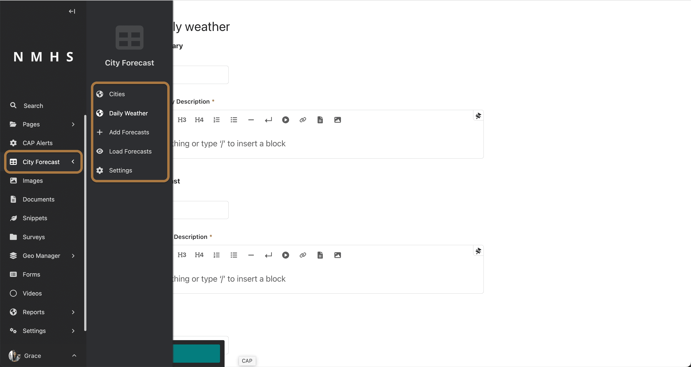
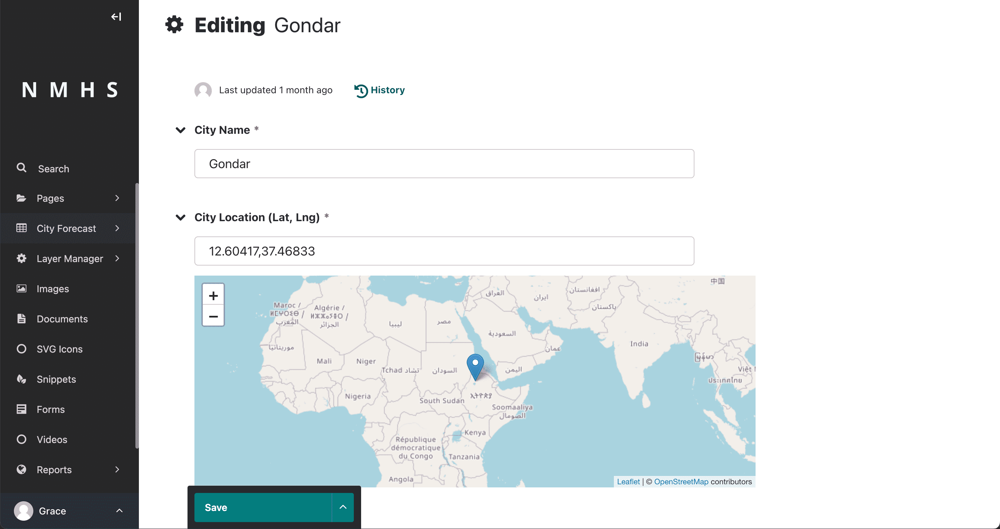
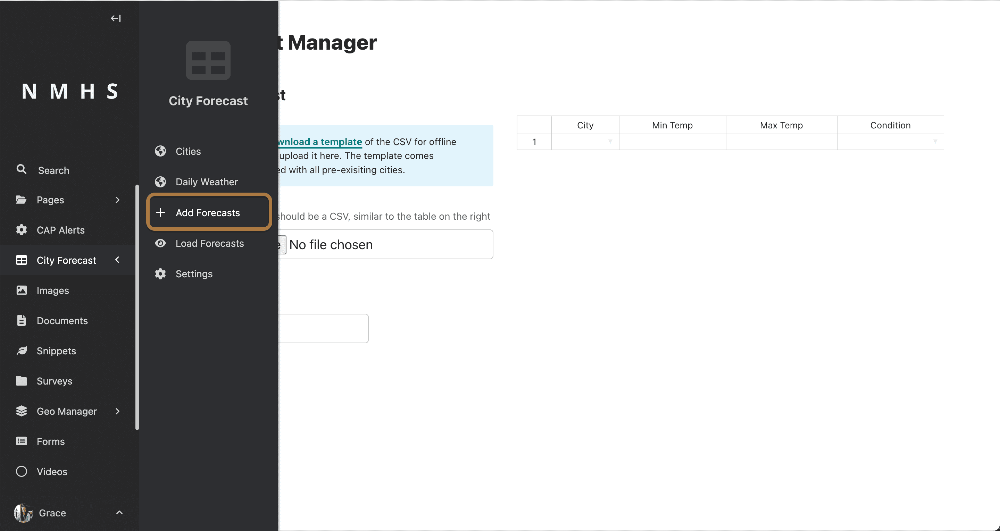
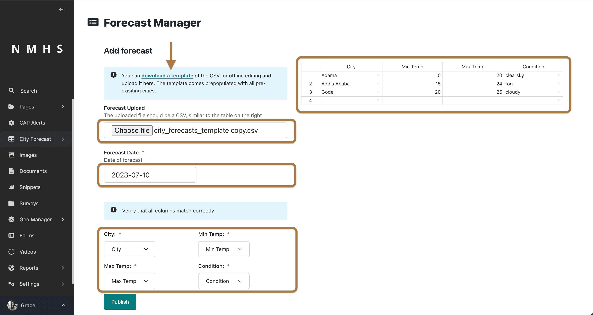
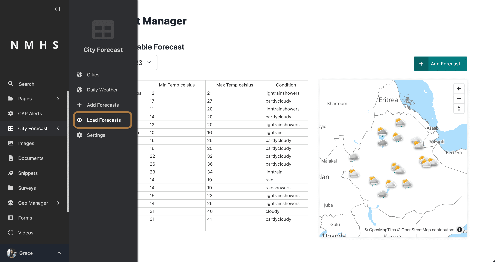
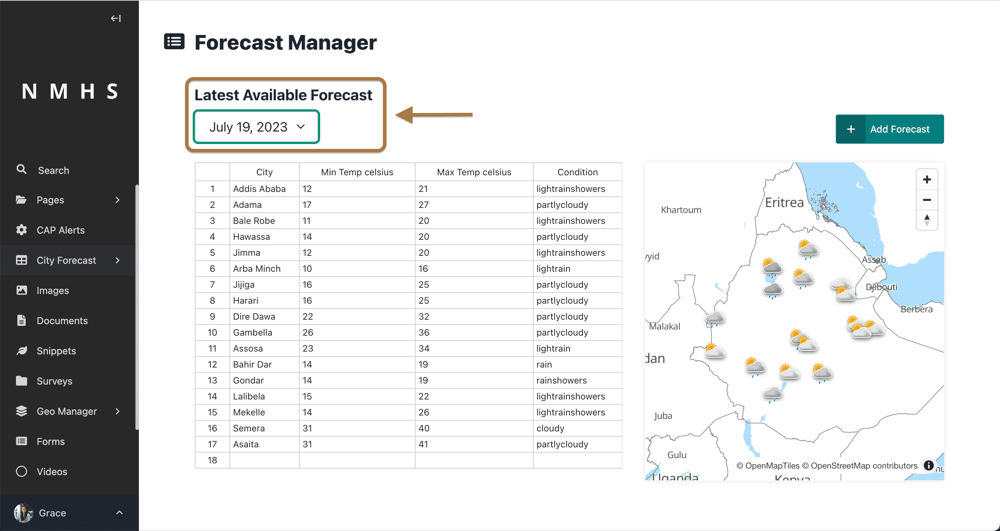
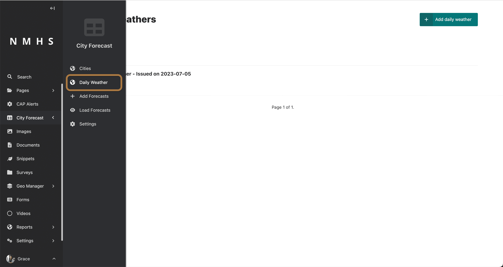
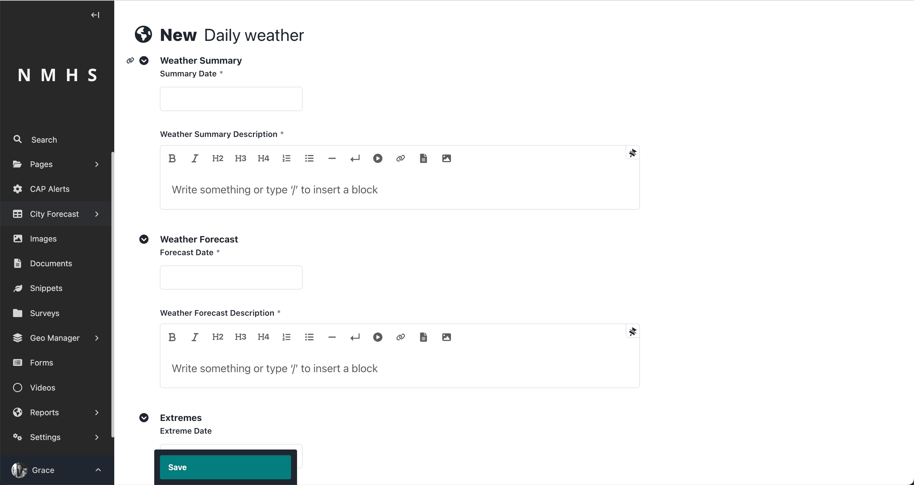
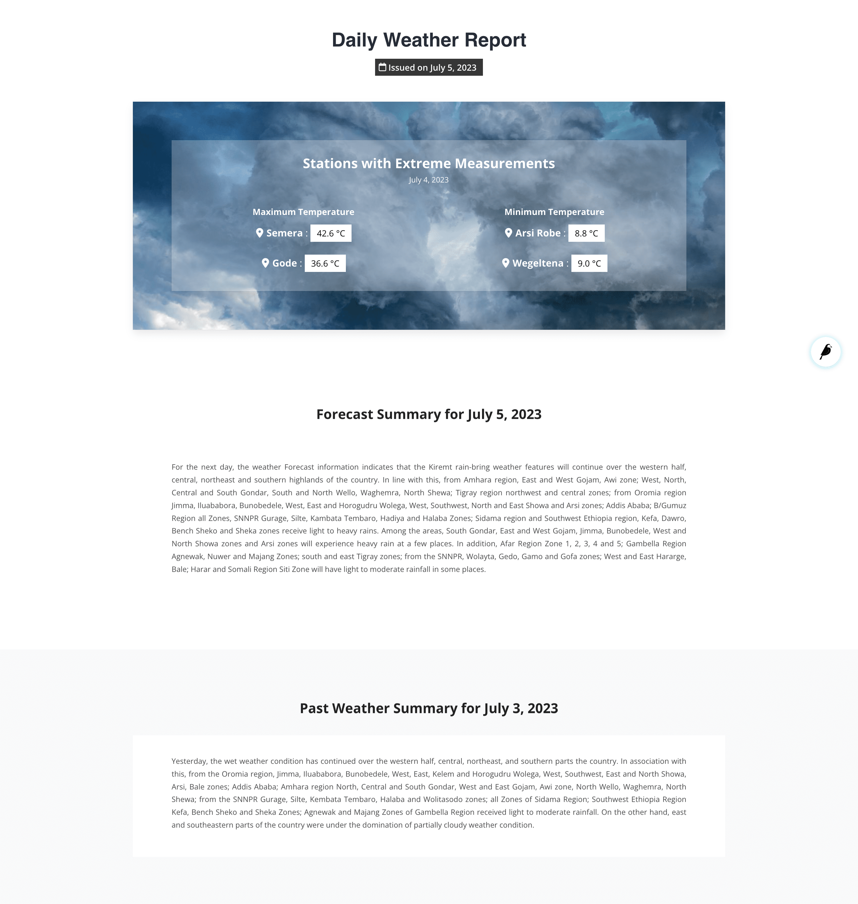
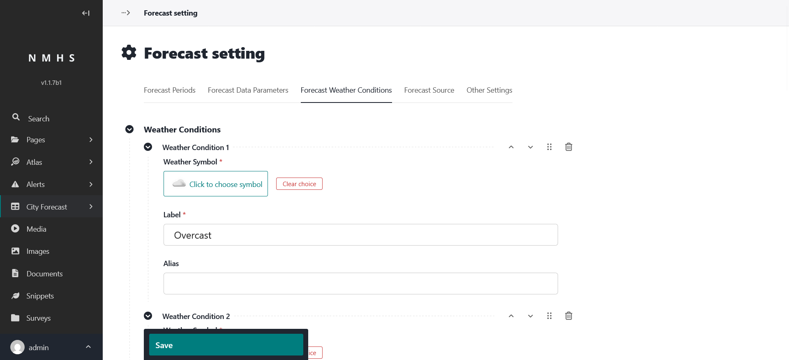

# City Forecasts

City forecasts on the homepage and forecasts page can be added in three ways:
City forecasts on the homepage and forecasts page can be added in three ways:

1. Manually adding daily forecasts
2. Uploading a CSV file prepared offline
3. Fetching city forecasts automatically from an external source

For step-by-step instructions on CSV uploads, see [Uploading a CSV forecast](#uploading-a-csv-forecast-manually).

> **Note:** The forecast manager comes with predefined weather conditions and icons. See the Yr weather symbols documentation for icons and naming conventions: <https://api.met.no/weatherapi/weathericon/2.0/documentation>

## Before you start

You need a ClimWeb admin account with staff access. Go to your site's admin URL (for example, `https://your-nmhs-site.org/cms-admin/`) and sign in with your credentials. Your system administrator should have given you this URL when your account was created. If you do not have it, ask them. It typically ends in `/cms-admin/` or `/admin/`. If you do not have an account, contact your system administrator.

For the CSV upload method, you also need a spreadsheet application such as Microsoft Excel or LibreOffice Calc.

## Manually adding forecasts

The **City Forecast** menu in the left sidebar has five items: Cities, Daily Weather, Add Forecasts, Load Forecasts, and Settings.


2. Uploading a CSV file prepared offline
3. Fetching city forecasts automatically from an external source

For step-by-step instructions on CSV uploads, see [Uploading a CSV forecast](#uploading-a-csv-forecast-manually).

> **Note:** The forecast manager comes with predefined weather conditions and icons. See the Yr weather symbols documentation for icons and naming conventions: <https://api.met.no/weatherapi/weathericon/2.0/documentation>

## Before you start

You need a ClimWeb admin account with staff access. Go to your site's admin URL (for example, `https://your-nmhs-site.org/cms-admin/`) and sign in with your credentials. Your system administrator should have given you this URL when your account was created. If you do not have it, ask them. It typically ends in `/cms-admin/` or `/admin/`. If you do not have an account, contact your system administrator.

For the CSV upload method, you also need a spreadsheet application such as Microsoft Excel or LibreOffice Calc.

## Manually adding forecasts

The **City Forecast** menu in the left sidebar has five items: Cities, Daily Weather, Add Forecasts, Load Forecasts, and Settings.


You can:
You can:
- Add/Edit/Delete a city (city name and location).

    
    

- Import city forecasts in CSV format.

    
    


    Import city forecasts from a CSV file or type values into the data grid. To enter data manually, click any cell in the grid and type the value. When you are finished entering data, fill in the **Forecasts Date** and **Effective period** fields and click **Save**. For step-by-step CSV upload instructions, see [Uploading a CSV forecast](#uploading-a-csv-forecast-manually).

    
    Import city forecasts from a CSV file or type values into the data grid. To enter data manually, click any cell in the grid and type the value. When you are finished entering data, fill in the **Forecasts Date** and **Effective period** fields and click **Save**. For step-by-step CSV upload instructions, see [Uploading a CSV forecast](#uploading-a-csv-forecast-manually).

    

- Preview previously added city forecasts (last 7 days).

    

    Switch between available dates and view data in either table or map format.

    

- Add a daily weather summary.

    

    

    The daily weather summary form has three sections:

    - **Weather Summary**: set the summary date and describe observed conditions using the rich text editor.
    - **Weather Forecast**: set the forecast date and describe expected conditions.
    - **Extremes**: add records of extreme station readings from the previous day (for example, the hottest or coldest station). Each entry requires a title, location name, and numeric value.

    Here is how it appears on the website:

    


## Uploading a CSV forecast manually

Prepare forecast data offline in a spreadsheet, then upload it here.

> **Note:** You must be logged in to the ClimWeb admin before following these steps. Go to your site's admin URL (for example, `https://your-nmhs-site.org/cms-admin/`) and sign in with your credentials.

If you are setting up ClimWeb for the first time and have not added any cities or configured forecast parameters, start at Step 1. If your instance already has cities, parameters, and at least one forecast period configured, jump straight to [Step 3](#step-3-download-the-csv-template). If you are not sure, start at Step 1.

### Step 1: Configure forecast setting

Forecast settings control three things: what time periods you can forecast for, what data columns appear in your CSV template, and what weather condition icons are available.

Go to **Settings → Forecast setting** in the left sidebar.


#### Forecast Periods

Click **+ Add Forecast Period**. Set the **Forecast Effective Time** to `12:00` and the **Label** to `Day`. If your service publishes morning and afternoon forecasts separately, you can add a second period here; otherwise one is enough.

Click **Save**.

#### Forecast Data Parameters

Click the **Forecast Data Parameters** tab. Each parameter you add here becomes a column in your CSV template.

Click **+ Add Data Parameter** for each of the following parameters. Leave **Use predefined parameters** ticked. Set **Parameter Type** to `Number` for all four.

| Parameter Label | Parameter | Parameter Type | Unit of measurement |
|---|---|---|---|
| Max Temperature | Maximum Air Temperature | Number | °C |
| Min Temperature | Minimum Air Temperature | Number | °C |
| Wind Speed | Wind Speed | Number | m/s |
| Relative Humidity | Relative Humidity | Number | % |


Click **Save**.

#### Forecast Weather Conditions

Click the **Forecast Weather Conditions** tab. Conditions are the weather icons that appear on the forecast map. The label you give each condition becomes the value in your CSV's Condition column, so spelling and capitalisation must match exactly. In some documentation this is called a condition code.

Click **+ Add Weather Condition**. For the **Weather Symbol** field, click the button to open the **Choose symbol** dialog.


Click an icon. Add these four conditions.

| Symbol to select | Label |
|---|---|
| Clear sky Day | Clear Sky |
| Partly Cloudy Day | Partly Cloudy |
| Rain | Rain |
| Heavy Rain | Heavy Rain |


Click **Save**.

> **Note:** **Forecast Source** and **Other Settings** are for the automated Yr.no integration. Skip them for CSV uploads.

### Step 2: Add cities

In the left sidebar, go to **City Forecast → Cities**, then click **Add City**.

Type a city name in the **City Name** field. ClimWeb uses OpenStreetMap to look up the location and place a pin on the map automatically.


Check that the pin landed in the right place, then click **Save**. Repeat for every city you want to include.

If the pin is in the wrong location, drag it to the correct spot, or type the correct coordinates directly into the **Latitude** and **Longitude** fields. If ClimWeb cannot find the city by name, try adding the country (for example, `Nairobi, Kenya` instead of `Nairobi`).

### Step 3: Download the CSV template

In the left sidebar, go to **City Forecast → Add Forecasts**, then click **+ Add Forecast**. The page that opens is headed **New**: this is where you enter and upload your forecast data.

Click **download a template** in the blue notice at the top of the page to download `forecast_template.csv`.


The template reflects the cities and parameters currently in the system. If you add cities after downloading, re-download the template or add rows manually.

> **Note:** The date is not a column in the CSV. You set the forecast date separately in Step 6 after uploading the file.

```
City,Max Temperature,Min Temperature,Wind Speed,Relative Humidity,Condition
Nairobi,,,,,
Mombasa,,,,,
Kisumu,,,,,
```

| Column | What to enter |
|---|---|
| City | Exact city name as added in Step 2 |
| Max Temperature | Number in °C, no units |
| Min Temperature | Number in °C, no units |
| Wind Speed | Number in m/s, no units |
| Relative Humidity | Number in %, no units |
| Condition | Exact label from Step 1 (for example, `Clear Sky`) |

### Step 4: Fill in your forecast data

Open the template in a spreadsheet or text editor and enter values for each city:

- **Condition values must match exactly.** Type `Clear Sky`, `Rain`, or whichever label you set up in Step 1. ClimWeb rejects the upload if any condition label does not match.
- **City names must match exactly.** The names in your CSV must be spelled the same way as when you added the cities in Step 2, including capitalisation. ClimWeb skips rows with city names it does not recognise.
- **All cells must have a value.** Every cell needs a value or the upload will fail.
- **Data column values must be numbers.** Temperature, wind speed, and humidity must be numbers. Negative values are accepted (for example, a minimum temperature of `-3`). Do not include units such as °C or m/s in the cells.

```
City,Max Temperature,Min Temperature,Wind Speed,Relative Humidity,Condition
Eldoret,26,14,3,65,Partly Cloudy
Kisumu,31,18,4,72,Rain
Mombasa,33,24,6,80,Clear Sky
Nairobi,28,15,3,60,Partly Cloudy
Nakuru,27,13,2,58,Clear Sky
```


Save the file. In Excel, use **File → Save As** and select **CSV UTF-8 (Comma delimited)** from the format dropdown. Saving as a different CSV format may cause the upload to fail. One city per upload is valid, but three or more makes column-matching errors easier to spot.

### Step 5: Upload the CSV and verify column matching

Go back to the **Add Forecast** page. Click **Choose File** and select your filled CSV.

A **Match Fields** section appears above the data grid, showing one dropdown per column. ClimWeb matches each CSV column to the corresponding parameter by comparing your column headers to the parameter names from Step 1.

Check each dropdown. If a column is wrong, open its dropdown and select the right parameter. Pay particular attention to the **City** column: if it is not correctly mapped, no rows will appear in the data grid. ClimWeb ignores any extra columns that do not match a parameter.


### Step 6: Set the date and save

On the left side of the page, fill in the remaining fields:

1. **Forecasts Date**: enter the date this forecast covers in `YYYY-MM-DD` format, for example `2026-05-26`.
2. **Effective period**: select the period you set up earlier, for example `Day`. If the dropdown is empty, go to **Settings → Forecast setting → Forecast Periods** and add at least one period first.
3. **Replace existing data if found**: this checkbox is ticked by default. Leave it ticked to permanently replace the existing forecast with your new data. Untick it to keep the existing forecast and discard your new upload. **Overwriting cannot be reversed; the previous data is deleted.**


Click **Save**. ClimWeb publishes the forecast immediately and takes you back to the Forecasts list. There is no separate publish step. To confirm, go to your site's homepage (for example, `https://your-nmhs-site.org/`), click **Forecasts** in the navigation, and check that the forecast appears.


Click the forecast row to review the data.

To correct a forecast, upload a new CSV for the same date and period with **Replace existing data if found** ticked. To delete a forecast, open it from the Forecasts list and click **Delete** at the bottom of the page.


> **If something goes wrong:**
>
> - **Data grid is empty after upload:** You may have saved it in a non-CSV format, or Excel may still have it open. Close it in Excel, save it again as CSV with UTF-8 encoding (select this option in the **Save As** dialog), and try again.
> - **Fewer rows than expected in the data grid:** City names in your CSV do not match the names in the system. ClimWeb skips any city names it does not recognise, without showing a warning. Download a fresh template and compare the city names.
> - **Error when saving:** Confirm that **Forecasts Date** and **Effective period** are both filled in. Both are required.
> - **Columns matched to the wrong parameters:** Correct the **Match Fields** dropdowns before saving. If you have already saved with wrong mappings, upload again with **Replace existing data if found** ticked and the dropdowns set correctly.
> - **Some rows show blank values in the data grid:** A cell in your CSV was left empty. Fill in every cell, save the file, and upload again.
- Preview previously added city forecasts (last 7 days).

    

    Switch between available dates and view data in either table or map format.

    

- Add a daily weather summary.

    

    

    The daily weather summary form has three sections:

    - **Weather Summary**: set the summary date and describe observed conditions using the rich text editor.
    - **Weather Forecast**: set the forecast date and describe expected conditions.
    - **Extremes**: add records of extreme station readings from the previous day (for example, the hottest or coldest station). Each entry requires a title, location name, and numeric value.

    Here is how it appears on the website:

    


## Uploading a CSV forecast manually

Prepare forecast data offline in a spreadsheet, then upload it here.

> **Note:** You must be logged in to the ClimWeb admin before following these steps. Go to your site's admin URL (for example, `https://your-nmhs-site.org/cms-admin/`) and sign in with your credentials.

If you are setting up ClimWeb for the first time and have not added any cities or configured forecast parameters, start at Step 1. If your instance already has cities, parameters, and at least one forecast period configured, jump straight to [Step 3](#step-3-download-the-csv-template). If you are not sure, start at Step 1.

### Step 1: Configure forecast setting

Forecast settings control three things: what time periods you can forecast for, what data columns appear in your CSV template, and what weather condition icons are available.

Go to **Settings → Forecast setting** in the left sidebar.


#### Forecast Periods

Click **+ Add Forecast Period**. Set the **Forecast Effective Time** to `12:00` and the **Label** to `Day`. If your service publishes morning and afternoon forecasts separately, you can add a second period here; otherwise one is enough.

Click **Save**.

#### Forecast Data Parameters

Click the **Forecast Data Parameters** tab. Each parameter you add here becomes a column in your CSV template.

Click **+ Add Data Parameter** for each of the following parameters. Leave **Use predefined parameters** ticked. Set **Parameter Type** to `Number` for all four.

| Parameter Label | Parameter | Parameter Type | Unit of measurement |
|---|---|---|---|
| Max Temperature | Maximum Air Temperature | Number | °C |
| Min Temperature | Minimum Air Temperature | Number | °C |
| Wind Speed | Wind Speed | Number | m/s |
| Relative Humidity | Relative Humidity | Number | % |


Click **Save**.

#### Forecast Weather Conditions

Click the **Forecast Weather Conditions** tab. Conditions are the weather icons that appear on the forecast map. The label you give each condition becomes the value in your CSV's Condition column, so spelling and capitalisation must match exactly. In some documentation this is called a condition code.

Click **+ Add Weather Condition**. For the **Weather Symbol** field, click the button to open the **Choose symbol** dialog.


Click an icon. Add these four conditions.

| Symbol to select | Label |
|---|---|
| Clear sky Day | Clear Sky |
| Partly Cloudy Day | Partly Cloudy |
| Rain | Rain |
| Heavy Rain | Heavy Rain |


Click **Save**.

> **Note:** **Forecast Source** and **Other Settings** are for the automated Yr.no integration. Skip them for CSV uploads.

### Step 2: Add cities

In the left sidebar, go to **City Forecast → Cities**, then click **Add City**.

Type a city name in the **City Name** field. ClimWeb uses OpenStreetMap to look up the location and place a pin on the map automatically.


Check that the pin landed in the right place, then click **Save**. Repeat for every city you want to include.

If the pin is in the wrong location, drag it to the correct spot, or type the correct coordinates directly into the **Latitude** and **Longitude** fields. If ClimWeb cannot find the city by name, try adding the country (for example, `Nairobi, Kenya` instead of `Nairobi`).

### Step 3: Download the CSV template

In the left sidebar, go to **City Forecast → Add Forecasts**, then click **+ Add Forecast**. The page that opens is headed **New**: this is where you enter and upload your forecast data.

Click **download a template** in the blue notice at the top of the page to download `forecast_template.csv`.


The template reflects the cities and parameters currently in the system. If you add cities after downloading, re-download the template or add rows manually.

> **Note:** The date is not a column in the CSV. You set the forecast date separately in Step 6 after uploading the file.

```
City,Max Temperature,Min Temperature,Wind Speed,Relative Humidity,Condition
Nairobi,,,,,
Mombasa,,,,,
Kisumu,,,,,
```

| Column | What to enter |
|---|---|
| City | Exact city name as added in Step 2 |
| Max Temperature | Number in °C, no units |
| Min Temperature | Number in °C, no units |
| Wind Speed | Number in m/s, no units |
| Relative Humidity | Number in %, no units |
| Condition | Exact label from Step 1 (for example, `Clear Sky`) |

### Step 4: Fill in your forecast data

Open the template in a spreadsheet or text editor and enter values for each city:

- **Condition values must match exactly.** Type `Clear Sky`, `Rain`, or whichever label you set up in Step 1. ClimWeb rejects the upload if any condition label does not match.
- **City names must match exactly.** The names in your CSV must be spelled the same way as when you added the cities in Step 2, including capitalisation. ClimWeb skips rows with city names it does not recognise.
- **All cells must have a value.** Every cell needs a value or the upload will fail.
- **Data column values must be numbers.** Temperature, wind speed, and humidity must be numbers. Negative values are accepted (for example, a minimum temperature of `-3`). Do not include units such as °C or m/s in the cells.

```
City,Max Temperature,Min Temperature,Wind Speed,Relative Humidity,Condition
Eldoret,26,14,3,65,Partly Cloudy
Kisumu,31,18,4,72,Rain
Mombasa,33,24,6,80,Clear Sky
Nairobi,28,15,3,60,Partly Cloudy
Nakuru,27,13,2,58,Clear Sky
```


Save the file. In Excel, use **File → Save As** and select **CSV UTF-8 (Comma delimited)** from the format dropdown. Saving as a different CSV format may cause the upload to fail. One city per upload is valid, but three or more makes column-matching errors easier to spot.

### Step 5: Upload the CSV and verify column matching

Go back to the **Add Forecast** page. Click **Choose File** and select your filled CSV.

A **Match Fields** section appears above the data grid, showing one dropdown per column. ClimWeb matches each CSV column to the corresponding parameter by comparing your column headers to the parameter names from Step 1.

Check each dropdown. If a column is wrong, open its dropdown and select the right parameter. Pay particular attention to the **City** column: if it is not correctly mapped, no rows will appear in the data grid. ClimWeb ignores any extra columns that do not match a parameter.


### Step 6: Set the date and save

On the left side of the page, fill in the remaining fields:

1. **Forecasts Date**: enter the date this forecast covers in `YYYY-MM-DD` format, for example `2026-05-26`.
2. **Effective period**: select the period you set up earlier, for example `Day`. If the dropdown is empty, go to **Settings → Forecast setting → Forecast Periods** and add at least one period first.
3. **Replace existing data if found**: this checkbox is ticked by default. Leave it ticked to permanently replace the existing forecast with your new data. Untick it to keep the existing forecast and discard your new upload. **Overwriting cannot be reversed; the previous data is deleted.**


Click **Save**. ClimWeb publishes the forecast immediately and takes you back to the Forecasts list. There is no separate publish step. To confirm, go to your site's homepage (for example, `https://your-nmhs-site.org/`), click **Forecasts** in the navigation, and check that the forecast appears.


Click the forecast row to review the data.

To correct a forecast, upload a new CSV for the same date and period with **Replace existing data if found** ticked. To delete a forecast, open it from the Forecasts list and click **Delete** at the bottom of the page.


> **If something goes wrong:**
>
> - **Data grid is empty after upload:** You may have saved it in a non-CSV format, or Excel may still have it open. Close it in Excel, save it again as CSV with UTF-8 encoding (select this option in the **Save As** dialog), and try again.
> - **Fewer rows than expected in the data grid:** City names in your CSV do not match the names in the system. ClimWeb skips any city names it does not recognise, without showing a warning. Download a fresh template and compare the city names.
> - **Error when saving:** Confirm that **Forecasts Date** and **Effective period** are both filled in. Both are required.
> - **Columns matched to the wrong parameters:** Correct the **Match Fields** dropdowns before saving. If you have already saved with wrong mappings, upload again with **Replace existing data if found** ticked and the dropdowns set correctly.
> - **Some rows show blank values in the data grid:** A cell in your CSV was left empty. Fill in every cell, save the file, and upload again.

## Fetching from an external source

The Norwegian Meteorological Institute provides Yr.no as a free weather forecast API. It uses each city's coordinates (set in Step 2) to request temperature, wind speed, and weather condition data. When enabled, ClimWeb automatically fetches this data for all your cities and publishes it.

To enable automated fetching, go to **Settings → Forecast setting** and open the **Forecast Source** tab. Tick **Enable automated forecasts** and click **Save**. The only required action is ticking **Enable automated forecasts**. Other fields visible in the tab are pre-configured and do not need to be changed unless your administrator instructs you to.

After enabling, the first fetch may take up to 60 minutes. After that, forecasts update every hour.


**If automated forecasts are not updating:**


## Using the City Forecast API

This section details how to connect ClimWeb to a third-party weather provider using **Open-Meteo** as a test source. Connecting an external API automates 7-day city forecasts without requiring manual data entry.

- Configure the API Endpoint & Authentication

  Real-world weather APIs require a web address (**endpoint**) and a secret credential (**API key or token**). 

  To secure these credentials and prevent accidental exposure in the admin panel, store them in the server's environment configuration file (`.env`):

  1. Open the `.env` file on your server.
  2. Add your API provider's endpoint URL and authentication token:
  ```env
  FORECAST_API_URL=[https://api.open-meteo.com/v1/forecast](https://api.open-meteo.com/v1/forecast)
  FORECAST_API_TOKEN=your_api_key_here (leave blank for Open-Meteo)```

3. In the ClimWeb admin panel, navigate to **City Forecast** to **Settings** to **Forecast Source**.
4. Check **Enable automated forecasts** and save changes.


---

* Field Mapping & Internal Schema
ClimWeb maps external API JSON fields to its internal database schema using **Forecast Data Parameters** and **Weather Conditions**.
* **Data Parameters**
1. Navigate to **City Forecast** → **Settings** → **Forecast Data Parameters**.
2. Ensure the internal names match your incoming API payload. Visitors will see the customized labels and units defined here.


* **Weather Conditions & Aliases**
1. Navigate to **City Forecast** → **Settings** → **Forecast Weather Conditions**.
2. If using a provider other than Open-Meteo, map the API's weather codes to ClimWeb icons by entering the API's raw code into the **Alias** field (e.g., mapping an API code `HVY_RN` to the "Heavy Rain" condition).



---

* Test and Run the Connection
You can fetch data manually or test your connection mapping via the command line using the Django management command wrapper.
* **Dry Run (Test Connection):** Validate the API payload and mapping without writing to the database:
```bash
climweb fetch_open_meteo --dry-run
```

* **Targeted Run:** Fetch data for a single city to verify parsing:
```bash
climweb fetch_open_meteo --city "Nairobi"

```

* **Live Run:** Fetch and save forecasts for all configured cities:
```bash
climweb fetch_open_meteo

```


---

* Field Reference Table
The following table defines how the API connector maps incoming Open-Meteo JSON keys to the internal ClimWeb schema:

| ClimWeb Field Name | Description | API JSON Path | Unit Shown |
| --- | --- | --- | --- |
| `air_temperature` | Current air temperature | `hourly.temperature_2m` | °C |
| `relative_humidity` | Relative humidity percentage | `hourly.relative_humidity_2m` | % |
| `precipitation_amount` | Expected rain or snow accumulation | `hourly.precipitation` | mm |
| `wind_speed` | Wind velocity | `hourly.wind_speed_10m` | km/h |
| `wind_from_direction` | Compass direction of wind source | `hourly.wind_direction_10m` | ° (degrees) |
| `air_pressure_at_sea_level` | Atmospheric pressure at sea level | `hourly.surface_pressure` | hPa |
| `weathercode` | WMO weather condition code | `hourly.weathercode` | Mapped Icon & Label |

---

* Verify and Automate
1. **Verify Admin Data:** Go to **City Forecast** → **Forecasts** to confirm new 7-day entries exist.
2. **Verify Public Page:** Check the public-facing site to ensure the charts render correctly.


## Troubelshooting External API Jobs

| Problem | Likely cause | What to do |
|---|---|---|
| No data appears after enabling | Server cannot reach the external API | Contact your system administrator to confirm the server has internet access |
| Forecasts stopped updating | Checkbox was unticked, or a server-side job stopped | Confirm **Enable automated forecasts** is still ticked in **Settings → Forecast setting → Forecast Source**. If ticked and still not updating, ask your administrator to check the server logs. |
| Data appears stale | Fetch runs once per hour | Wait up to 60 minutes. If still stale after that, confirm the checkbox is still enabled. |
