# City Forecasts

City forecasts on the homepage and forecasts page can be added in three ways:

1. Manually adding daily forecasts
2. Uploading a CSV file prepared offline
3. Fetching city forecasts automatically from an external weather API (yr.no or Open-Meteo)

These methods work together. A common setup is to let an external API fill in a draft forecast automatically, then have a forecaster review, adjust a few cities, and publish. Forecaster edits are never overwritten by later automated runs.

For step-by-step instructions on CSV uploads, see [Uploading a CSV forecast](#uploading-a-csv-forecast-manually).

> **Note:** The forecast manager comes with predefined weather conditions and icons. See the Yr weather symbols documentation for icons and naming conventions: <https://api.met.no/weatherapi/weathericon/2.0/documentation>

## Before you start

You need a ClimWeb admin account with staff access. Go to your site's admin URL (for example, `https://your-nmhs-site.org/cms-admin/`) and sign in with your credentials. Your system administrator should have given you this URL when your account was created. If you do not have it, ask them. It typically ends in `/cms-admin/` or `/admin/`. If you do not have an account, contact your system administrator.

For the CSV upload method, you also need a spreadsheet application such as Microsoft Excel or LibreOffice Calc.

## Uploading a CSV forecast manually

Prepare forecast data offline in a spreadsheet, then upload it here.

> **Note:** You must be logged in to the ClimWeb admin before following these steps. Go to your site's admin URL (for example, `https://your-nmhs-site.org/cms-admin/`) and sign in with your credentials.

If you are setting up ClimWeb for the first time and have not added any cities or configured forecast parameters, start at Step 1. If your instance already has cities, parameters, and at least one forecast period configured, jump straight to [Step 3](#step-3-download-the-csv-template). If you are not sure, start at Step 1.

### Step 1: Configure forecast setting

Forecast settings control three things: what time periods you can forecast for, what data columns appear in your CSV template, and what weather condition icons are available.

Go to **Settings → Forecast setting** in the left sidebar.

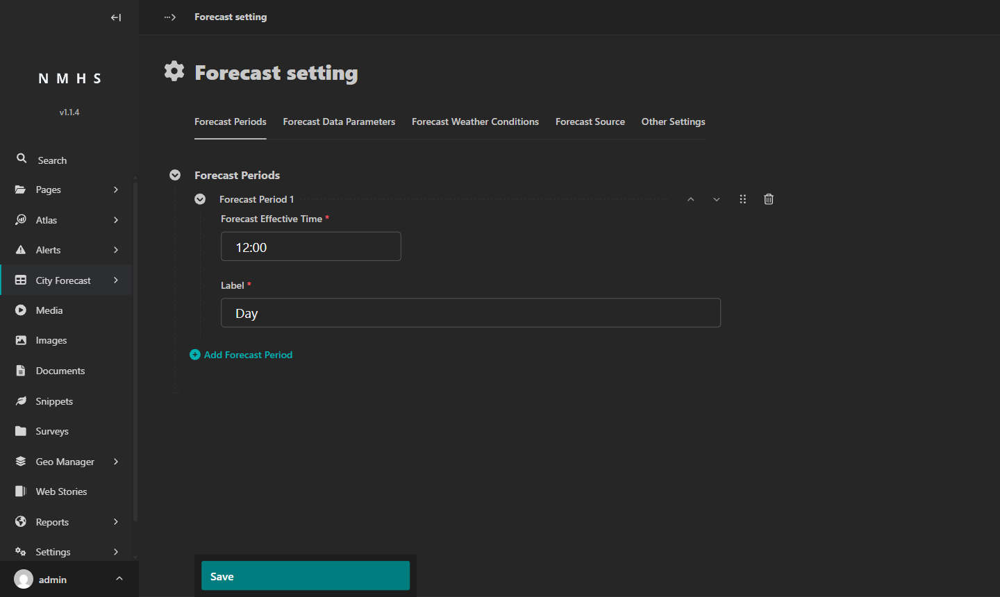

#### Forecast Periods

Click **+ Add Forecast Period**. Set the **Forecast Effective Time** to `12:00` and the **Label** to `Day`. If your service publishes morning and afternoon forecasts separately, you can add a second period here; otherwise one is enough.

Click **Save**.

#### Forecast Data Parameters

Click the **Forecast Data Parameters** tab. Each parameter you add here becomes a column in your CSV template, and is also the target you map automated-forecast fields onto (see [Fetching automated forecasts](#fetching-automated-forecasts-from-an-external-source)).

Click **+ Add Data Parameter** for each of the following parameters. Leave **Use predefined parameters** ticked. Set **Parameter Type** to `Number` for all four.

| Parameter Label | Parameter | Parameter Type | Unit of measurement |
|---|---|---|---|
| Max Temperature | Maximum Air Temperature | Number | °C |
| Min Temperature | Minimum Air Temperature | Number | °C |
| Wind Speed | Wind Speed | Number | m/s |
| Relative Humidity | Relative Humidity | Number | % |

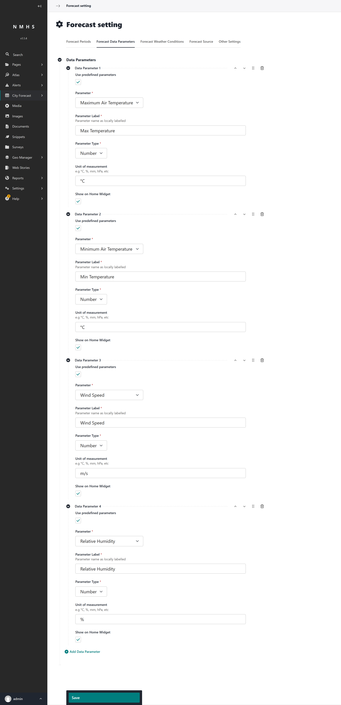

Click **Save**.

#### Forecast Weather Conditions

Click the **Forecast Weather Conditions** tab. Conditions are the weather icons that appear on the forecast map. The label you give each condition becomes the value in your CSV's Condition column, so spelling and capitalisation must match exactly. In some documentation this is called a condition code.

Click **+ Add Weather Condition**. For the **Weather Symbol** field, click the button to open the **Choose symbol** dialog.

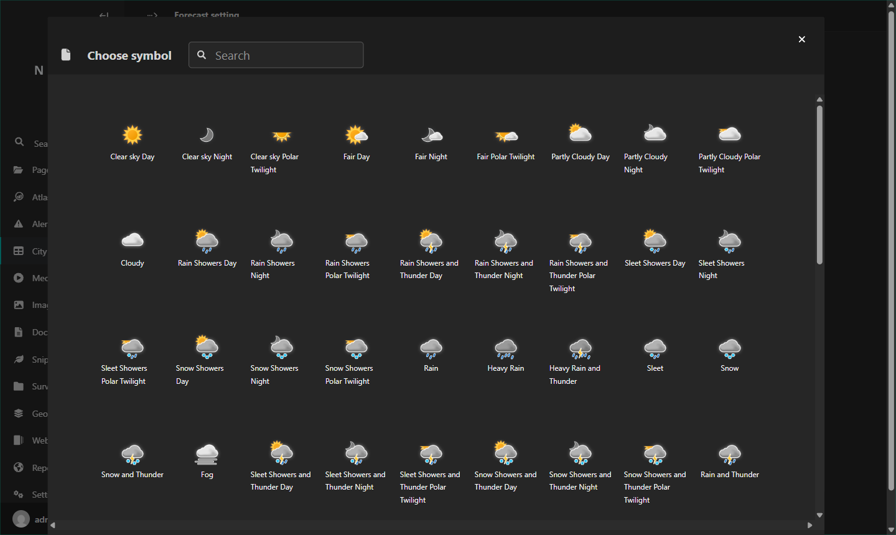

Click an icon. Add these four conditions.

| Symbol to select | Label |
|---|---|
| Clear sky Day | Clear Sky |
| Partly Cloudy Day | Partly Cloudy |
| Rain | Rain |
| Heavy Rain | Heavy Rain |

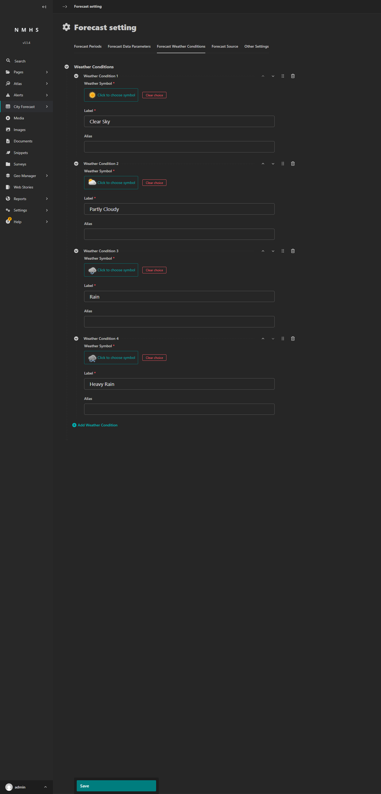

Click **Save**.

> **Note:** The **Forecast Source** tab is for the automated weather-API integration, covered in [Fetching automated forecasts](#fetching-automated-forecasts-from-an-external-source). You can skip it for CSV uploads.

### Step 2: Add cities

In the left sidebar, go to **City Forecast → Cities**, then click **Add City**.

Type a city name in the **City Name** field. ClimWeb uses OpenStreetMap to look up the location and place a pin on the map automatically.

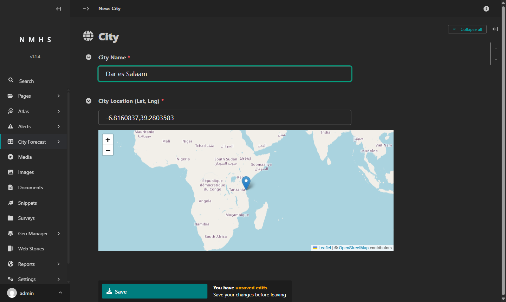

Check that the pin landed in the right place, then click **Save**. Repeat for every city you want to include.

If the pin is in the wrong location, drag it to the correct spot, or type the correct coordinates directly into the **Latitude** and **Longitude** fields. If ClimWeb cannot find the city by name, try adding the country (for example, `Nairobi, Kenya` instead of `Nairobi`).

### Step 3: Download the CSV template

In the left sidebar, go to **City Forecast → Add Forecasts**, then click **+ Add Forecast**. The page that opens is headed **New**: this is where you enter and upload your forecast data.

Click **download a template** in the blue notice at the top of the page to download `forecast_template.csv`.

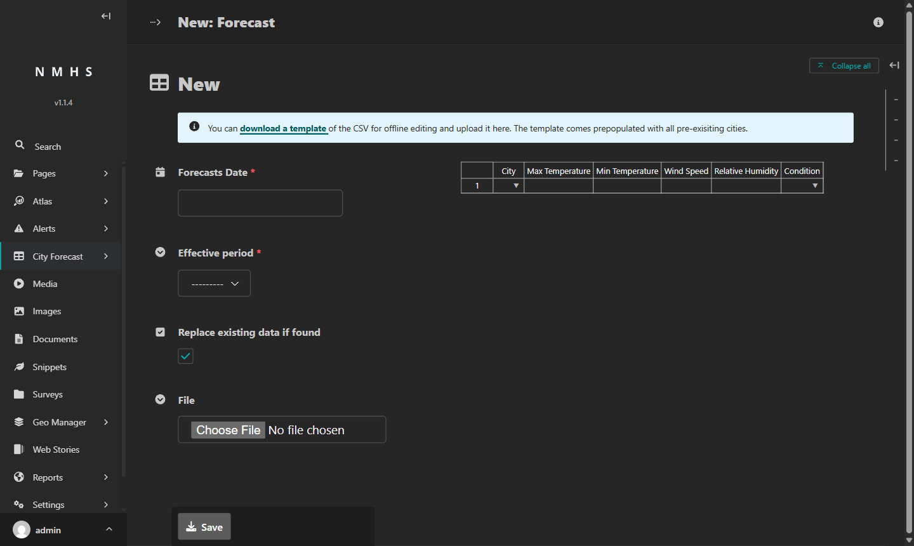

The template reflects the cities and parameters currently in the system. If you add cities after downloading, re-download the template or add rows manually.

> **Note:** The date is not a column in the CSV. You set the forecast date separately in Step 6 after uploading the file.

```
City,Max Temperature,Min Temperature,Wind Speed,Relative Humidity,Condition
Nairobi,,,,,
Mombasa,,,,,
Kisumu,,,,,
```

| Column | What to enter |
|---|---|
| City | Exact city name as added in Step 2 |
| Max Temperature | Number in °C, no units |
| Min Temperature | Number in °C, no units |
| Wind Speed | Number in m/s, no units |
| Relative Humidity | Number in %, no units |
| Condition | Exact label from Step 1 (for example, `Clear Sky`) |

### Step 4: Fill in your forecast data

Open the template in a spreadsheet or text editor and enter values for each city:

- **Condition values must match exactly.** Type `Clear Sky`, `Rain`, or whichever label you set up in Step 1. ClimWeb rejects the upload if any condition label does not match.
- **City names must match exactly.** The names in your CSV must be spelled the same way as when you added the cities in Step 2, including capitalisation. ClimWeb skips rows with city names it does not recognise.
- **All cells must have a value.** Every cell needs a value or the upload will fail.
- **Data column values must be numbers.** Temperature, wind speed, and humidity must be numbers. Negative values are accepted (for example, a minimum temperature of `-3`). Do not include units such as °C or m/s in the cells.

```
City,Max Temperature,Min Temperature,Wind Speed,Relative Humidity,Condition
Eldoret,26,14,3,65,Partly Cloudy
Kisumu,31,18,4,72,Rain
Mombasa,33,24,6,80,Clear Sky
Nairobi,28,15,3,60,Partly Cloudy
Nakuru,27,13,2,58,Clear Sky
```

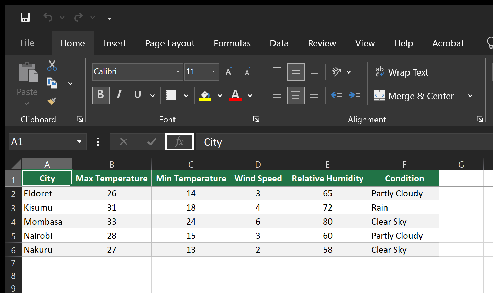

Save the file. In Excel, use **File → Save As** and select **CSV UTF-8 (Comma delimited)** from the format dropdown. Saving as a different CSV format may cause the upload to fail. One city per upload is valid, but three or more makes column-matching errors easier to spot.

### Step 5: Upload the CSV and verify column matching

Go back to the **Add Forecast** page. Click **Choose File** and select your filled CSV.

A **Match Fields** section appears above the data grid, showing one dropdown per column. ClimWeb matches each CSV column to the corresponding parameter by comparing your column headers to the parameter names from Step 1.

Check each dropdown. If a column is wrong, open its dropdown and select the right parameter. Pay particular attention to the **City** column: if it is not correctly mapped, no rows will appear in the data grid. ClimWeb ignores any extra columns that do not match a parameter.

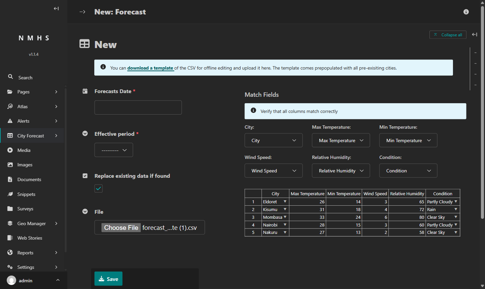

### Step 6: Set the date and save

On the left side of the page, fill in the remaining fields:

1. **Forecasts Date**: enter the date this forecast covers in `YYYY-MM-DD` format, for example `2026-05-26`.
2. **Effective period**: select the period you set up earlier, for example `Day`. If the dropdown is empty, go to **Settings → Forecast setting → Forecast Periods** and add at least one period first.
3. **Replace existing data if found**: this checkbox is ticked by default. Leave it ticked to permanently replace the existing forecast with your new data. Untick it to keep the existing forecast and discard your new upload. **Overwriting cannot be reversed; the previous data is deleted.**

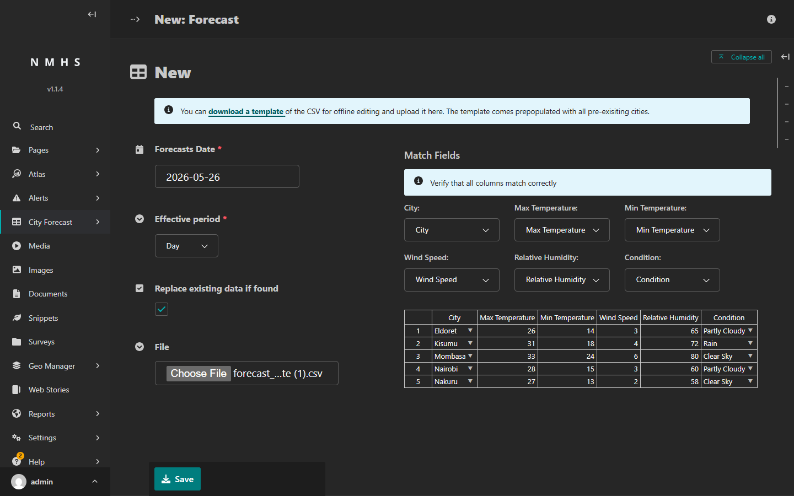

Click **Save**. ClimWeb publishes the forecast immediately and takes you back to the Forecasts list. There is no separate publish step for manual uploads. To confirm, go to your site's homepage (for example, `https://your-nmhs-site.org/`), click **Forecasts** in the navigation, and check that the forecast appears.

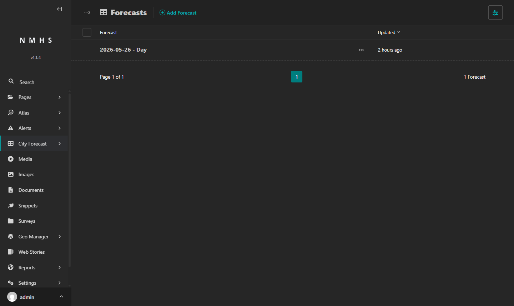

Click the forecast row to review the data.

To correct a forecast, upload a new CSV for the same date and period with **Replace existing data if found** ticked. To delete a forecast, open it from the Forecasts list and click **Delete** at the bottom of the page.

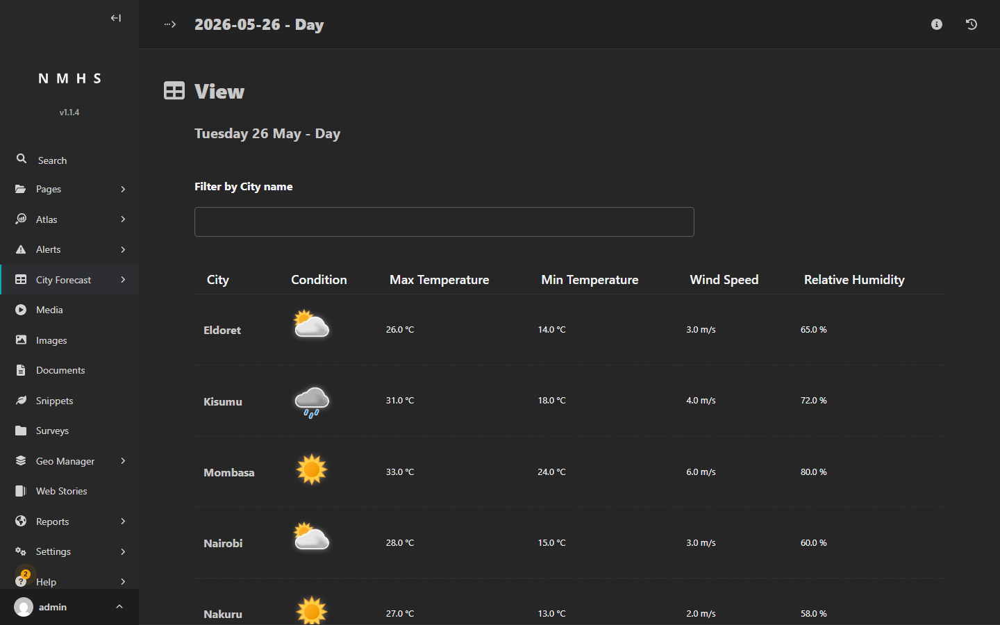

> **If something goes wrong:**
>
> - **Data grid is empty after upload:** You may have saved it in a non-CSV format, or Excel may still have it open. Close it in Excel, save it again as CSV with UTF-8 encoding (select this option in the **Save As** dialog), and try again.
> - **Fewer rows than expected in the data grid:** City names in your CSV do not match the names in the system. ClimWeb skips any city names it does not recognise, without showing a warning. Download a fresh template and compare the city names.
> - **Error when saving:** Confirm that **Forecasts Date** and **Effective period** are both filled in. Both are required.
> - **Columns matched to the wrong parameters:** Correct the **Match Fields** dropdowns before saving. If you have already saved with wrong mappings, upload again with **Replace existing data if found** ticked and the dropdowns set correctly.
> - **Some rows show blank values in the data grid:** A cell in your CSV was left empty. Fill in every cell, save the file, and upload again.

## Fetching automated forecasts from an external source

ClimWeb can fetch 7-day city forecasts automatically from a free weather API, using each city's coordinates (set in Step 2 above). Two providers are built in and need no API key:

- **yr.no** — the Norwegian Meteorological Institute (Met Norway) locationforecast API.
- **Open-Meteo** — an open weather API that aggregates many national models.

You choose one provider, map its data fields onto your forecast parameters, and decide whether fetched forecasts are published automatically or saved as drafts for review.

### Step 1: Choose the provider and enable fetching

Go to **Settings → Forecast setting** and open the **Forecast Source** tab.

1. Tick **Enable automated forecasts**.
2. Choose your **Automated forecast provider** (yr.no or Open-Meteo).
3. Decide on **Auto-publish automated forecasts**:
   - **On** — fetched forecasts go live immediately.
   - **Off** — fetched forecasts are saved as **drafts** for a forecaster to review and publish. Use this if you want a human to check the data before it appears on the public site.
4. Click **Save**.

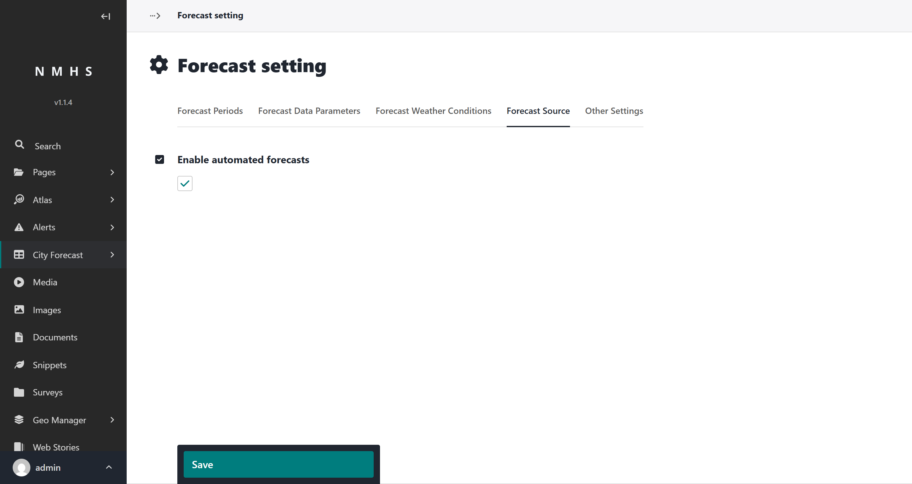

### Step 2: Map provider fields to your parameters

In the same **Forecast Source** tab, use the **Provider Parameter Mapping** section to tell ClimWeb which field from the API feeds each of your forecast parameters.

Click **+ Add Parameter Mapping** and, for each value you want to capture:

1. Choose the **Provider** (the same one you selected above).
2. Choose the **Provider source field** — the dropdown lists only the fields that provider offers (for example, Open-Meteo's *Temperature (2 m)* or yr.no's *Air Temperature*).
3. Choose the **Database parameter** — one of your Forecast Data Parameters from Step 1 of the CSV setup (for example, *Air Temperature*).

Add one row per parameter you want populated, then click **Save**.

> **Note:** If you leave the mapping empty, ClimWeb falls back to a sensible built-in default mapping (see the [field reference](#open-meteo-default-field-reference) below). Add your own rows only when you want to capture different fields or map them differently.

Weather conditions are handled separately: ClimWeb maps each provider's condition code to the icons you configured under **Forecast Weather Conditions**, creating any it doesn't yet have.

### Step 3: Run the fetch

Forecasts are fetched by a scheduled job on your server (typically hourly). Your administrator can also run it on demand from the command line.

Use the unified command, which reads the provider and mapping you configured:

```bash
# Fetch for all cities using the configured provider and mapping
climweb generate_auto_forecast

# Test the connection and mapping without writing anything
climweb generate_auto_forecast --dry-run

# Fetch a single city to verify parsing
climweb generate_auto_forecast --city "Nairobi"

# Open-Meteo only: limit to specific hours of day (e.g. morning/afternoon/evening)
climweb generate_auto_forecast --hours 6 12 18
```

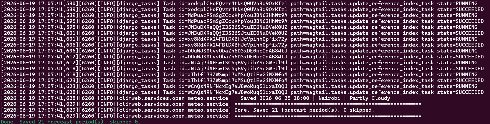

> **For administrators (scheduling):** schedule `generate_auto_forecast` with your task runner (e.g. Celery Beat). If you keep **Auto-publish** off, also schedule `publish_forecasts` for your review window so approved/untouched drafts go live automatically:
>
> ```bash
> climweb publish_forecasts            # publish all drafts
> climweb publish_forecasts --date 2026-06-23
> ```
>
> The older provider-specific commands (`generate_forecast` for yr.no, `fetch_open_meteo` for Open-Meteo) still exist, but `generate_auto_forecast` is preferred because it honours the provider and mapping chosen in the admin.

### Step 4: Review, edit, and publish

If **Auto-publish** is off, fetched forecasts appear in **City Forecast → Forecasts** with a **Draft** status. The list shows a **Status** column and can be filtered by status and source.

You have three ways to act on drafts:

- **Publish as-is** — tick the forecasts in the list and choose **Publish** from the bulk-action bar. (Use **Unpublish (make draft)** to take one back down.)
- **Edit values, then publish** — click **Edit values** on a forecast row (or the button on the forecast's page) to open a spreadsheet-style grid pre-filled with the current values. Change any cities you need to, optionally tick **Publish after saving**, and click **Save**.
- **Leave it** — drafts stay internal until published; only **Published** forecasts appear on the public website and API.

**How edits are protected:** when you change a city's values in the grid (or enter it manually / by CSV / via the API), that city is marked as *forecaster-authored*. Later automated runs **skip** forecaster-authored cities, so your edits are never overwritten — while cities you left untouched keep refreshing automatically from the API.

### Open-Meteo default field reference

When no custom mapping is configured, the Open-Meteo connector uses this default mapping. You can override any of it in the **Provider Parameter Mapping** section.

| ClimWeb parameter | Description | Open-Meteo source field | Unit |
|---|---|---|---|
| `air_temperature` | Air temperature | `temperature_2m` | °C |
| `relative_humidity` | Relative humidity | `relative_humidity_2m` | % |
| `precipitation_amount` | Precipitation | `precipitation` | mm |
| `wind_speed` | Wind speed | `wind_speed_10m` | km/h |
| `wind_from_direction` | Wind direction | `wind_direction_10m` | ° (degrees) |
| `air_pressure_at_sea_level` | Surface pressure | `surface_pressure` | hPa |
| (weather condition) | WMO weather code → icon | `weathercode` | Mapped icon & label |

### Verify

1. **Admin data:** go to **City Forecast → Forecasts** and confirm new entries exist (and are **Published** once you've approved them).
2. **Public page:** open the public site and check the forecast widget and charts render correctly.

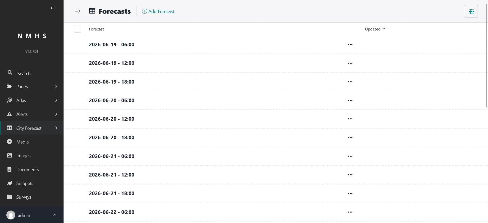

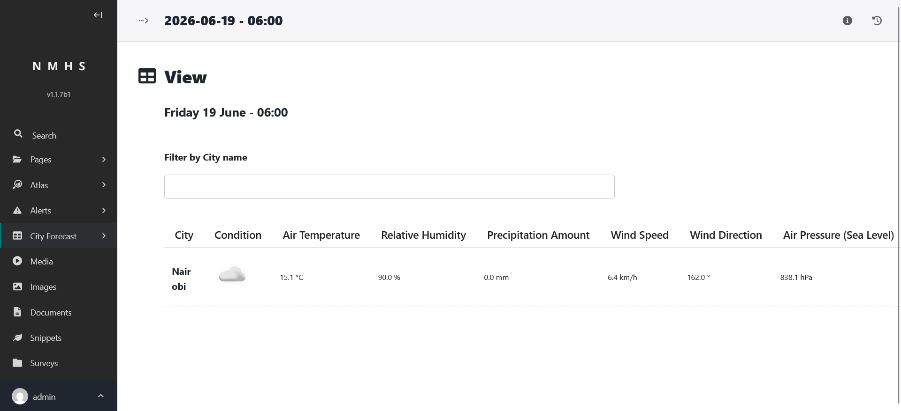

## Troubleshooting automated forecasts

| Problem | Likely cause | What to do |
|---|---|---|
| No data appears after enabling | Server cannot reach the external API, or the scheduled job hasn't run yet | Wait for the next scheduled run (up to ~60 minutes), then confirm the server has internet access with your administrator. |
| Fetched forecasts don't show on the site | They are saved as **drafts** | Publish them: tick them in the Forecasts list and choose **Publish**, or turn on **Auto-publish automated forecasts** in **Forecast Source**. |
| A city never updates from the API | It was edited by a forecaster (or added manually/CSV/API) and is therefore protected | This is expected. To let the API manage it again, delete that city's forecast for the slot so the next run recreates it. |
| Some parameters are empty | No mapping row for that field, or the provider doesn't supply it | Add a row in **Provider Parameter Mapping** linking the provider field to your parameter. |
| Wrong values in a parameter | The mapping points at the wrong source field | Correct the row in **Provider Parameter Mapping** and re-run. |
| Forecasts stopped updating | The scheduled job stopped, or **Enable automated forecasts** was unticked | Confirm the checkbox is ticked in **Settings → Forecast setting → Forecast Source**; if it is, ask your administrator to check the server logs. |

## Using the City Forecast API (push)

External systems can push forecasts into ClimWeb over its REST API instead of (or alongside) the built-in providers. Forecasts pushed this way are treated as authoritative: they are **published** and marked as forecaster-authored, so automated runs will not overwrite them. Ask your administrator for the API endpoint and authentication details for your instance.
