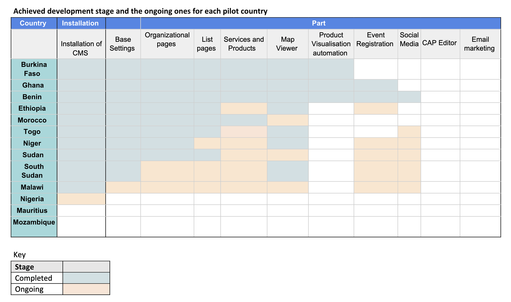

# Pilot Phase

The regional office began piloting the CMS with several African countries from **July to December of 2023**, in response
to formal request from the WMO’s Permanent Representatives (PRs), addressed to the director of WMO Regional Office for
Africa. This section summarizes the progress in the pilot phase, conclusions drawn from the technical support and
collaboration provided to NMHSs in developing their pilot websites.

## Summary of the progress

Initially, the selected pilot countries were:

- Ethiopia
- Mozambique
- Niger
- Burkina Faso
- Ghana

However, several additional countries have expressed interest in adapting the CMS

The table below lists the status of the CMS setup for each country that has requested to install the CMS so far:

|     | Country       | Status/Stage             | Public URL                                                        |
|:----|---------------|--------------------------|-------------------------------------------------------------------|
| 1   | Algeria       | Internal Testing         |                                                                   |
| 2   | Benin         | Training stage           |                                                                   |
| 3   | Burkina Faso  | Published                | [https://www.meteoburkina.bf](https://www.meteoburkina.bf)        |
| 4   | Burundi       | Training stage           |                                                                   |
| 5   | Chad          | Server setup stage       |                                                                   |
| 6   | Djibouti      | Initial discussion stage |                                                                   |
| 7   | Ethiopia      | Training stage           |                                                                   |
| 8   | Ghana         | Training Stage           |                                                                   |
| 9   | Guinea Bissau | Initial discussion stage |                                                                   |
| 10  | Kenya         | Server setup stage       |                                                                   |
| 11  | Libya         | Initial discussion stage |                                                                   |
| 12  | Malawi        | Published                | [http://www.metmalawi.gov.mw](http://www.metmalawi.gov.mw)        |
| 13  | Mali          | Published                | [https://malimeteo.ml](https://malimeteo.ml)                      |
| 14  | Mauritius     | Initial discussion stage |                                                                   |
| 15  | Morocco       | Internal testing         |                                                                   |
| 16  | Niger         | Published                | [https://www.niger-meteo.ne](https://www.niger-meteo.ne)          |
| 17  | Nigeria       | Server setup stage       |                                                                   |
| 18  | Seychelles    | Published                | [https://www.meteo.sc](https://www.meteo.sc)                      |
| 19  | Sierra Leone  | Initial discussion stage |                                                                   |
| 20  | South Sudan   | Published                | [https://meteosouthsudan.com.ss](https://meteosouthsudan.com.ss ) |
| 21  | Sudan         | Published                | [https://meteosudan.sd](https://meteosudan.sd  )                  |
| 22  | The Gambia    | Initial discussion stage |                                                                   |
| 23  | Togo          | Published                | [https://www.anamet-togo.com](https://www.anamet-togo.com )       |
| 24  | Zimbabwe      | Initial discussion stage |                                                                   |

The development of the website generally encompasses eleven steps.

- The initial step is installation of the CMS software package
- Preparation of the base CMS setting
- Organisation of the website’s pages
- Listing of the desired pages,
- Listing of services and products made by NMHSs
- Setup of the MapViewer package
- Automatic products visualisation
- Event pages setup and registration integration
- Integration of NMHSs’s social media accounts into the website
- Setup of CAP composing tool
- Integration of email marketing tool with the website to enable users to sign up to receiving services via email.

The table below summarises each country’s progress:

## Conclusion and recommendations

### Broad Implementation and Technical Support

- **The CMS has been enthusiastically embraced by member states in Africa**, as numerous PRs have submitted formal
  requests to pilot the system to modernize their existing websites. Currently, ten countries are in various stages of
  CMS customization, with the first group aiming to launch their updated websites between February and March 2024.

- **Pilot countries have recognized the CMS's potential to significantly enhance service provision and elevate
  visibility**
  not only among their public but also across line ministries and other stakeholders at the national, regional, and
  global levels. The CMS is expected to foster greater public trust in the products and warnings, enhance national
  visibility, and improve institutional positioning within government structures. Additionally, its integration with
  digital marketing tools like email marketing and social media is anticipated to spur user growth. The CMS has also
  been designed to optimize the utilization of satellite products, amplify the impact and visibility of warnings, and
  enable more effective comparison of national, regional and global forecast, and monitoring products.

- **Given the crucial role of a website as an institution's global interface, it is recommended that the CMS be made
  broadly accessible to NMHSs across Africa**. The WMO's continued technical support in customizing and adopting the CMS
  is essential. A professional, user-friendly, and service-oriented website will bolster NMHSs' presence and demonstrate
  their value at the national level, potentially leading to increased funding and recognition from national governments.

### Licensing and Operational Guidelines

- Adopting a Free Open Software System (FOSS) License for the CMS is recommended, catering to the diverse needs of
  NMHSs. While the CMS is specifically tailored for meteorological services, it should be noted that WMO offers it
  without any liability or warranty. NMHSs are encouraged to employ the CMS according to their preferences, with the
  assurance of continued assistance from WMO and its partners in areas of installation and staff training.

### Establishing a Community of Practice and Digital Public Good

- **In recognition of its transformative potential, the CMS should be declared a "Digital Public Good."** This status
  will enhance its global visibility and utility. Furthermore, establishing a community of practice, comprising experts
  from various fields including ICT, climate science, and social sciences is crucial. This community will play a pivotal
  role in ensuring the CMS's continuous development, adapting it to the evolving challenges in climate services. A "
  Digital Public Good" refers to digital products, typically software, data, AI models, standards, or content, that
  adhere to specific criteria of openness and inclusivity. These goods are designed to foster collaboration and
  inclusivity, often focusing on solving societal challenges especially in areas such as climate, healthcare, education,
  and governance. The annexe contains further information on the criteria for digital public goods.

- **To ensure sustainable maintenance and iteration of the system functionalities and technologies we recommend
  developing a community of practice** made of ICT, climate and social science experts from NMHSs, Regional Climate
  Centers, Global Producing Centers, Satellite Agencies, Universities and any relevant institutions leading in
  innovation in climate services.

### Global Accessibility and Contribution to Early Warning Systems

- **Expanding the CMS’s reach beyond Africa is vital, aligning with the goals of the UN's Early Warning for All
  Initiative**. The CMS, with its advanced tools and integrations, can significantly enhance early warning systems
  globally, thereby contributing to improved disaster preparedness and response.

### Enhanced Visibility and Resource Accessibility

- **To maximize its impact, the CMS's code and user guides should be made widely accessible**. A dedicated landing page,
  alongside distribution through partner organizations' websites and networks, will ensure ease of access and usability.
  This step is crucial in promoting transparency, user engagement, and the system's widespread adoption.

## Resources

- [CMS Pitch](https://wmoomm-my.sharepoint.com/:b:/g/personal/gochieng_wmo_int/EWTk5L0QQ1dAmg3XFvdTzbQBdUjD4kvdQyDV_Dnm7DrVFQ)
- [Installation guide](https://github.com/wmo-raf/nmhs-cms-init)
- [Customization training parts](https://wmoomm-my.sharepoint.com/:b:/g/personal/gochieng_wmo_int/EXeqk659MglNsoNABgpku-UBa2HZFZj56WxUMYQEY58jeg)
- [Customization video Tutorials](https://wmoomm-my.sharepoint.com/:f:/g/personal/gochieng_wmo_int/Eg92KovWP0xBm3P8coKyX6IBrQDlTXsqirP1uUCDi-yfhQ)

