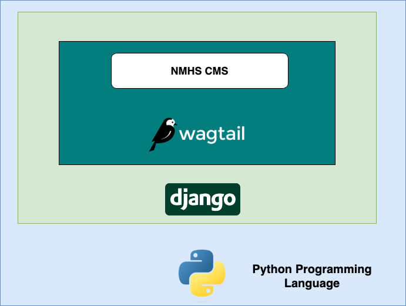
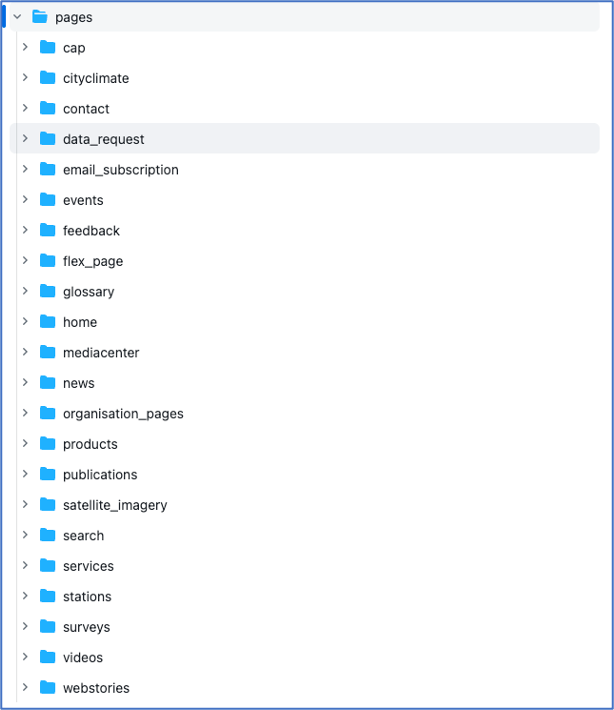
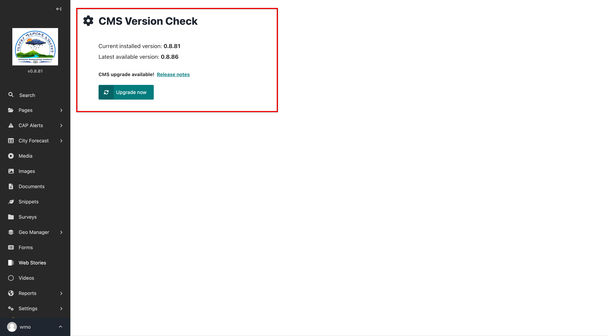

# Technology

The CMS includes tools and functionalities aimed at supporting the NMHSs in their daily website management activities,
in providing information and services to their users.

This section seeks to present the choice of technologies, development approach and present the packages that support the
functionalities available on the CMS at a high level.

The developed CMS is open-source and hosted on GitHub
at [https://github.com/wmo-raf/nmhs-cms](https://github.com/wmo-raf/nmhs-cms)

## Base CMS Framework

The website template is built on top of the open-source [Wagtail](https://wagtail.org/) Framework. Wagtail itself is
built on of [Django](https://www.djangoproject.com/) , which is a high-level Python web framework that encourages rapid
development and clean, pragmatic design

The following was taken into consideration when picking Wagtail as the framework of choice:

- **Python as the programming language**. The weather and climate domain requires a lot of interaction with scientific
  data. Python is one of the scripting languages that makes it easy to develop procedures for manipulating this kind of
  data. Developing a website using Python thus allows the flexibility of developing data-based functionalities

- **Easy to Use:** One of the key features of Wagtail is its intuitive, user-friendly interface. This makes it easy for
  content editors to manage websites without having to learn the complexities and technicalities of the underlying
  framework.

- **Flexibility:** Wagtail is flexible when it comes to creating and managing websites. It allows for quick development
  of highly customized websites with complex layouts, content, and features, based on what the content editors need.

- **Extensibility:** Wagtail is designed to be easily extended with a wide variety of plugins, themes, components, and
  other features. This allows to add new features, customise the look and feel of their website, and extend the
  functionality of the CMS.

- **Security:** Wagtail is designed with security in mind. It comes with Django's built-in security features such as
  user authentication, input validation, and protection against common attack methods.

- **Scalability:** Being based on Django, Wagtail is designed to be highly scalable, making it an ideal choice for
  websites with large amounts of content and users. It can handle large amounts of data without any performance issues,
  allowing developers to create websites that can grow as their user base increases.

- **Enterprise features out of the box:** Wagtail includes user and group permissions, content and moderation workflows,
  reports, content editing history tracking, and other features that website administrators and teams need.

- **Experience of the development team:** The current development team of the NMHSs CMS has extensive experience in
  developing Wagtail and Django based projects. This makes it quick to implement new features and functionality

## Development Approach

We use the Django/Wagtail modular approach of developing “Django applications” to provide a set of features and
functionality. A Django/Wagtail application is a Python package that provides some set of features. Applications may be
reused in various projects.

Applications include some combination of Django models, views, templates, template tags, static files, URLS, middleware
etc. These are then wired to the project with INSTALLED_APPS settings. An application thus, in this context, is a set of
code that interacts with various parts of the framework.

The NMHS CMS is thus designed with a set of internal applications that provide functionality for different webpages of
the functional website. These are organized under the pages directory of the CMS source code. Each sub directory of the
pages corresponds to a section on the website that can allows to create one or more related pages of that section

More specialized functionality is developed as external Wagtail applications that can be plugged into the code project.
These are then installed as Python packages published on the Python Package Index (PyPI) , which is a repository of
software for the Python programming language.

Below is a list of currently developed external applications that add required functionality to the NMHSs CMS

More specialized functionality is developed as external Wagtail applications that can be plugged into the code project.
These are then installed as Python packages published on the [Python Package Index (PyPI)](https://pypi.org/) , which is
a repository of software for the Python programming language.

Below is a list of currently developed external applications that add required functionality to the NMHSs CMS

### Functionality Packages

- [CAP Composer:](https://github.com/wmo-raf/cap-composer)  Common Alerting Protocol (CAP) composing and publishing tool
  that provides functionality to create and publish CAP formatted alerts.

- [Forecast Manager](https://github.com/wmo-raf/forecastmanager) – Interface for managing NMHSs City Forecasts

- [GeoManager](https://github.com/erick-otenyo/geomanager) - Provides an interactive interface for managing and
  publishing Geo-referenced (GIS) datasets

- [Administrative Boundary Manager:](https://github.com/erick-otenyo/adm-boundary-manager) Provides functionality to
  load, manage and visualize boundaries for a country

- [WebStories Editor](https://github.com/erick-otenyo/wagtail-webstories-editor) - Provides functionality to create and
  publish [Google Web Stories](https://creators.google/en-us/content-creation-products/own-your-content/web-stories/)

- [Surveys Creator](https://github.com/erick-otenyo/wagtail-surveyjs) – Provides functionality to create and publish
  surveys directly in the CMS, visualization and analysis of the results using interactive graphics

### Third party tools integration packages

#### Email Marketing

- [Mailchimp Integration:](https://github.com/erick-otenyo/wagtail-mailchimp-integration)
  Integrate [Mailchimp](https://mailchimp.com/) into Wagtail Projects

- [Mautic Integration:](https://github.com/erick-otenyo/wagtail-mautic-integration) Integration
  of [Mautic](https://www.mautic.org/) forms in Wagtail Projects.

#### Online Meetings

- [Zoom Integration:](https://github.com/erick-otenyo/wagtail-zoom-integration) Integrate [Zoom](https://zoom.us/)
  Events (meetings or webinars) registration to form pages created with Wagtail

### User Interface Frameworks and Libraries

- Templating - [Django based templates](https://docs.djangoproject.com/en/5.0/topics/templates/)
- CSS Framework - [Bulma](https://bulma.io/)
- JavaScript Library - [JQuery](https://jquery.com/)
- Web Mapping Library - [MapLibre GL JS](https://maplibre.org/)
- SVG Icon Sources - [Font Awesome](https://fontawesome.com/)
  , [Ocha Humanitarian Icons](https://web.brand.unocha.org/svg-icon-library)

## Developing new functionality

A modular approach is used when developing new functionality to be included in the CMS. The new functionality should be
developed in isolation as a Wagtail Python package and published on PyPi for installation using Pip.

We follow the following steps in general:

- Explore existing packages in the Wagtail/Django community that provide similar functionality.

- If an existing package exists and cannot be directly integrated into the CMS, we try to customize as much as we can on
  top of this package, to make it interoperable. Otherwise, we use it directly

- If we cannot find existing packages, then we develop the package from scratch. The idea is to avoid reinvention of the
  wheel where possible.

## Production Deployment

[Docker](https://www.docker.com/) is used to containerize the different components of the CMS.

Other containers used include

- [PostgreSQL](https://github.com/postgis/docker-postgis) with PostGIS extension as the database

- [Nginx](https://hub.docker.com/_/nginx) as the webserver and web proxy

- [Memcached](https://hub.docker.com/_/memcached) as the caching system for web requests

- [Eclipse Mosquitto](https://hub.docker.com/_/eclipse-mosquitto) as the MQTT message broker. Mainly used for CAP alerts
  messaging

These are put into a docker compose configuration file, used to deploy the project using Docker Compose.

An initialization repository is provided that brings together all the different components into one project. This can be
accessed at [https://github.com/wmo-raf/nmhs-cms-init](https://github.com/wmo-raf/nmhs-cms-init) . An installation guide
is provided in the README file of the repository.

## Managing Updates

New releases with bug fixes and feature updates are periodically published on
the [nmhs-cms repository releases](https://github.com/wmo-raf/nmhs-cms/releases).

When there is a new release, The CMS Admin interface will show a message indicating that there is a new release. The
Website administrator can then choose to upgrade to the new version, after going through the release notes that
accompany every release.

The upgrade is through a click of a button, that triggers a docker build process with the new versions. Once the new
version is built successfully, the container is restarted with the new version effected.

In rare cases where the automatic build trigger fails, the system admins are trained to manually perform the upgrade

## Security in Django/Wagtail

The CMS, by using Django/Wagtail, out of the box contains the following security features inbuilt. More details on each
feature can be found
at [https://docs.djangoproject.com/en/5.0/topics/security](https://docs.djangoproject.com/en/5.0/topics/security/)

- Cross site scripting (XSS) protection
- Cross site request forgery (CSRF) protection
- SQL Injection protection
- Clickjacking protection
- SSL\HTTPS protection settings
- Host header validation
- Referrer Policy Protection
- Cross-origin opener policy
- Session Security
- User-uploaded content protection

### CMS Specific security features:

- Ability to change admin url periodically
- Daily backup mechanisms
- Brute force login preventions 

