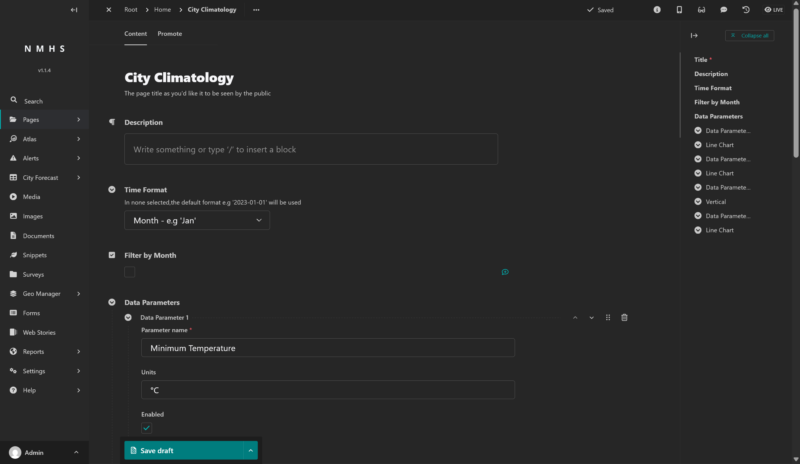
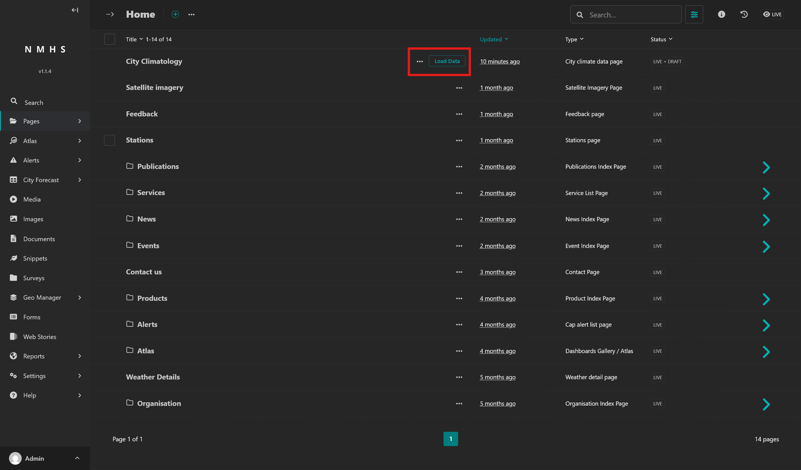
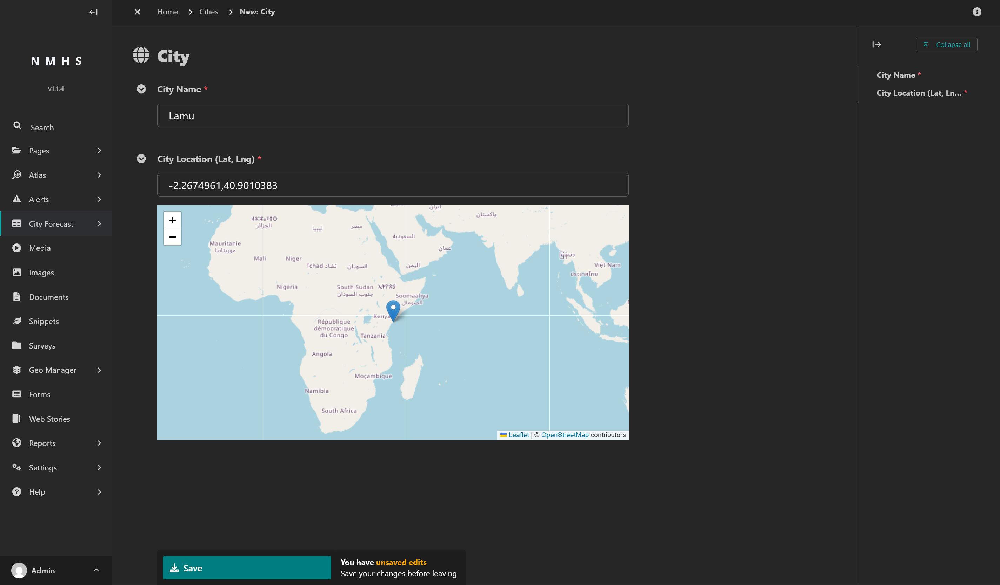
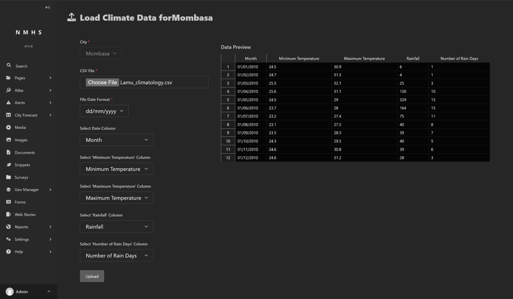
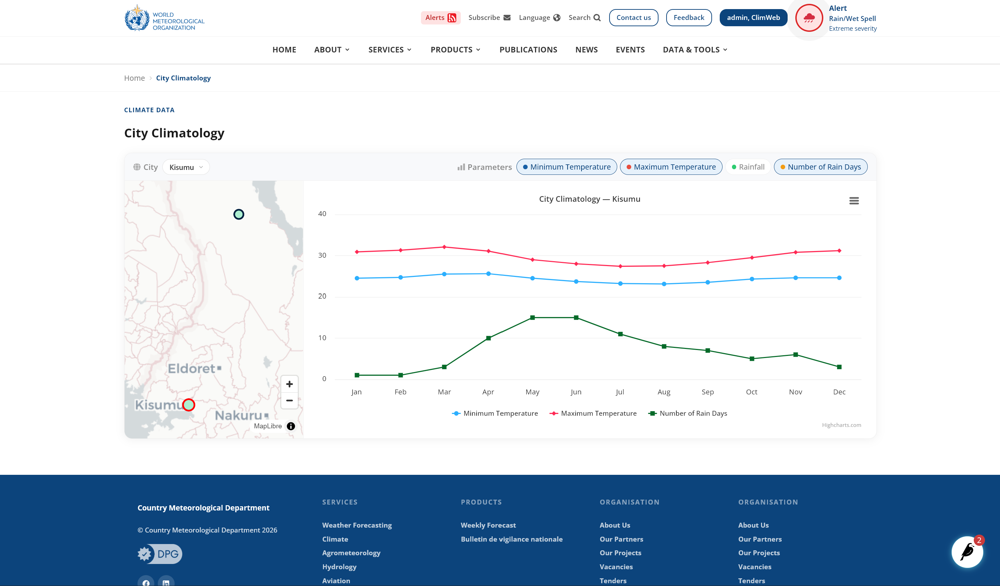

# City Climate

## Before you start

You need a ClimWeb admin account with staff access. Go to your site's admin URL (for example, `https://your-nmhs-site.org/cms-admin/`) and sign in with your credentials. Your system administrator should have given you this URL when your account was created. If you do not have it, ask them. It typically ends in `/cms-admin/` or `/admin/`. If you do not have an account, contact your system administrator.

For the CSV upload of city climate data, you also need a spreadsheet application such as Microsoft Excel or LibreOffice Calc.

## Managing the City Climate page

The City Climatology page can be accessed as below:

> **Note:** You must be logged in to the ClimWeb admin before following these steps. Go to your site's admin URL (for example, `https://your-nmhs-site.org/cms-admin/`) and sign in with your credentials.

Navigate to **Pages** in the explorer menu.

Go to **Home** and find **City Climatology**.

Here, you can find the admin console to control the City Climate page and how the data will be rendered.

Currently, there are 4 configurable data parameters: **Minimum Temperature**, **Maximum Temperature**, **Rainfall**, and **Number of Rain Days**.

For each data parameter, you can:
1. Edit the parameter name
2. Edit the units
3. Enable/Disable the parameter display on the public page
4. Configure the chart display options (chart type, color, etc.)

Inside the same page editor, you can also *add* a new **Data Parameters** at the bottom of the page.

## Managing the City Climate data a City Climate CSV

The steps to manage the current live City Climate data is as below:

### Step 1: Find City Climate page

Navigate to **Pages** in the explorer menu.

Go to **Home** and find **City Climatology**.

Choose **Load Data** next to the **City Climatology** page.

From the list of existing cities, you can:
1. Select a city to upload climate data
2. View the uploaded data of an existing city
3. Modify the uploaded data of an existing city

### Step 2: Upload City Climate data for a city

Assume you would like to publish monthly climate normals for one city, including:

- Minimum Temperature (deg C)
- Maximum Temperature (deg C)
- Rainfall (mm)
- Number of Rain Days

1. Select *Load Data* for an existing city
> To add a new city:  Navigate to **City Forecast -> Cities** and create one city, for example **Lamu**.

> 

2. Select your CSV file
3. Configure the data fields and file date format according to your data

4. Press *Upload*

## Configuring Chart Display
When using the chart, you can interact with the chart viewer to 
1. Select the displayed city
2. Toggle the displayed data field(s)

