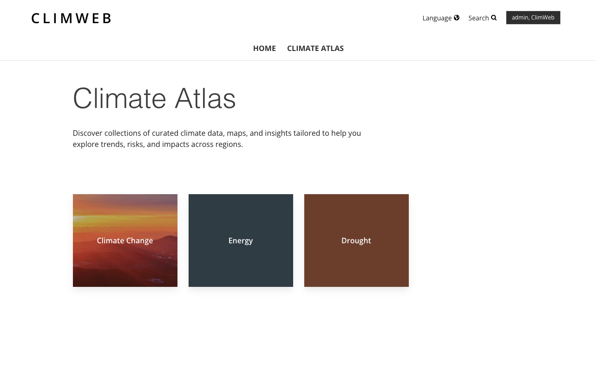
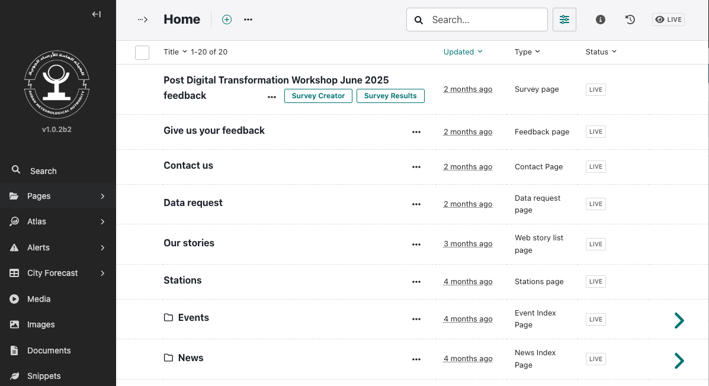
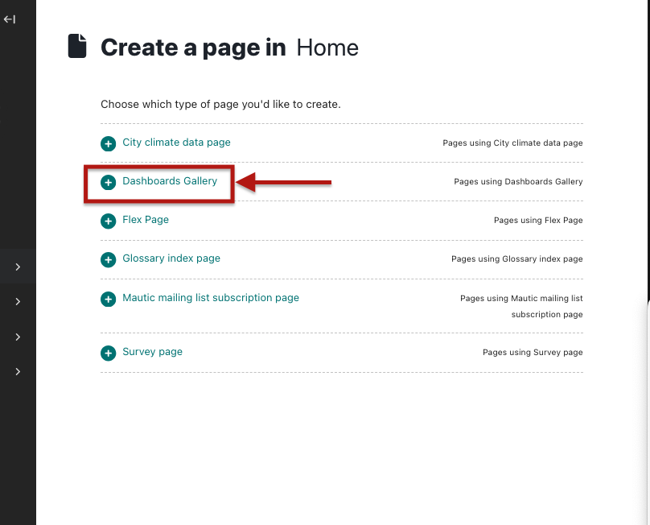
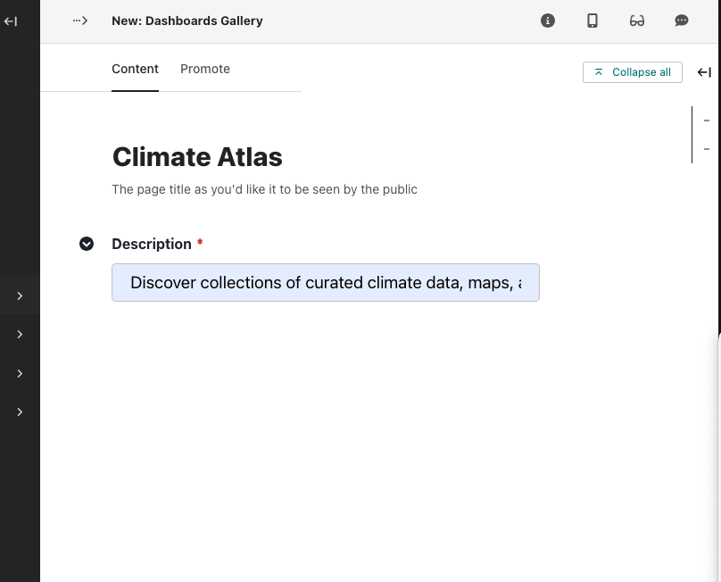
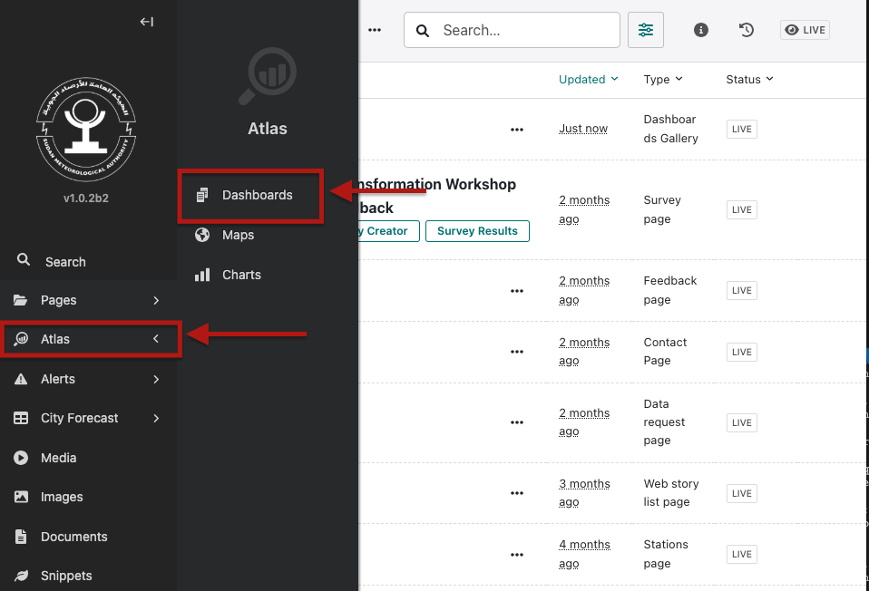
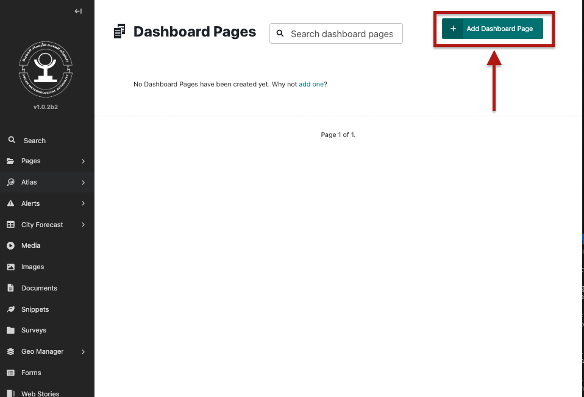

## Creating Dashboard Gallery

This section will guide you create and manage dashboards in an Atlas. 

### Accessing Dashboards Gallery / Atlas

This is the page that lists all dashboard.

1. Log in to the **Wagtail Admin**.
2. If this is the first time creating the dashboards you will be required to first create a parent Atlas/Dashboard Gallery page that houses all dashboards. Go to **Pages -> Home** and create it as a child page of the home page. This will require a title and description. 

3. In the left menu, go to **Atlas → Dashboards**. 

4. Select an existing dashboard or click **Add Dashboard Page** to create a new one.

