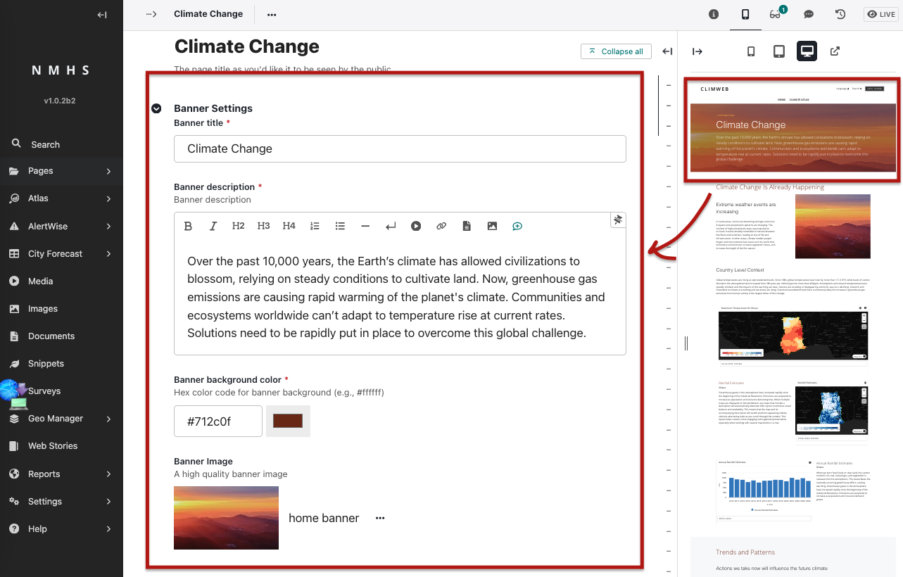
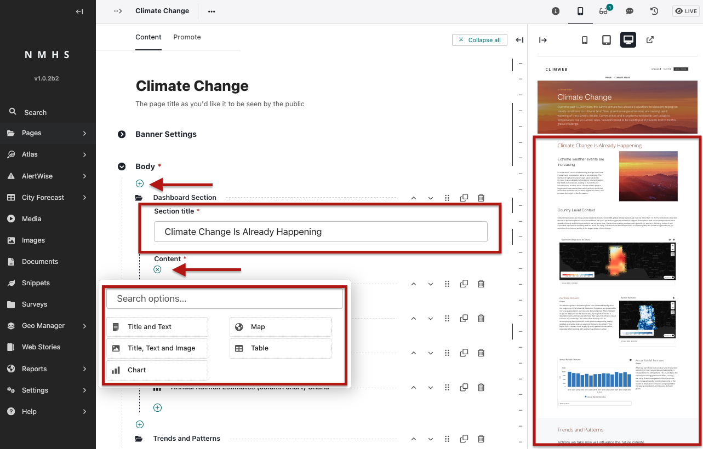

## Creating a Dashboard Page

When creating a new Dashboard Page:

 

* Enter a **page title**, **banner title** and optional **banner description**.
* Choose a **background color** (theme for the atlas that will be used for section headings) and **banner image** if desired.
* In the body, add sections containing content using reusable **blocks** (explained below). Each Section requires a section title and description. You can build dashboards using different block types:

   1. **Title & Text Block** – Simple block for adding a section heading and supporting text.
   2. **Title, Text & Image Block** – A heading, text, and image side by side.
   3. **Table Block** – Add tabular data (rows and columns).
   4. **Map Block** – Display an interactive map (from a Map Snippet).
   5. **Chart Block** – Display a chart (from a Chart Snippet).

Once blocks are added, scroll to the bottom of the page. Click **Save Draft** to preview or **Publish** to make the dashboard live.
