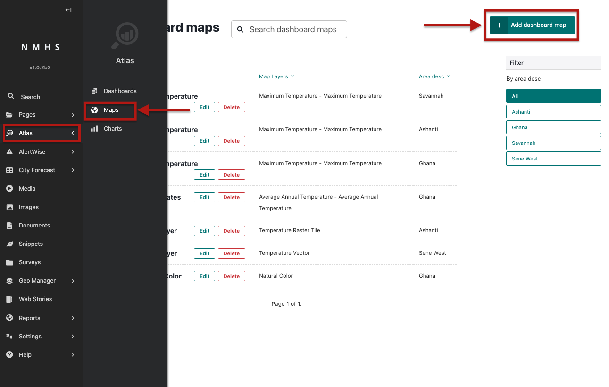
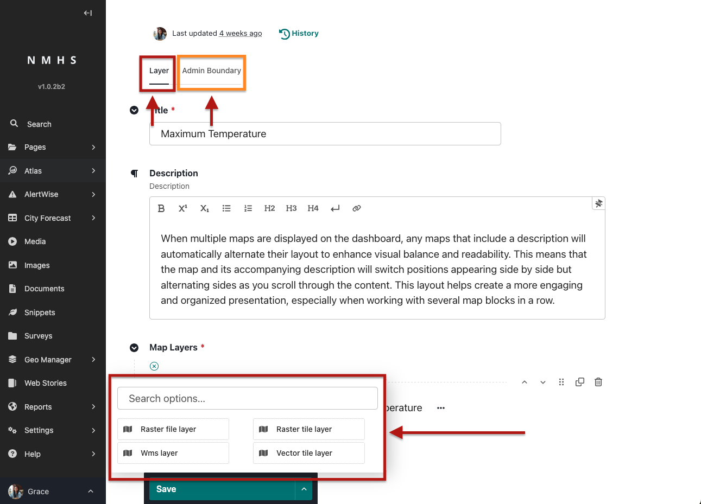
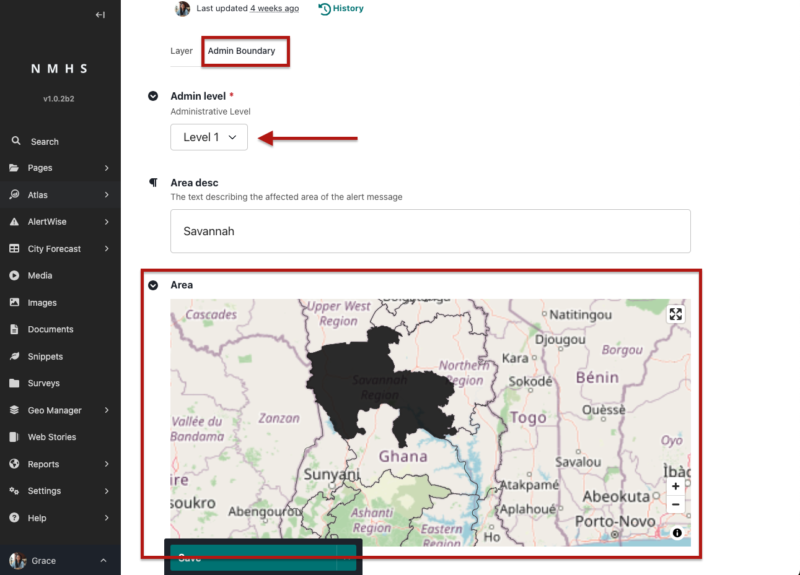
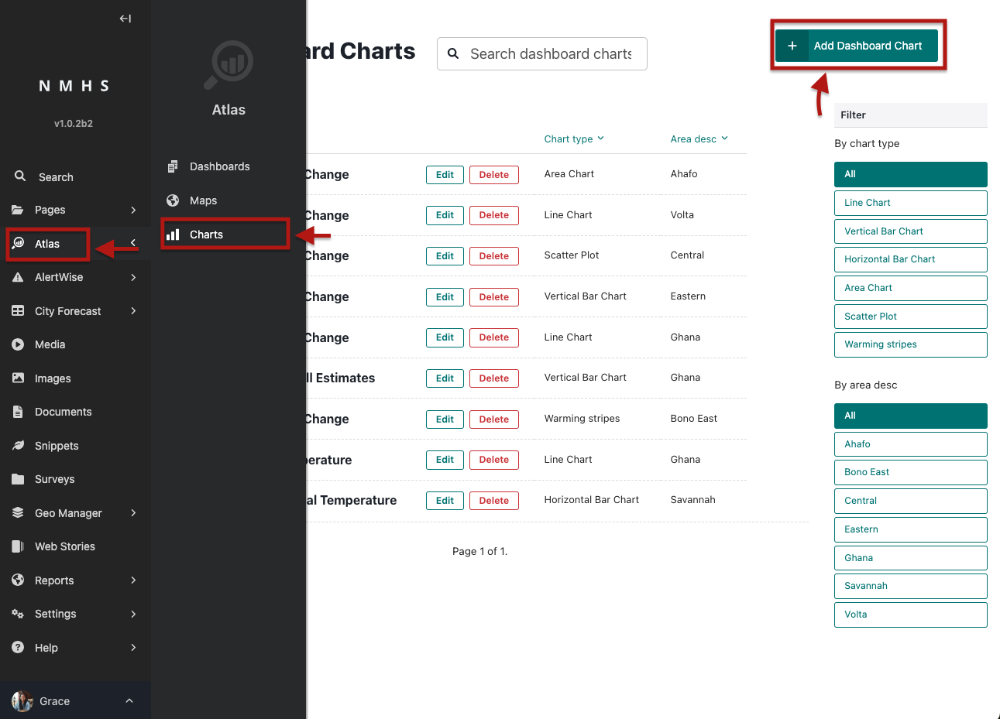
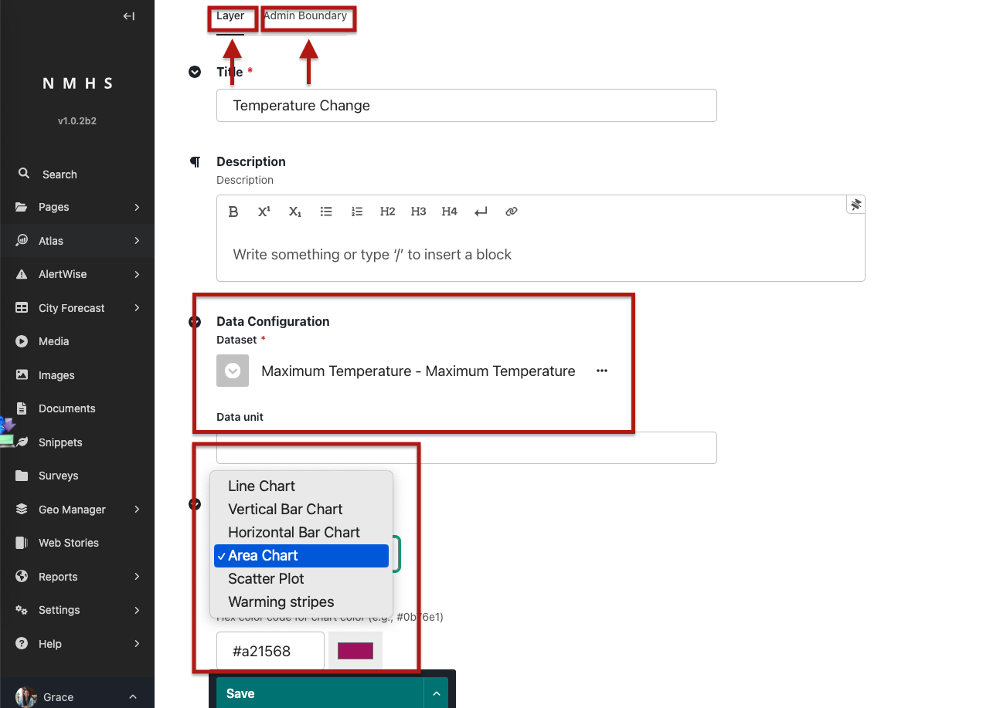

## Creating Reusable Maps and Charts (Snippets)

Snippets are reusable components for maps and charts. You must first create these before you can add them to a dashboard page.

### How to Create a Map Snippet

1. In Admin Menu, go to **Atlas → Maps → Add Map**.
2. Fill in the following:

   * **Title** – A short name for the map.
   * **Optional Description** – Explains what the map shows.
   * **Dataset** – Choose from datasets created in **GeoManager**.
   * **Layer Type** – One per snippet (**Raster File Layer**, **Raster Tile Layer**, **WMS Layer**, or **Vector Tile Layer**).
   * **Legend** – Already defined in **GeoManager** when creating the dataset (not in the snippet).
   * **Admin Area** – Select an admin level and then click on the map to generate the area description.
3. Save the snippet.

**Note:** Each snippet can only contain **one layer**.

---

### How to Create a Chart Snippet

1. In Wagtail Admin, go to **Snippets → Dashboard Charts → Add Chart**.
2. Fill in the following:

   * **Title** – A short name for the chart.
   * **Optional Description** – A short explanation of the chart.
   * **Dataset** – Choose the dataset that will power the chart.
   * **Chart Type** -  available options are bar graph, column graph, line chart, area chart and heatmap
   * **Chart Colour** - The color that will be applied to the graph when styling the data.
   * **Admin Area** – Select an admin level and then click on the map to generate the area description.

3. Save the snippet.

---

## Block Layout Rules

* Blocks can be arranged in any order.
* **When two Map blocks or two Chart blocks appear consecutively and each has a description**, the **text/title alternates sides automatically**:

  * Example: First block → text on the left, map/chart on the right.
  * Next block → text on the right, map/chart on the left.
* This ensures dashboards remain visually balanced and easy to read.

✅ With this setup, you can create rich dashboards combining **text, images, tables, maps, and charts**—all styled for clarity and interactivity.