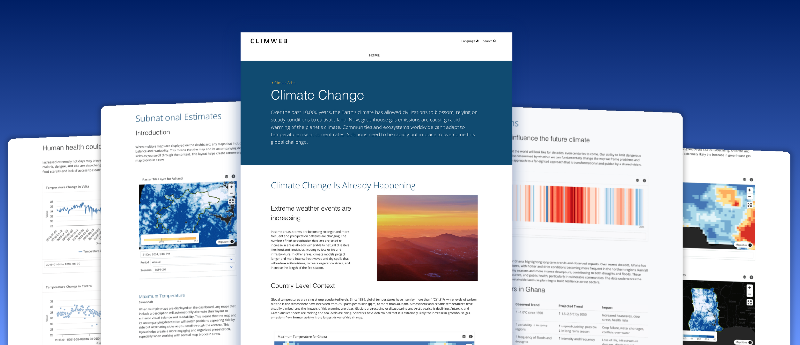

# Atlas | Interactive Dashboards




The Atlas is a component of climweb that enables **modular, reusable, and CMS-editable dashboards** that bring together maps, charts, warming stripes, and narrative content for effective climate data storytelling. This component is **linked to the geomanager/mapviewer component** within climweb allowing linkage with already created datasets/layers and boundary data. It features:
- **Interactive dashboards** built using reusable blocks for maps, charts, text, images, and other components — enabling flexible and modular page layouts
- **Dynamic maps** supporting raster, vector tile, and WMS layers with custom symbology and legend options
- **Warming stripes** for a visual summary of long-term temperature trends
- **Customizable charts** for time-series and comparative analysis in bar, column, line or scatter plots
- A **user-friendly CMS** that allows teams to manage and update dashboard content independently
- Analysis at different **admin levels**

---

```{toctree}
---
maxdepth: 1
---
Create-Dashboard-Gallery
Create-Dashboard
Create-Snippets
FAQ
Troubleshooting
```


