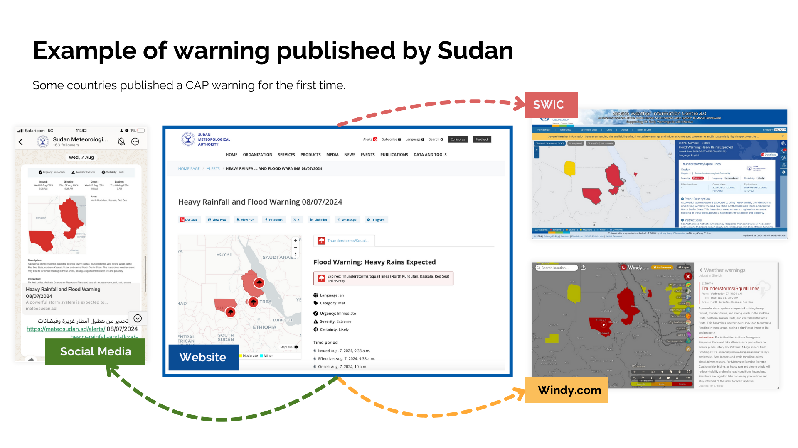

# CAPComposer Features

## CAP Warning Composer Features

The CAPComposer tool is a solution that provides a range of functionalities to support the NMHS in seamlessly issuing
CAP. It has been developed with an aim of increasing the adoption of CAP by NMHS in Africa.

Some of the key features of
the tool include:

## 🌟 Features

- Modern user-friendly composer that follows [CAP 1.2](http://docs.oasis-open.org/emergency/cap/v1.2/CAP-v1.2-os.html)
  standard. Built on top of the awesome [Wagtail CMS](https://wagtail.org)
- Preview a CAP alert as you edit. Save drafts for sharing with colleagues and collaborating
- Inbuilt CAP validation. The page will not save if you have not input the required data according to CAP standard
- User-friendly alert area map tool that allows multiple ways of constructing alert geographic areas, while keeping the
  interface simple
    - Upload and use your country/territory's administrative boundaries
    - Draw a polygon
    - Draw a circle
    - Selecting predefined areas that you create beforehand for common alert areas
- Inbuilt publishing workflow using Wagtail's powerful page model, with automated emails to composers and approvers
- Collaborate with team members using inbuilt comments (similar to how you could do in Word) with automated
  notifications. Request for changes and approvals
- Publish realtime notifications/messages to third party integrations using MQTT messaging protocol
- Predefine a list of hazards types monitored by your institution, with intuitive icons
  from [OCHA humanitarian icons](https://brand.unocha.org/d/xEPytAUjC3sH/icons#/humanitarian-icons)
- Extendable to add your custom logic and functionality. The package provides an `abstract` django model that can be
  inherited for customizations.