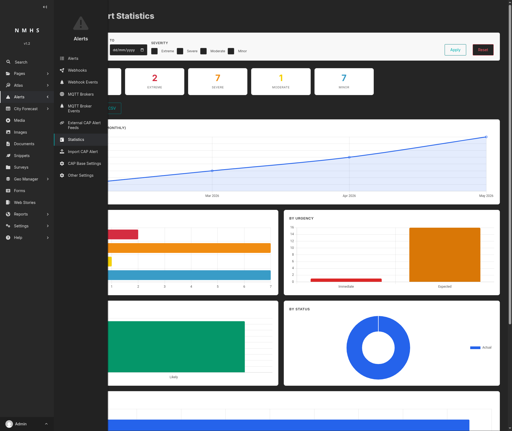
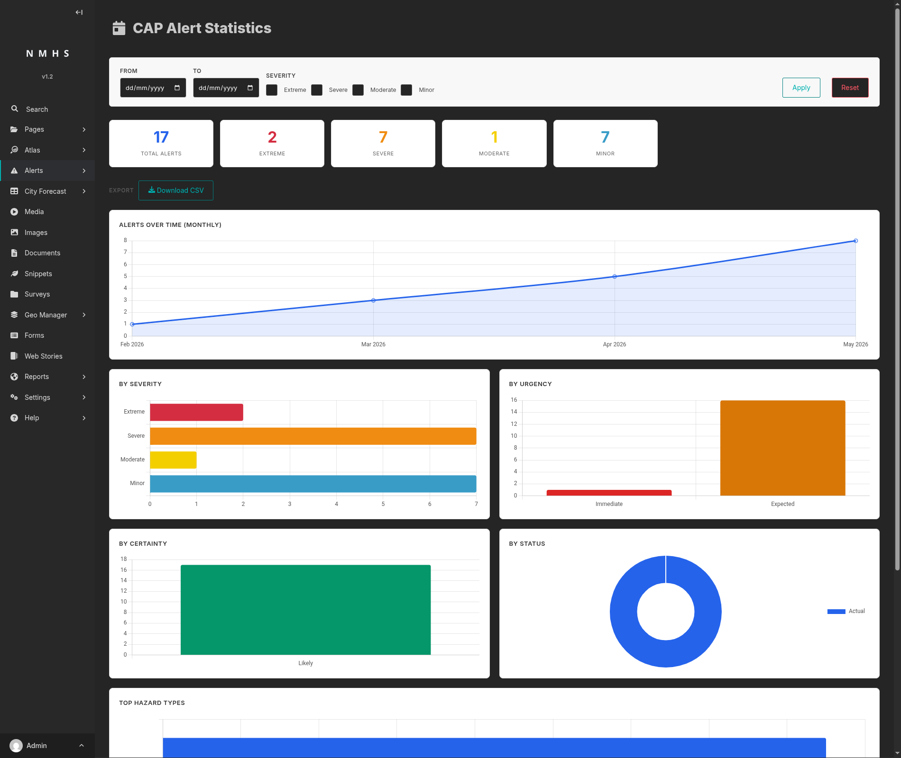
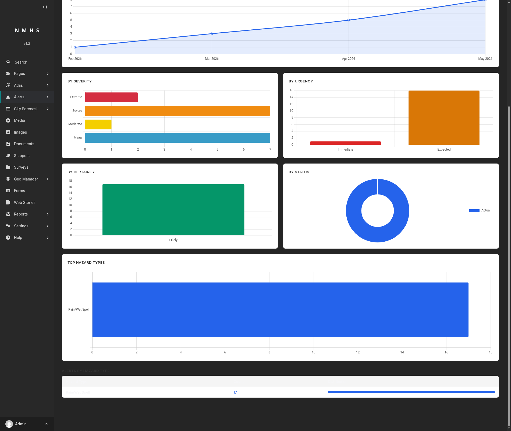

# CAP Alert Statistics

## Purpose

Displays counts and charts for CAP alerts on your site, including drafts: totals by severity, urgency, certainty,
status, and hazard type, along with a monthly trend. Alerts can be filtered by date range and severity, and the
filtered set can be exported as CSV.

To open it: **Alerts → Statistics**.

## Screenshot

The page opens with the filter bar, summary cards, and CSV export button, followed by all six charts: alerts over
time, by severity, by urgency, by certainty, by status, and top hazard types.

Below the Top Hazard Types chart, a table lists each hazard type with its count and share of the total.

## Field Reference

### Filter bar

| Field | Type | Required | Description |
|---|---|---|---|
| From | Date | No | Restricts results to alerts sent on or after this date. |
| To | Date | No | Restricts results to alerts sent on or before this date. |
| Severity | Checkboxes (Extreme, Severe, Moderate, Minor) | No | Restricts results to the checked severities. With none checked, all severities are included. |

**Apply** runs the filters. **Reset** clears them. Filters apply to the summary cards, charts, breakdown table, and
CSV export together.

### Summary cards

| Card | Shows |
|---|---|
| Total Alerts | Count of alerts matching the current filters. |
| Extreme / Severe / Moderate / Minor | Count of alerts at that severity level. A card appears only if at least one matching alert has that severity. |

Alerts with no recorded severity, such as incomplete drafts or alerts imported from an external CAP feed missing
that field, count toward Total Alerts without a corresponding card. The four severity cards do not always sum to
the total.

### Charts

| Chart | Shows |
|---|---|
| Alerts Over Time (Monthly) | Alert count per calendar month, as a line chart. |
| By Severity | Matching alerts grouped by severity level. |
| By Urgency | Matching alerts grouped by urgency (Immediate, Expected, Future, Past). |
| By Certainty | Matching alerts grouped by certainty (Observed, Likely, Possible, Unlikely). |
| By Status | Matching alerts grouped by status (Actual, Test, Exercise, Draft, System), as a donut chart. |
| Top Hazard Types | The 15 most common hazard/event types among matching alerts, as a horizontal bar chart. |

Charts with no matching data are hidden.

### Alerts by Hazard Type (table)

Lists the top 15 hazard types among the matching alerts, with each type's count and its share of the total as a
proportional bar. Percentages are computed against the true total alert count, not the sum of the listed types. With
more than 15 hazard types in use, the remainder are omitted and the listed percentages will not sum to 100%.

### Export

**Download CSV** exports every alert matching the current filters, not only the ones charted, as a CSV file with one
row per alert and these columns: ID, Title, Sent, Status, Message Type, Scope, Sender, Severity, Urgency, Certainty,
Event, and Area Description.
