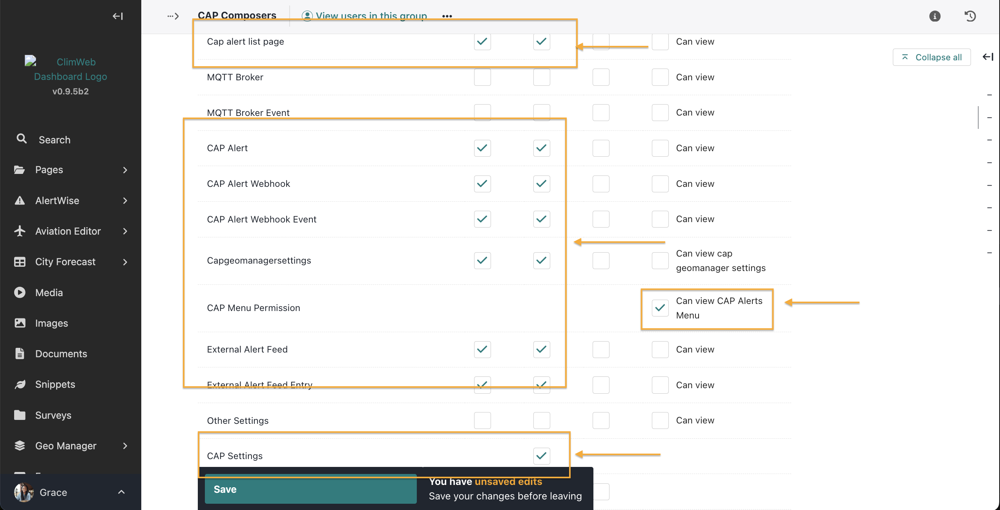

# CAP Composer and Approver Roles and Publishing Workflows

Within CAP, roles such as "Composer" and "Approver" are essential to ensure the accuracy and authorization of alerts before dissemination.

**CAP Composer Role:**

A CAP Composer is responsible for creating and drafting alert messages. This role involves collecting pertinent information about an incident and structuring it according to the CAP format. The Composer ensures that all necessary details are included to inform the public or specific agencies effectively.

**CAP Approver Role:**

The CAP Approver reviews the alerts composed by the Composer. This role is crucial for validating the content, ensuring compliance with organizational protocols, and authorizing the release of the alert to the intended audience. The Approver acts as a quality control measure to prevent the dissemination of incorrect or unauthorized information.

**Configuring Composer and Approver Roles**

The general process for setting up Composer and Approver roles involves the following steps:

1. **Access the User Management or Administration Section:**
   - Navigate to the system's settings where users and groups are managed. 

2. **Define Roles and Permissions:**
   - Click on groups
   - Create roles/groups titled "Composer" and "Approver."

   

   - Assign permissions to each role based on their responsibilities:
     - **Composer:** Permissions to create and edit alerts but not to publish them.

    

    

    

     - **Approver:** Permissions to review, approve, or reject alerts, and to publish approved alerts.

     

     

3. **Assign Users to Roles:**
   - Allocate users to the Composer and Approver roles based on their job functions and expertise.

>**_Note:_** Ensure to enable 2Factor authenitcation for the Approver role

4. **Implement Approval Workflows:**
   - Configure the system's workflow to require approval from an Approver before an alert created by a Composer can be published.

5. **Test the Workflow:**
   - Conduct tests to ensure that alerts follow the correct path from composition to approval and finally to dissemination.
