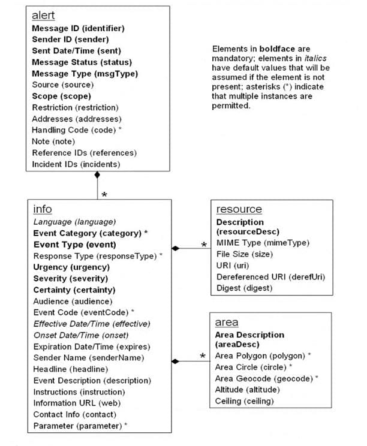
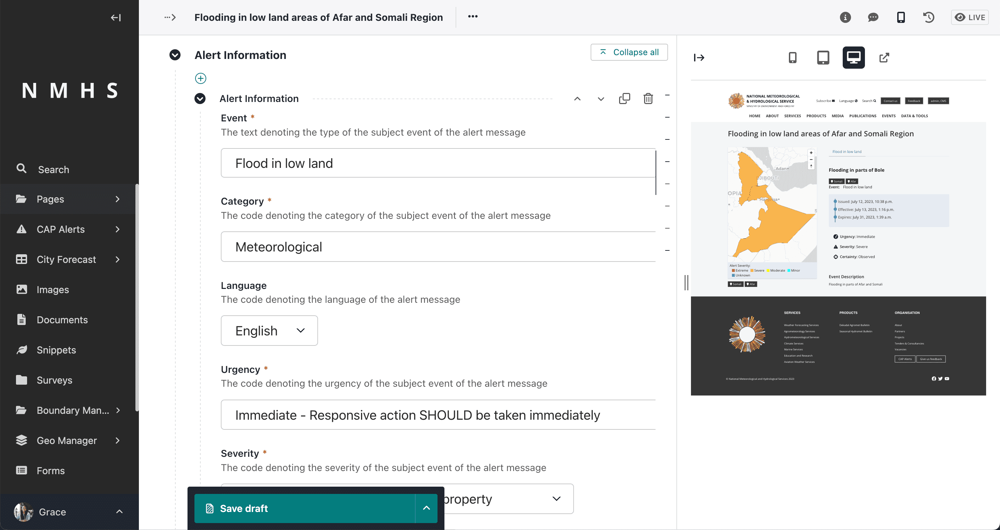
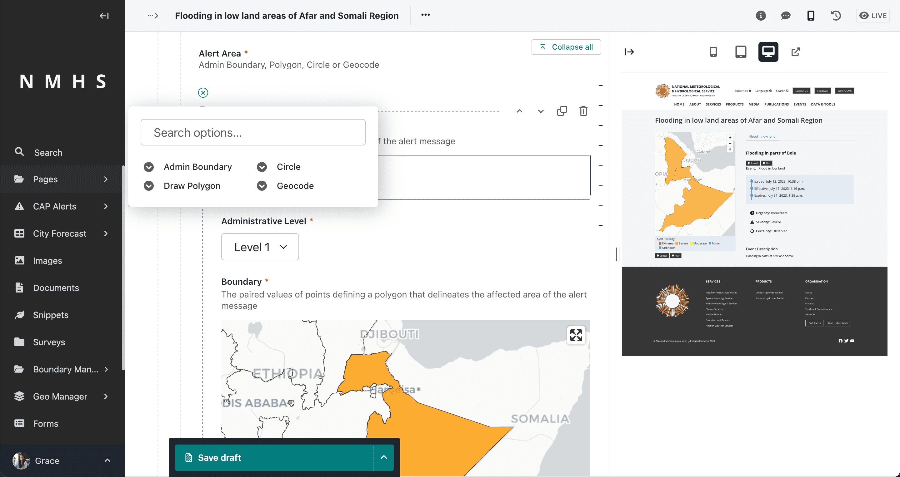
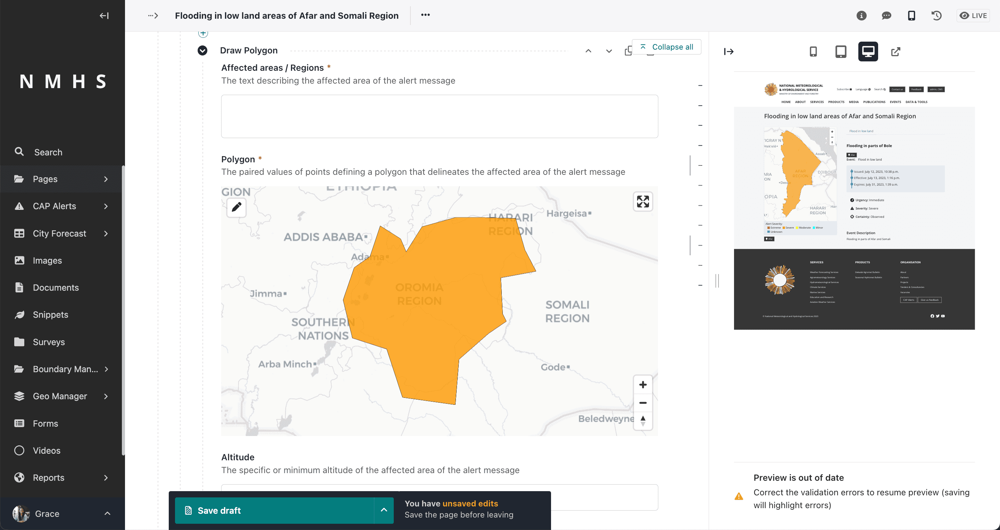
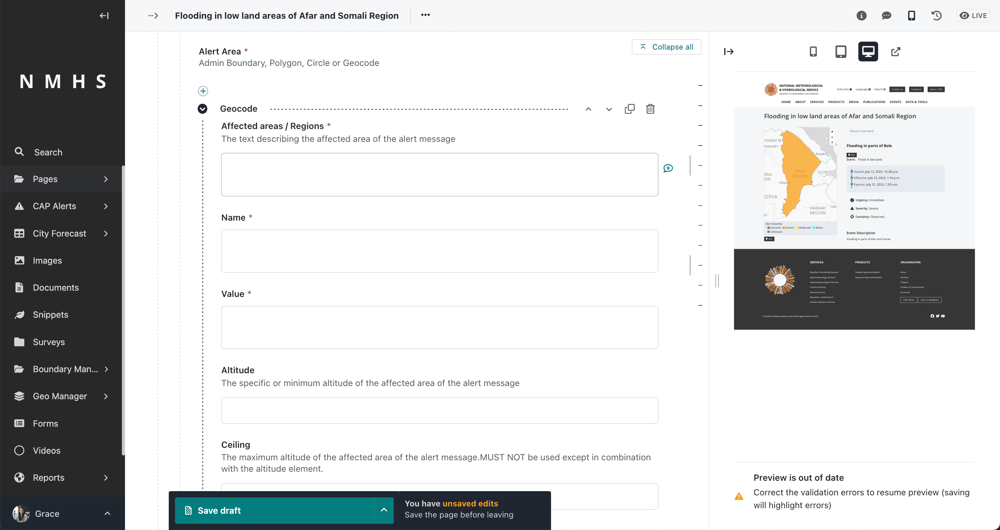
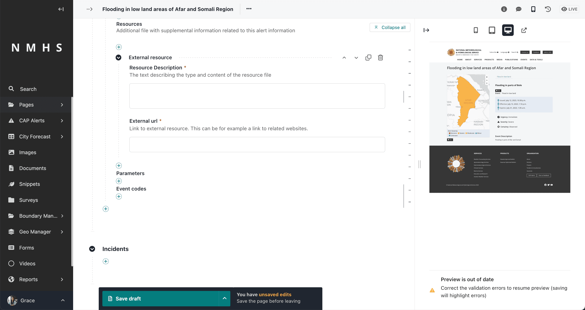

# Creating CAP Alerts

To create a CAP Alert access the CAP composing interface from the explorer menu as below and add a new cap alert page:


------------------------------------------------------------------------

## Sections in the Alert Page and corresponding XML

The overall Document Object Model of an alert is as below:



### Alert Identification

It contains the following entities required for a valid CAP message:

- Sender ID(sender),
- Sent Dat/Time (sent),
- Message Status (status),
- Message Type (msgType),
- Scope(scope),
- Restriction (restriction),
- Addresses (addresses),
- Note (note),
- Reference IDs (references) and
- Incident ids (incidents).

The alert identifier is generated automatically and is not editable.

```{note}
Some fields are visible based on selection of different parameters.
```


### Alert Information

Corresponds to the `<info>` element in the CAP message. The <info> entity specifies the alert's details. At least
one <info> block is required for an alert. If you support multiple languages, it is recommended that you use one <info>
block for each language for the same <alert> entity.:

A CAP message expects at least one `<info>` element to be present. Multiple `<info>` blocks should all have the
same `<category>` and `<event>` element values.

Each `Information` block contains the following elements:

- Langauge (langauge
- Event Category/Categories (category)
- Event Type (event)
- Response Type/Types (responseType)
- Urgency (urgency)
- Severity (severity)
- Certainty (certainty)
- Audience (audience)
- Event Code/Codes (eventCode)
- Effective Date/Time (effective)
- Onset Date/Time (onset)
- Expiration Date/Time (expires)
- Sender Name (senderName)
- Headline(headline)
- Event description (description)
- Instructions (instruction)
- Information URL (web),
- Contact Info (contact) and
- Parameter/Parameters(parameter)



#### Alert Area

Information Entity that defines the geographic area to be notified. Multiple areas can be defined in the alert. Each
area contains the following elements:

- Area Description (areaDesc),
- Area Polygon/Polygons (polygon),
- Area Circle/Circles (circle),
- Area Geocode/Geocodes (geocode),
- Altitude (altitude),
- Ceiling (ceiling)



The Alert area input has 4 selector options:

- Admin Boundary (area is picked from predefined boundaries). To use this option, ensure that admin boundaries are
  initially loaded. Refer to [Setting up boundaries](./Setting-Boundaries.md) section.


- Polygon (drawing a polygon). If you have not yet uploaded boundaries refer to [Setting boundaries Section](./Setting-Boundaries.md#setting-boundaries)



- Circle (drawing a circle which specifies the latitude, longitude and radius)


- Geocode (specifying area geocode name and value). Using this option presumes knowleged of the coding system



#### Alert Resource

Entity that defines supplemental information related to an <info> object Multiple instances of this section are allowed.
It contains:

- Description (resourceDesc), MIME Type (mimeType), File Size (size), URI (uri), Dereferenced URI (derefUri) and
  Digest (digest)**

The Alert resource input has 2 selector options:

- File resource (takes in a file and description)


- External resource



#### Additional CAP Inputs

Addition alert information elements include parameters and event codes

### Incidents

This defines the reference incident to the current alert, if any.


---