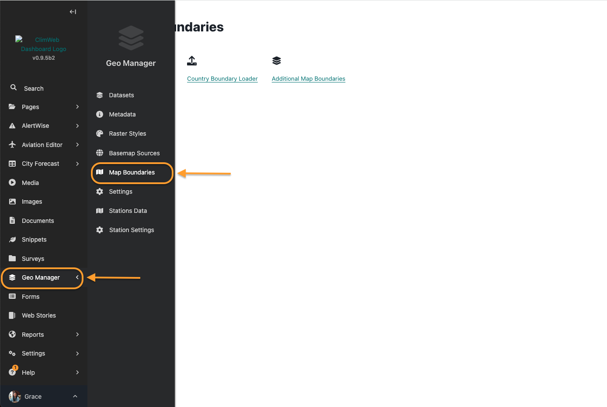
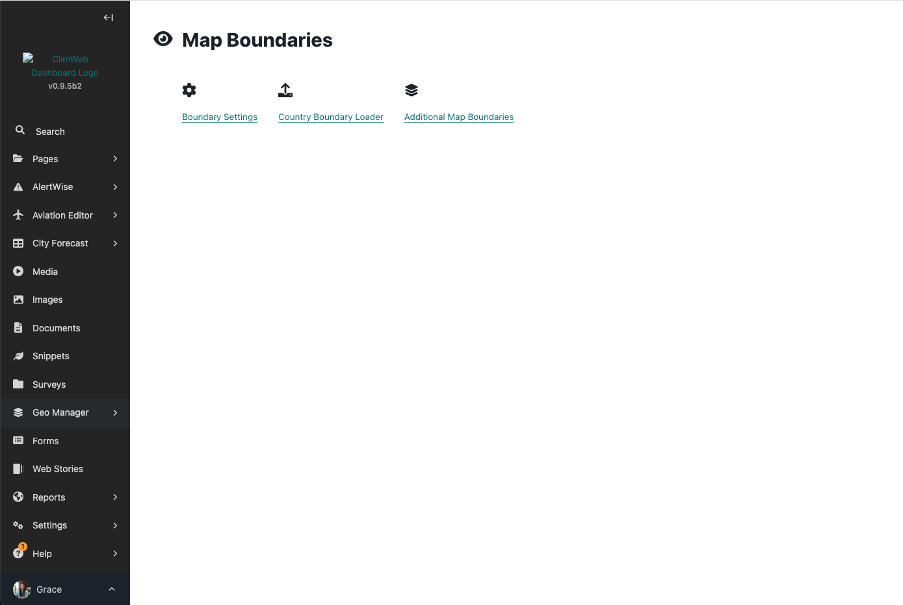
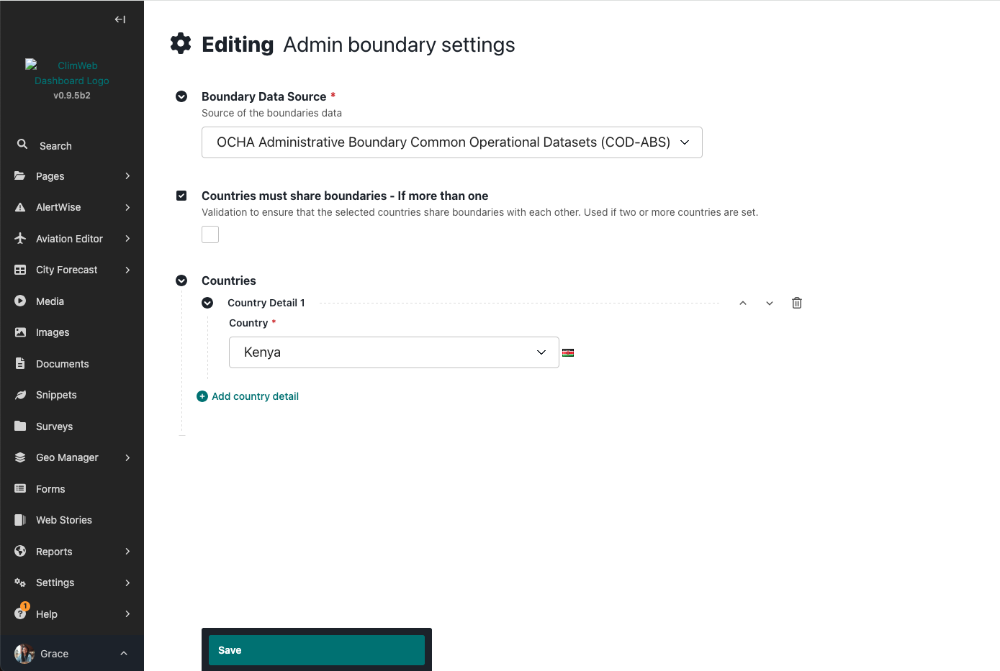
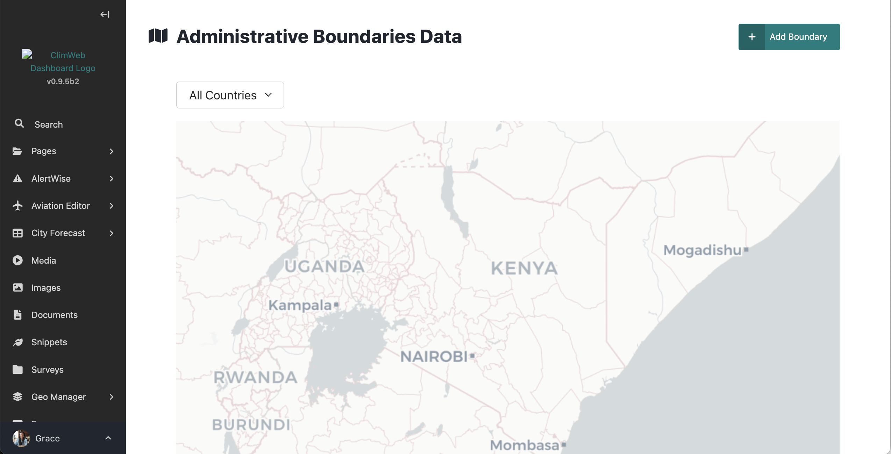
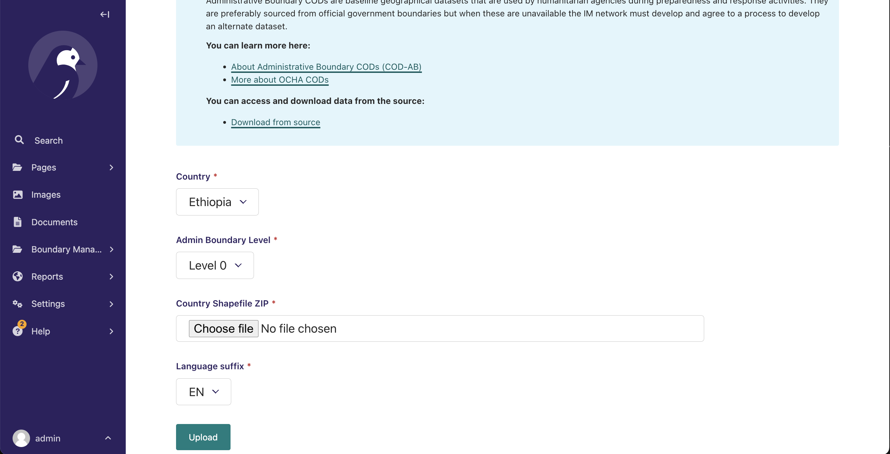

# Setting Boundaries

This section guides you on how to set up boundaries which are useful in the creating an [Alert Area by polygon]() .


<!-- TODO : Link to this section above -->

The Geo Manager allows for the addition of boundaries to be used in the creation of an alert area using the admin boundary option.



To access it, click on the geomanager in the explorer menu as below and select 'Boundary settings' to select the boundary data source and country/countries of interest. You will then need to add boundary data for the countries selected:




Select the 'boundary data source' where you will download the boundaries. The current options are:

- OCHA Administrative Boundary common Operational Datasets (COD-ABS) (*default*) https://data.humdata.org/
- Global Administrative Areas 4.1 (GADM) https://gadm.org/download_country.html




Add one or more countries

To add boundary data, access the menu as below and click on 'Country Boundary Loader' and click 'Add boundary' button:




Load country boundaries at each of different levels (level 0 to 4) in zipped shapefile format



```{note}
Zip shapefiles seperately by Admin levels before upload. 
```
