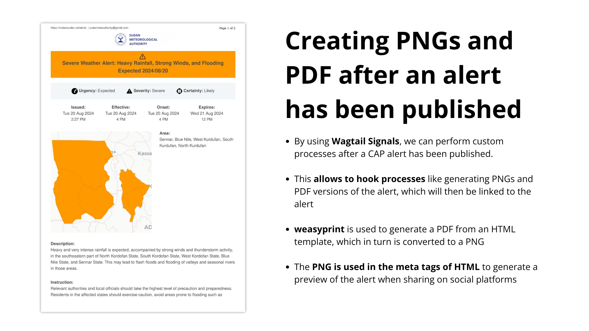
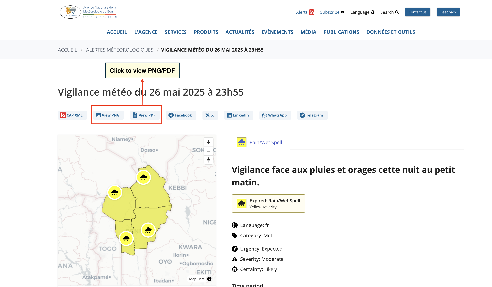
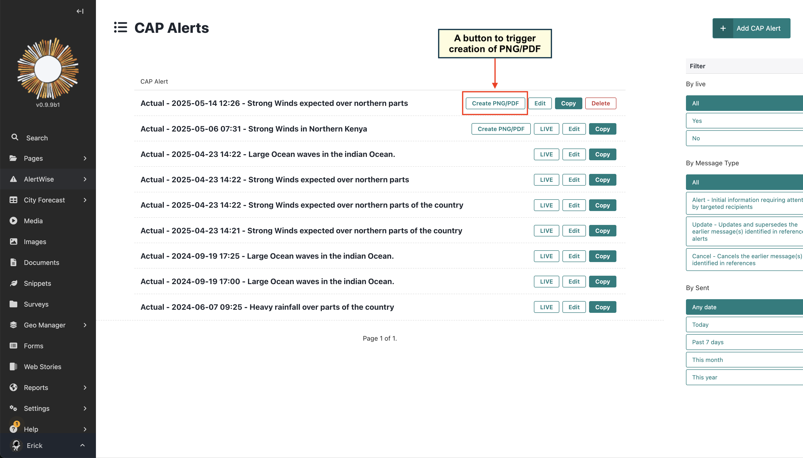

# Generating PNG/PDF

A PNG and PDF version of a published CAP is generated automatically after publishing an alert.



The links to view/download the PNG and PDF files are available on the published CAP detail page



If for some reason the PNG or PDF files are not generated, you can manually trigger the generation by clicking the "
Create PNG/PDF" button on the Admin page of the CAP.



```{note}
The `Create PNG/PDF` button is only available for CAPs that have been published. If the CAP is not published, the
button will not be visible.
```