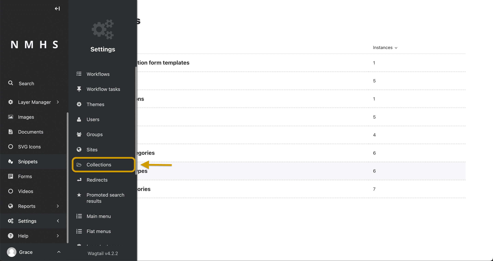
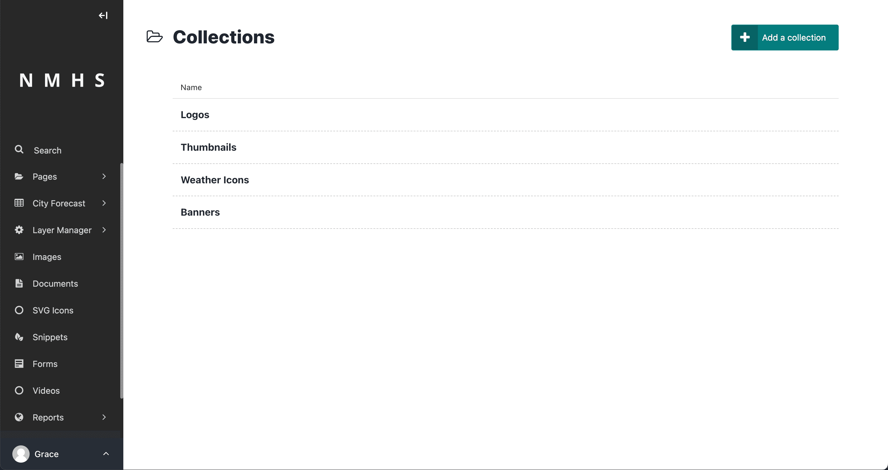
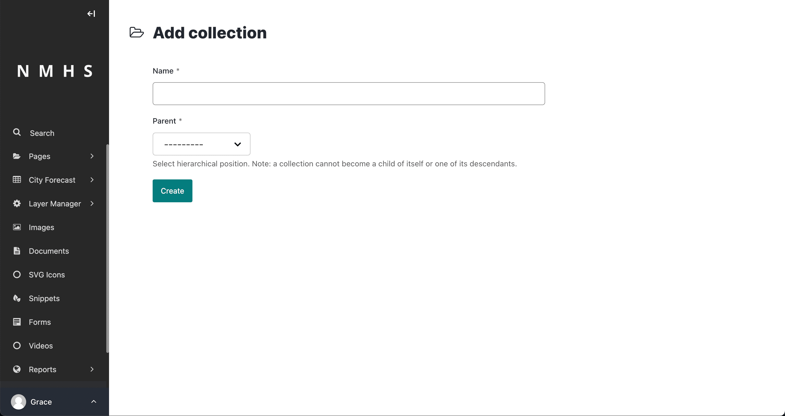
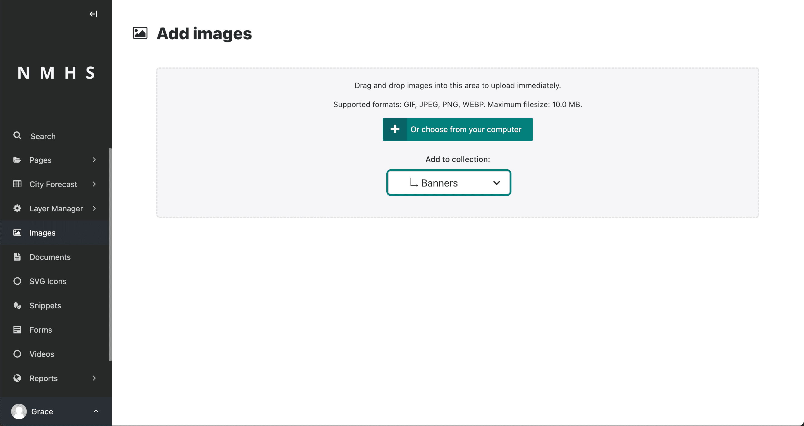
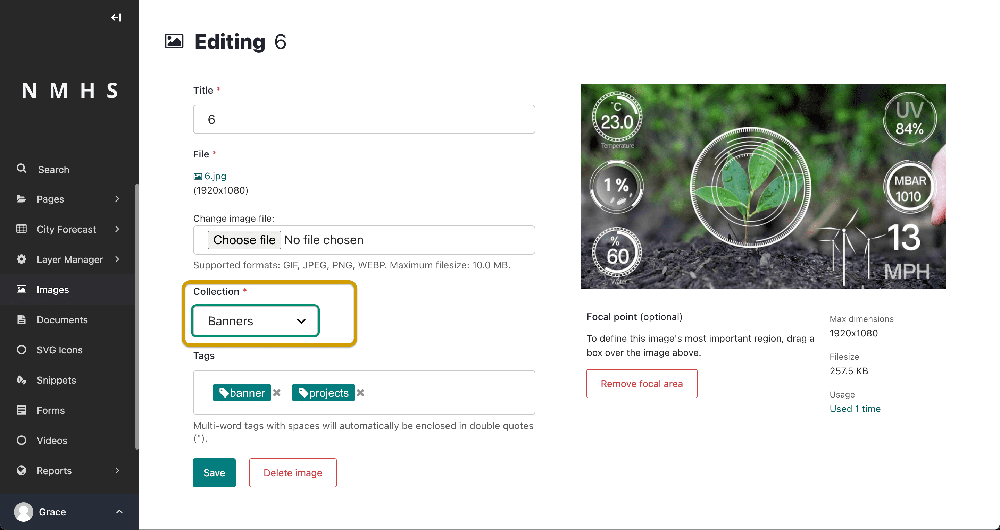
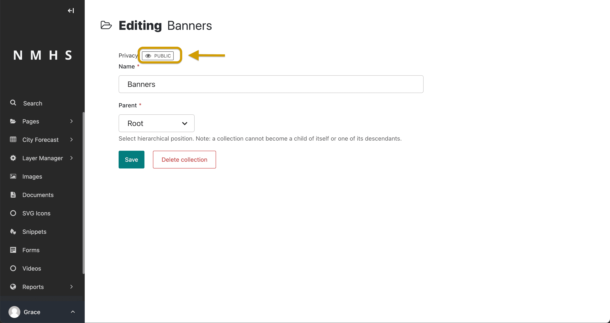
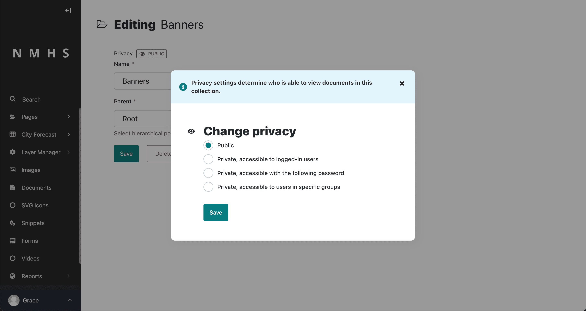

# Collections

You can control access to specific sets of images and documents by setting up collections. By default, all images and documents belong to the root collection, but users with appropriate permissions can create new collections from the Collections interface. Go to Settings > Collections from the Wagtail Sidebar to access the Collections interface.

---

## Add a collection

To create a collection, click **Add a collection** from the Collections interface. Then enter a name in the **Name** field and select a parent. Click **Create** to complete the creation process.

## Add images or documents to a collection

To add images to a collection, click Images from the Wagtail sidebar and select a collection from the Collections dropdown. Then click Add an image and follow the instructions on the screen.

The process of adding documents to a collection is similar to that of images. Click Documents from the Sidebar and select a collection from the Collections dropdown. Then click Add a document and follow the instructions on the screen.

It's possible to add an image or document to a collection while editing them. To do this, click Images or Documents from the Sidebar and select the image or document you want to add to a collection by clicking it. Then choose a collection from the Collection dropdown in the edit screen.

You can also select a collection as part of uploading multiple images or documents.

## Privacy settings

To set permissions to determine who is able to view documents within a collection, go to **Settings > Collections** and select a collection. Then click **Privacy** preceding the collection name.

Clicking Privacy gives you a pop-up modal from which you can select the level of privacy for the collection.

The permissions set on a collection apply to that collection and all collections below it in the hierarchy. Therefore, if you make the root collection private, all documents on the site become private. Permissions set in other collections only apply to those collections.

> Privacy settings added to a collection are only enforced for documents within the collection. Privacy settings do not apply to images.