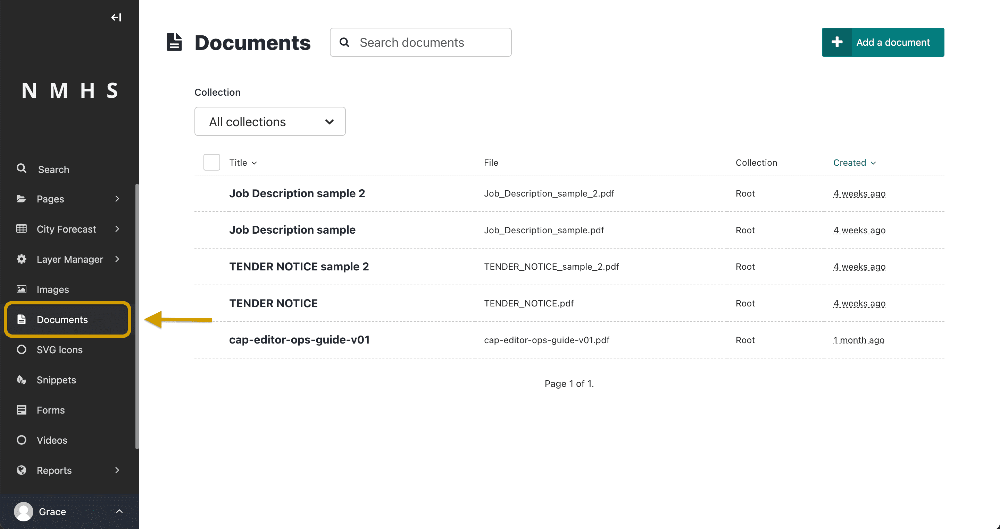
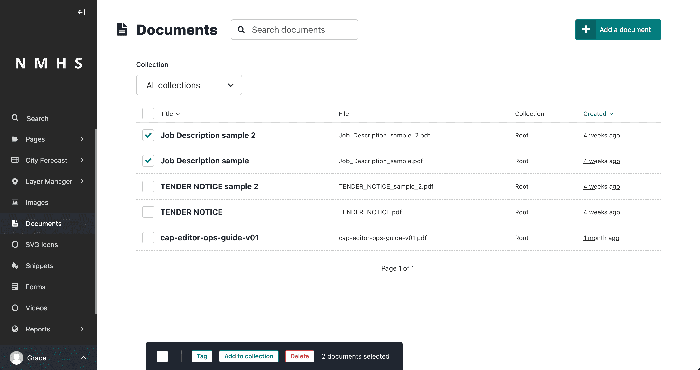
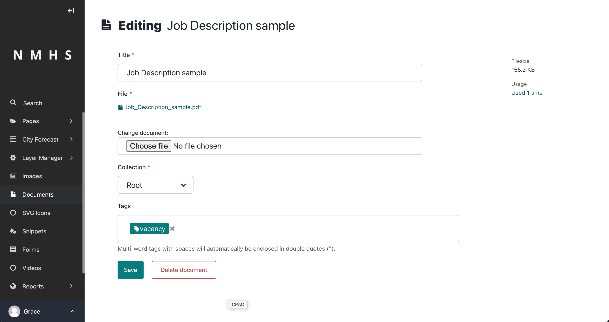
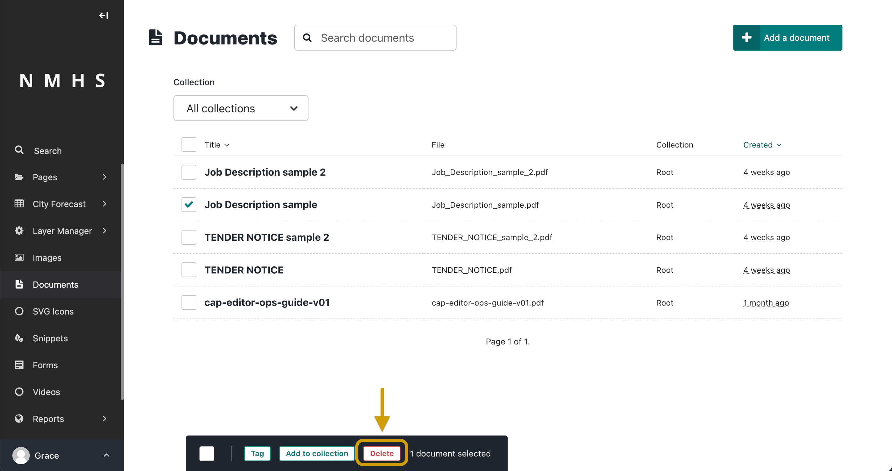

# Documents

You can manage documents such as PDF files from the Documents interface. To access the Documents interface, click Documents in the Sidebar. This interface allows you to add documents to and remove documents from the Admin interface.

Add documents by clicking Add documents at the top right of the documents interface. Search for previously added documents by entering the title of the document in the search bar. The results automatically update as you type. You can also filter the results by Collection by selecting a collection from the Collection dropdown preceding the documents list.

Select multiple documents by clicking the checkbox on the left side of each document, then use the bulk actions bar at the bottom to perform an action on all selected documents.

If you want to edit a document, click the title of the document. Doing this takes you to the edit screen.

When editing a document, you can replace the file associated with that document record. This means you can update documents without having to update the pages they're on. Changing the file changes it on all pages that use the document. You can also change the collection of the document by clicking on the Collection dropdown on the edit page and selecting a new collection of your choice. Add or remove tags using the Tags field on the edit screen. Once you are done editing a document, save your edits by clicking Save at the bottom of the edit screen.

To completely delete a document and its record, select the document by clicking the checkbox at the left-hand side of the document record row in the Documents interface. Then click Delete from the action bar displayed at the bottom of the Documents interface.

You can also delete a document and its record from the edit screen when editing a document by clicking Delete document at the bottom of the edit screen.

> Deleted documents cannot be recovered.

