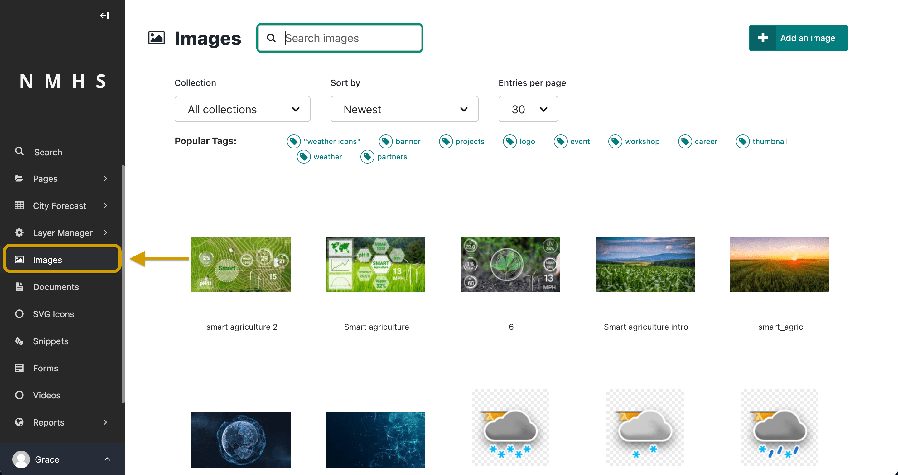
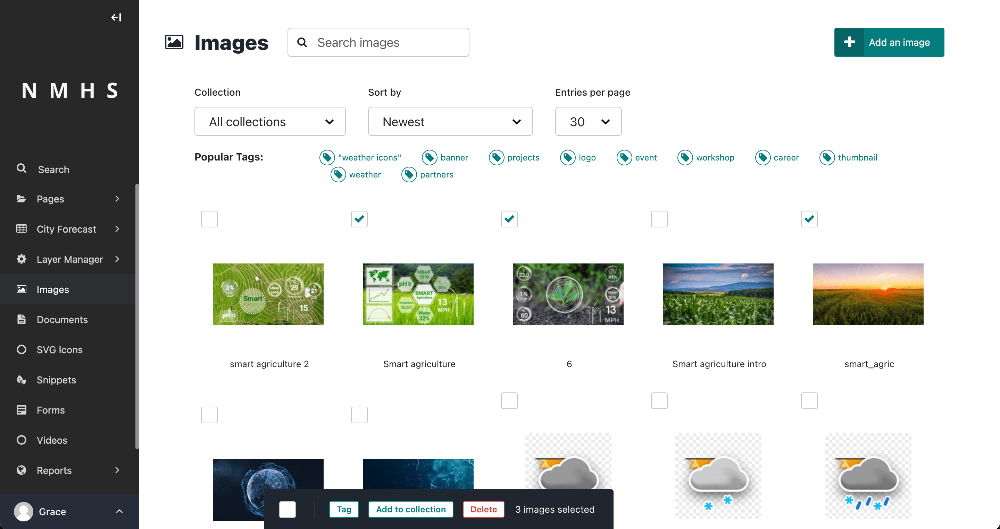
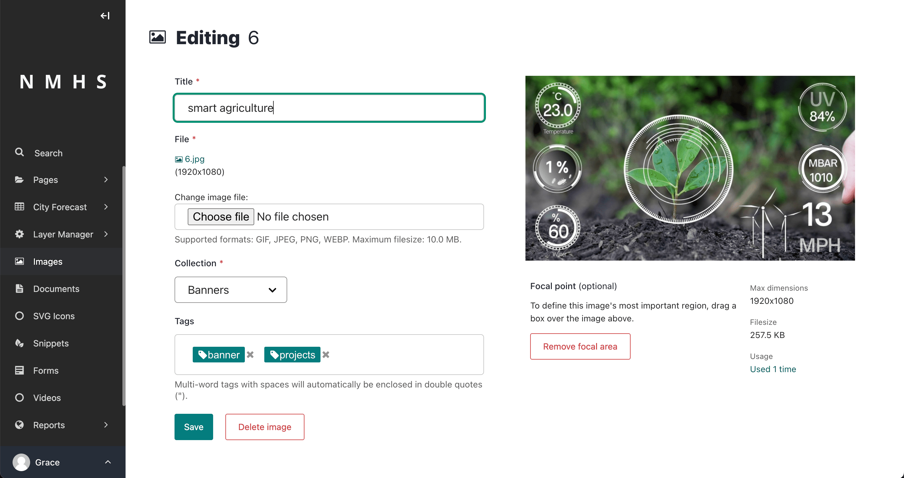

# Images

## Add, edit, and remove images

If you want to edit, add, or remove images from the Admin interface outside of the individual pages, you can do so from the Images interface. To access the Images interface, click Images in the Sidebar.

It is possible to select multiple images from the Images interface at once. To do this, select the checkbox on the top left of each image block, then use the bulk actions bar at the bottom to perform an action on all selected images.

Also, the ClimWeb allows you to edit the data associated with an image by clicking on the image to access its edit screen. Image data includes the title, the file, the collection associated with it, the associated tags, and the focal area.

Changing the image file when editing an image updates the image without updating the pages on which it appears.

> Changing the file will change it on all pages that use the image.

## Set the focal area of an image

The Images interface allows you to set a focal area, which can affect how your image displays to visitors on the front end. If you crop your images in some way to make them fit into a specific shape, then the focal area defines the centre point from which you crop the images.

You can set the focal area of an image by clicking the image to access its edit screen. Then drag a marquee around the most significant element of the image, and then click Save to save it. Once you set the focal area of an image and save it, you can see the most significant element of the image on the front end.

To remove the focal area, click Remove focal area in the edit screen.

