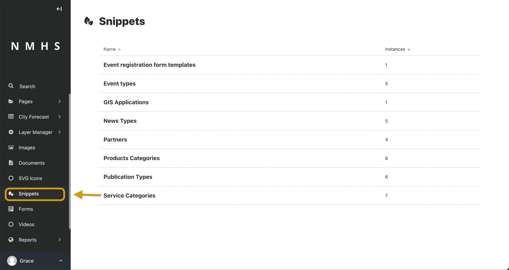

# Snippets

## Using Snippets

Snippets allow you to create elements on a website once and reuse them in multiple places. You only have to change something in a snippet once, and the changes appear in all occurrences.

The use of snippets varies between websites. Wagtail developers use snippets for the following purposes:

For blog post authors. As a result, you can add them to multiple pages and manage them from one place.
For adverts. This way, you can apply them site-wide or on individual pages.
To manage links in a global area of the site. For example, in the footer.
For calls to action, such as newsletter sign-up blocks, that may be consistent across many different pages.

## The Snippets Menu

You can access the snippets by clicking **Snippets** in the Sidebar. Clicking **Snippets** takes you to the Snippets interface. To add, edit, or delete a snippet, click the snippet type that interests you. Clicking the snippet type takes you to the edit screen, from which you can add, edit, or delete a snippet. Hovering over an individual snippet displays the options to edit or delete that snippet. To add a new snippet to the snippet type, click **Add (snippet type)**.

>Editing a snippet changes it on all of the pages on which it appears. In the top-right corner of the Snippet edit screen, you can see a label saying how many times you have used the snippet. Clicking this label displays a listing of all of these pages.

## Add snippets while editing a page

Open the Snippets interface in a new tab while editing the page by pressing Ctrl+click in Windows or cmd+click in macOS. You can also open a new tab by right-clicking it and then selecting the Open in new tab option. Add the new snippet from this new tab as you normally would. Then return to your existing tab and reopen the Snippet chooser window by clicking Snippets from the Sidebar.

Congratulation, you can now see your new snippet, even though you didn’t leave the edit page.

> Even though this is possible, it is advisable to save your page as a draft as often as possible. This prevents you from accidentally exiting the edit page and losing your changes.