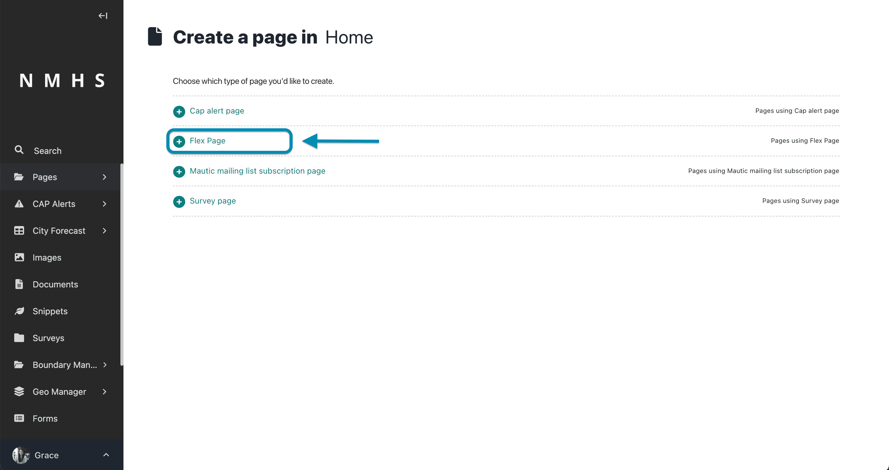
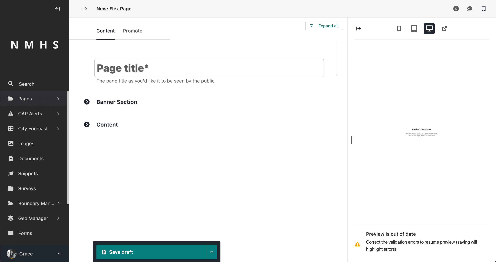
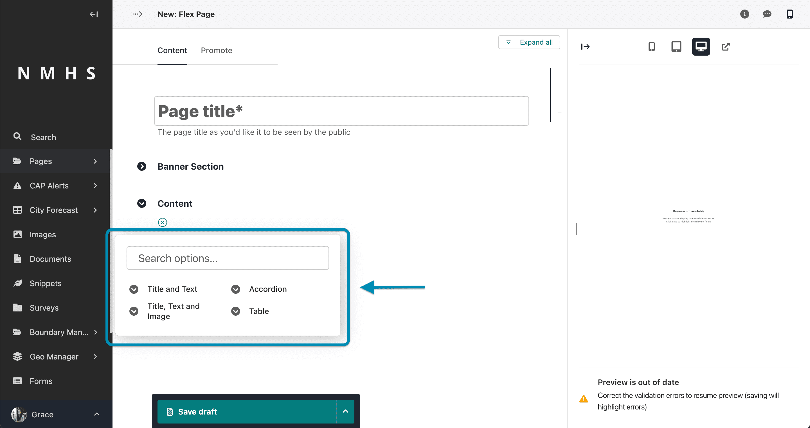
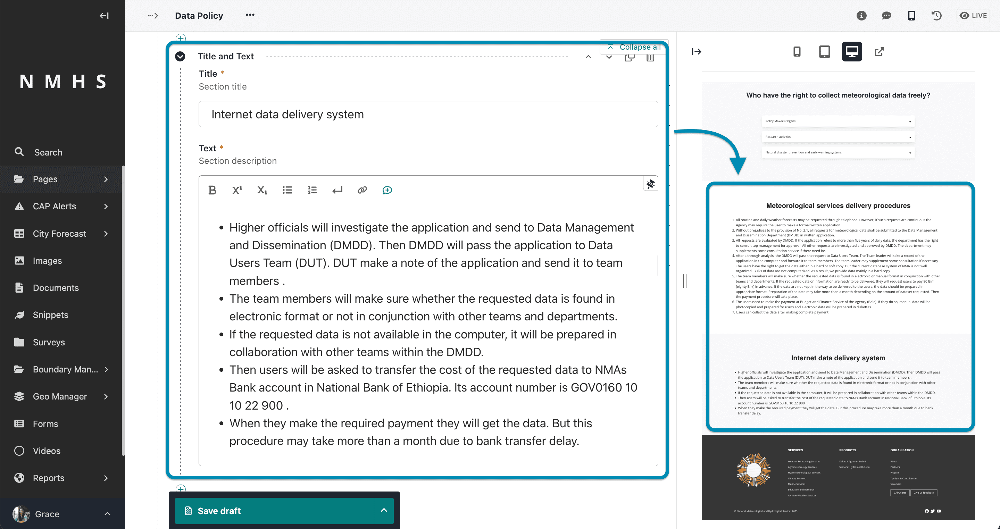
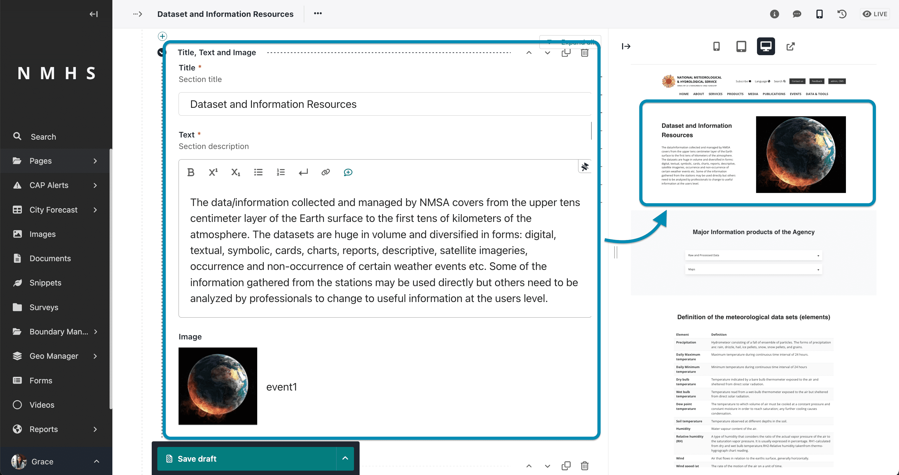
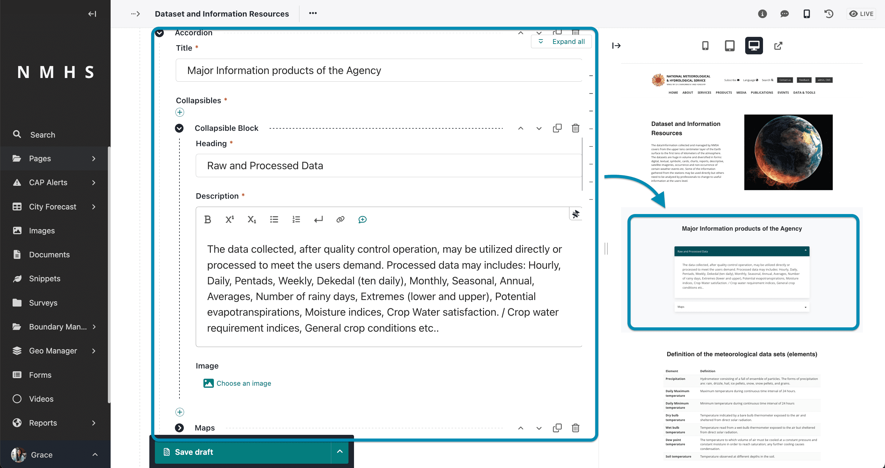
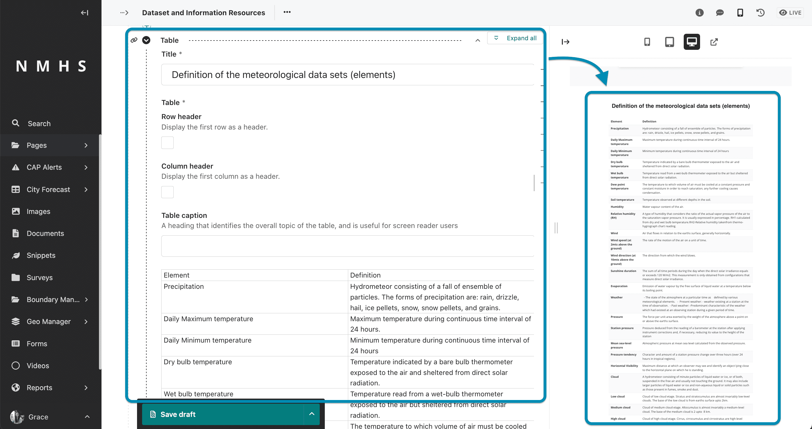

# Flexible Pages (Flex Page)

This is a type of content page that offers a high degree of customization and flexibility in terms of layout and content structure. Unlike other pages above, which have a fixed set of predefined fields, a Flex Page allows you to add various content blocks and sections to create dynamic and richly structured pages.

With a Flex Page, you have the flexibility to add, rearrange, and customize these content blocks within the page editor. This enables you to build complex and unique page layouts without the need for technical expertise or assistance from developers.

The ability to create Flex Pages is one of the features that make Wagtail a powerful and user-friendly ClimWeb. It allows website administrators and editors to have greater control over the presentation of content, making it easier to maintain a consistent design while accommodating diverse content needs across different pages of the website.

---

## Create a Flex Page

To create this page navigate to the 'pages' item on the explorer menu as shown below and click on the pages item at the top.

Hover over the Home item and click 'Add Child Page'

Select Flex Page from the type of pages provided.

---

## Sections of a Flex Page

The main sections of the flex page include the **page title, banner and content** section.

The **content section** contains a set of resuable and reorderable blocks, i.e

1. Title and Text Block

    

    ---
2. Title, Text and Image Block

    

    ---

3. Accordion Block
    

    ---

4. Table Block
    

    ---

