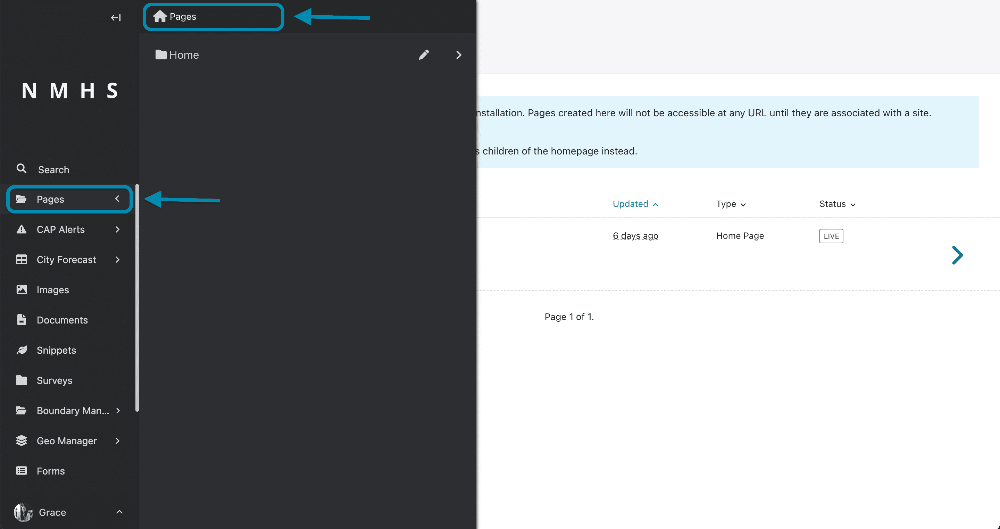

# Forms and Email Notifications

ClimWeb includes built-in form pages designed to facilitate communication between the public, external stakeholders, and National Meteorological and Hydrological Services (NMHSs).

These form pages allow visitors to send inquiries, request observational or forecast data, and provide feedback on NMHS services. Each form can be configured to automatically send email notifications to designated staff members whenever a submission occurs.

The built-in form types include:

1. **Contact Us Page** (`ContactPage`) — For general inquiries, office locations, and public correspondence.
2. **Data Request Page** (`DataRequestPage`) — For official requests for climate, weather, or hydrological datasets, including supporting document/letter uploads.
3. **Feedback Page** (`FeedbackPage`) — For collecting public feedback, suggestions, and service ratings.
4. **Flexible Form Page** (`FlexibleFormPage`) — Reusable form pages that can be placed in different sections of the website for custom surveys or registrations.

---

## 1. Prerequisites: Server Email (SMTP) Configuration

Before form pages can deliver email notifications, the ClimWeb server must be configured with valid outgoing email (SMTP) credentials. These settings are configured via environment variables (typically in your `.env` file).

| Environment Variable | Description | Default | Example |
|---|---|---|---|
| `SMTP_EMAIL_HOST` | Hostname of the outgoing SMTP server | *(empty)* | `smtp.gmail.com` or `mail.meteo.gov.xx` |
| `SMTP_EMAIL_PORT` | Port for the SMTP server | `25` | `587` (TLS) or `465` (SSL) |
| `SMTP_EMAIL_USE_TLS` | Whether to use TLS encryption | `True` | `True` |
| `SMTP_EMAIL_HOST_USER` | Username or email address for SMTP authentication | *(empty)* | `notifications@meteo.gov.xx` |
| `SMTP_EMAIL_HOST_PASSWORD` | Password or application-specific password for SMTP | *(empty)* | `your-smtp-password` |
| `DEFAULT_FROM_EMAIL` | Default sender address used if a form does not specify a custom sender | *(empty)* | `ClimWeb <no-reply@meteo.gov.xx>` |
| `CMS_ADMINS` | Comma-separated list of administrators who receive spam alerts and system error reports | *(empty)* | `"Admin <admin@meteo.gov.xx>"` |

```{note}
If `DEFAULT_FROM_EMAIL` is not specified and a form page leaves the **From address** field blank, ClimWeb falls back to `climweb@localhost`. In production, always set `DEFAULT_FROM_EMAIL` to a valid email address authorized on your mail server to prevent notifications from being flagged as spam.
```

---

## 2. Email Notification Settings Overview

All form pages in ClimWeb share a dedicated **Email** settings section in the Wagtail page editor:

| Field | Description | Required | Example |
|---|---|---|---|
| **To address** (`to_address`) | Recipient email address(es) that will receive notifications when the form is submitted. Multiple addresses can be entered separated by commas. | **Yes** *(for notifications)* | `info@meteo.gov.xx, inquiries@meteo.gov.xx` |
| **From address** (`from_address`) | The sender email address shown on notification emails. If left blank, the site-wide `DEFAULT_FROM_EMAIL` is used. | No | `no-reply@meteo.gov.xx` |
| **Subject** (`subject`) | The subject line of the notification email sent to staff. | No | `New Contact Us Form Submission` |

```{important}
If the **To address** field is left empty, the form will still accept and save submissions in the database, but **no email notifications will be sent**.
```

---

## 3. Contact Us Page

The **Contact Us Page** provides contact details, interactive map coordinates of the organisation's headquarters or offices, and an inquiry form.

### Creating or Editing the Contact Us Page

1. In the Wagtail Admin sidebar, navigate to **Pages** and click on **Home**.
2. Hover over **Home** and click **Add Child Page**.
3. Select **Contact Page** from the list of page types.

```{note}
Only one instance of the Contact Us page is allowed (`max_count = 1`). If the page already exists, locate it in the page tree under Home and click **Edit**.
```



### Configuring Page Content and Location

- **Title**: The title of the page (e.g., `Contact Us`).
- **Location (`name`)**: Name or physical address of your organisation (uses OpenStreetMap/Nominatim geocoding).
- **Coordinates (`location`)**: Geographic coordinates (latitude and longitude) of your office, selectable directly on the Leaflet map panel.
- **Form fields**: Add or modify fields for the form (e.g., `Name`, `Email`, `Subject`, `Message`). Ensure each field has an appropriate field type (single-line text, email, multiline text).
- **Thank you message (`thank_you_text`)**: Rich text displayed to the visitor after successful form submission.

### Configuring Email Notifications

Scroll to the **Email** panel at the bottom of the page:

1. **To address**: Enter the email address of the department or staff member responsible for responding to public inquiries (e.g., `info@meteo.gov.xx`). To notify multiple recipients, separate them with commas (e.g., `info@meteo.gov.xx, communications@meteo.gov.xx`).
2. **From address**: (Optional) Enter a specific sender address or leave blank to use `DEFAULT_FROM_EMAIL`.
3. **Subject**: Enter a clear subject line, such as `Website Contact Us Submission`.

### Contact Us Email Features

- **Direct Reply (`Reply-To`)**: When a visitor provides an email address in a field labeled `email`, ClimWeb automatically sets that email as the `Reply-To` header of the notification email. Staff can simply click **Reply** in their email client to respond directly to the visitor.
- **Automatic Confirmation Email**: If the form contains fields named `email` and `subject`, ClimWeb automatically sends an acknowledgment email to the submitter confirming that their message was received:
  > *"Thank you for getting in touch! We appreciate you contacting us. Our team will get back to you as soon as possible. Thanks!"*

---

## 4. Data Request Page

The **Data Request Page** is tailored for NMHS operations where researchers, governmental agencies, or the public request meteorological, hydrological, or climate datasets.

### Creating or Editing the Data Request Page

1. In the Wagtail Admin sidebar, go to **Pages → Home**.
2. Click **Add Child Page** and select **Data Request Page**.
3. Like the Contact Us page, only one instance of this page is allowed (`max_count = 1`).

### Configuring Page Content and Fields

- **Introduction Title**: Heading displayed on the form (e.g., `Request Climate and Meteorological Data`).
- **Introduction Subtitle**: Explanatory text detailing available datasets, terms of use, or required lead time.
- **Illustration Image**: An optional image displayed alongside the form introduction.
- **Form fields**: In addition to standard text and email fields, the Data Request page supports specialized upload fields:
  - **Upload PDF Document** (`document`): Allows users to upload official request letters, research proposals, or authorization forms.
  - **Upload Image** (`image`): Allows users to attach identity documents, organization badges, or location maps.
- **Thank you message**: A message displayed after submission, outlining the expected review timeframe.

### Configuring Email Notifications

In the **Email** section:

1. **To address**: Enter the email address(es) of the data management or customer service unit (e.g., `data-requests@meteo.gov.xx, archive@meteo.gov.xx`).
2. **From address**: (Optional) Custom sender address.
3. **Subject**: Subject line, such as `New Climate Data Request Received`.

When a request is submitted:
- An email containing all form responses is sent to the `to_address` recipients.
- Uploaded files (PDFs and images) are securely stored in the ClimWeb database and can be accessed by administrators in the Wagtail Admin.

---

## 5. Feedback Page

The **Feedback Page** enables users to provide opinions, report issues, or evaluate public weather products and early warning alerts.

### Creating or Editing the Feedback Page

1. Navigate to **Pages → Home**.
2. Click **Add Child Page** and select **Feedback Page** (`max_count = 1`).

### Configuring Content and Fields

- **Introduction Title**: Main title (e.g., `We Value Your Feedback`).
- **Introduction Subtitle**: Brief text encouraging users to share their experiences.
- **Illustration**: Optional graphic or icon.
- **Form fields**: Add fields such as name, email, rating (dropdown or radio buttons), and comments.
- **Thank you message**: Confirmation message thanking the user for their contribution.

### Configuring Email Notifications

In the **Email** section:

1. **To address**: Enter the email address of the quality assurance, communications, or public relations team (e.g., `feedback@meteo.gov.xx`).
2. **From address**: (Optional) Custom sender address.
3. **Subject**: Subject line, such as `New Website Feedback Received`.

### Feedback Email Features

- **Direct Reply (`Reply-To`)**: If the feedback form includes an `email` field and the user provides their email address, ClimWeb sets `Reply-To` to the submitter's address, enabling follow-up communication if needed.

---

## 6. Flexible Forms (Custom Form Pages)

For requirements beyond the singleton pages above, ClimWeb provides **Flexible Form Pages** (`FlexibleFormPage`):

- **No singleton restriction**: You can create multiple flexible forms across the site.
- **Flexible placement**: Can be created as a child of **Home**, **Services**, **Organisation**, or **About** pages.
- **Features**: Supports custom fields, file/image uploads, thank you text, and the same **Email** configuration panel (`to_address`, `from_address`, `subject`) for dispatching instant notifications.

---

## 7. Viewing Submissions in Wagtail Admin

In addition to receiving email notifications, all form submissions are permanently stored in the database.

To access submitted data:

1. In the Wagtail Admin sidebar, navigate to **Forms**.
2. A table will display all form pages across your site along with the number of submissions received.
3. Click on the name of any form (e.g., `Contact Us`, `Data Request`, or `Feedback`) to view the submissions list.
4. From the submissions view, you can:
   - View individual submissions and submission timestamps.
   - For Data Request forms, view and download uploaded PDF documents and image attachments directly.
   - Filter submissions by date range (**Filter by date from / to**).
   - Export all submissions as **CSV**, **Excel (XLSX)**, or **JSON** for offline analysis and reporting.

---

## 8. Anti-Spam Protection and Admin Alerts

Public forms are frequently targeted by automated bots. ClimWeb integrates several layers of protection without requiring extra user effort:

1. **Google reCAPTCHA**: Every form page inherits from `WagtailCaptchaEmailForm` to block automated submissions.
2. **Honeypot and Timing Analysis**: ClimWeb checks how quickly a form is submitted (`ANTISPAM_MIN_SUBMIT_SECONDS`) and validates invisible honeypot fields.
3. **Link Flooding and Duplicate Detection**: Submissions containing excessive URLs (`ANTISPAM_MAX_LINKS`) or duplicate entries across multiple fields are identified as suspicious.

### Suspicious Submissions Routing

When a submission is flagged as suspicious:
- It is blocked from being sent to regular staff inboxes (`to_address`).
- An alert is automatically routed to administrators listed in `CMS_ADMINS` with the subject:
  - `POSSIBLE SPAM (CONTACT US PAGE) - <Subject>`
  - `POSSIBLE SPAM (DATA REQUEST PAGE)- <Subject>`
  - `POSSIBLE SPAM (FEEDBACK PAGE) - <Subject>`
- This protects operational inboxes from spam while allowing administrators to inspect flagged submissions if needed.

---

## 9. Linking Forms in Site Navigation

To make published Contact Us and Feedback pages accessible across your website:

1. In the Wagtail Admin sidebar, go to **Settings → Important Pages**.
2. In the **Contact us page** field, choose your published Contact Page.
3. In the **Feedback page** field, choose your published Feedback Page.
4. Click **Save**.

This ensures that "Contact Us" and "Feedback" links in the header, footer, and navigation menus automatically direct visitors to the correct form pages.

---

## 10. Troubleshooting Checklist

If form submission notifications are not being received:

- [ ] **Verify `to_address`**: Open the form page in Wagtail Admin and verify that the **To address** field in the **Email** panel contains at least one valid email address.
- [ ] **Check SMTP settings**: Ensure that `SMTP_EMAIL_HOST`, `SMTP_EMAIL_PORT`, `SMTP_EMAIL_HOST_USER`, and `SMTP_EMAIL_HOST_PASSWORD` are correctly configured in your server `.env` file and that your mail provider allows outgoing connections from the server.
- [ ] **Verify `DEFAULT_FROM_EMAIL`**: Ensure `DEFAULT_FROM_EMAIL` uses a domain name that matches your SMTP server's authenticated domain (to satisfy SPF/DKIM policies and prevent mail from being rejected).
- [ ] **Check Spam/Junk folders**: Check the recipient's spam folder in case outgoing emails are filtered.
- [ ] **Inspect application logs**: Check ClimWeb container logs for outgoing mail errors:
  ```bash
  docker compose logs climweb_dev
  ```
  Look for log messages tagged with `[CONTACT_US_PAGE]`, `[DATA_REQUEST_PAGE]`, or `[FEEDBACK_PAGE]`.
- [ ] **Contact Us confirmation email**: If submitters report not receiving confirmation emails, ensure your Contact Us form fields include fields with the exact names `email` and `subject`.
