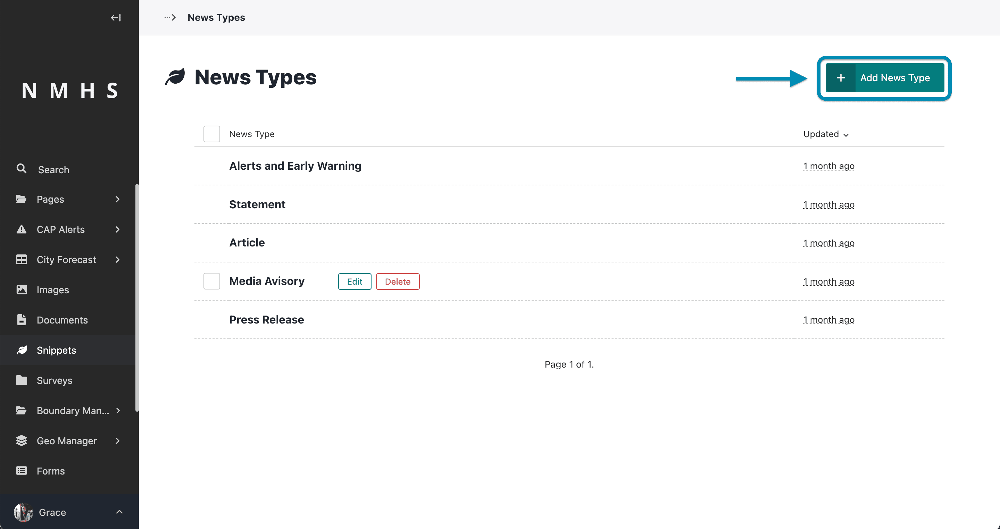
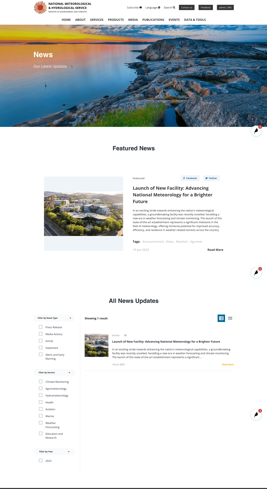

# News

## Creation of news

The creation of news follows the steps below:

1. Create a news type
2. Create a news listing page
3. Create a news page

## News Creation Example Scenario

Assume you would like to have news on the website, the practical way to do it using the steps above would be:

### Step 1: Create an news type

To create a news type, navigate to the 'Snippets' section on the explorer menu and select 'News Types' as below:

Click on 'Add news Type' to create a new news type.

Provide news type name and choose an icon and save.

---

### Step 2: Create a news listing page

A listing page is a page that holds a list of pages. For example, a news Listing page would hold one or more news. It lists the banner, latest featured news and all other news.

To create this page navigate to the 'pages' item on the explorer menu as shown below and click on the pages item at the top.

Note: This option will only appear if no news listing page already exists as there can only be on instance/occurrrence of a news listing page.

Hover over the Home item and click 'Add Child Page'

Select news List Page from the type of pages provided.

Provide a the page title, banner image, title, subtitle and call to action and either save draft, publish or submit to moderation depending on your previlleges.

---

### Step 3: Create a news page

This will navigate to the list of pages under the home page including the news list page you just created. Hover over the the news listing page and click on 'add child page'.

---

The sections of a service page include:
- **News Type** - selected from previously prepared news type in step 1

- **Relevant Service** - selected from previously prepared service categories. Refer to [Create Services Categories Section](./Manage-Services#step-1-create-an-agromet-service-category) to create service categories.

- **Relevant Projects** - select from previously prepared projects. Please refer [Manage Projects](./Manage-Projects) to guide on creation of projects.

- **Post date** - the date the news was published

- **Subtitle** - optional subtitle

- **Body** - the body of the news

- **Tags** - tags related to the news

- **Extra Links** - additional links

- **Is featured** - If enabled, the news will appear as Featured news on the news listing page

- **Is visible on homepage** - If enabled, the news will appear in the homepage as an alert/latest update

>Note: To create additional news in the future you would need to begin from [Step 3: Create a news page](./Manage-news#step-3-create-a-news-page) if the desired news type is already defined.