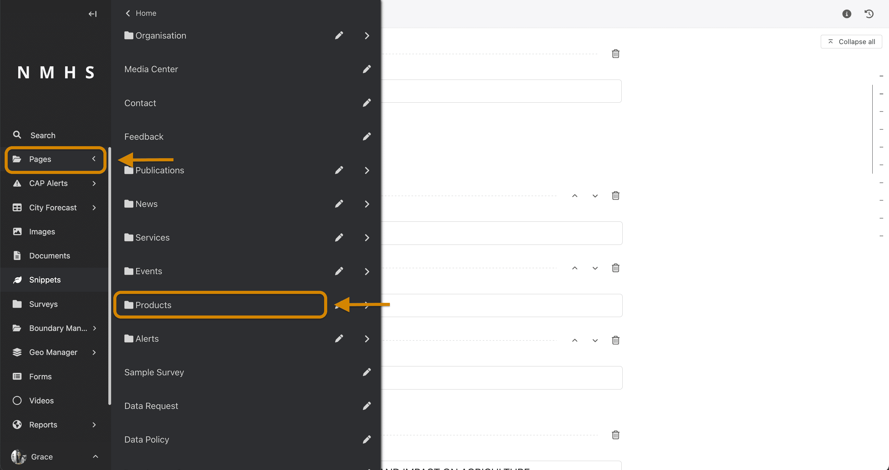

# Products

The creation of products follows the steps below:

1. Creation of a product and a service category
2. Creation of one or more product categories for each of the products
3. Creation of one or more product item types for each of the product categories
4. Creation of a product page that will serve all products for a specific category
5. Creation of one or more product items for a product page

## Product Creation Example Scenario

Assume you would like to have Dekadal Agromet Bulletin Products on the website, the practical way to do it using the steps above would be:

### Step 1: Create an 'Agromet Service Category' and a 'Dekadal Agromet Bulletin' Product

To create a service, navigate to the 'Snippets' section on the explorer menu and select 'Servies' as below:


Click on 'Add service' to create a new service.


Provide service category name and choose an icon and save.


---

To create a product, navigate to the 'Snippets' section on the explorer menu and select 'Products' as below:


Click on 'Add product' to create a new product.


Fill in the form providing the name of the product e.g Dekadal Agromet Bulletin


---

### Step 2: Creation of one or more product categories for each of the products

Create a product category based on sections measured and reported in Dekadal Agrometeorology providing the name and icon e.g

- Category 1 - Weather Assessment
- Category 2 - Agrometeorological conditions and impact on agriculture
- Category 3 - Bulletin


Category 1 and 2 can contain text and images and allows you to break down your bulletin into sharable sections while category 3 can hold the bulletin file/document for download by users. A preview of these categories to the public would appear as below on the website.


---

### Step 3: Creation of one or more product item types for each of the product categories

For each of the three categories above, you can now add product item types e.g

- **Category 1** - Weather Assessment
    - |_ Rainfall Amount
    - |_ Rainfall Anomaly
    - |_ Moisture Condition
- **Category 2** - Agrometeorological conditions and impact on agriculture
    - |_ Vegetation Condition & Impact on Agriculture
- **Category 3** - Bulletin
    - |_ Document


A preview of these product item types to the public would appear as below on the website.


---
### Step 4: Creation of a product page that will serve all products for a specific category

Once a product, its categories and items have been defined, a product page can be created to hold all products linked to it. To create this, navigate to 'pages' in the explorer menu and click on products.



Click on the three dots and select 'Add child pages'


Choose the relevant service category and product as below. Fill in another necessary and optional inputs including an introduction section, introduction image and text that will appear at the top of the Dekadal Agromet Bulletin Page.


Save draft / Publish page.

---
### Step 5: Creation of one or more product items for a product page

Add a product item by hovering over Dekadal Agromet Bulletin and selecting 'add child page'.


For example, you can add a product item for **1 - 10 June 2023** , by specifying the date, valid until and products. 


The 'products' input accepts two options:

- Map/Image Product
- Document/Bulletin Product


An example of a product based on Map/Image product would be the type 'Rainfall Amount'


An example of a product based on Document/Bulletin product would be the type 'Document'


```{note}
When adding a new bulletin, you will only need to begin from Step 5: [Creation of one or more product items for a product page](Manage-Products#step-5-creation-of-one-or-more-product-items-for-a-product-page) section above to upload the document or any related text and images about a new period.
```
