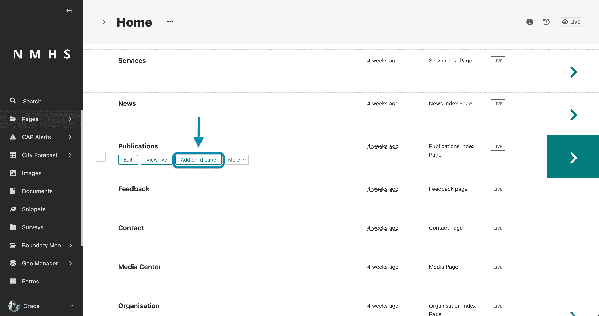

# Publications

## Creation of Publications

The creation of publications follows the steps below:

1. Create a publication type
2. Create a publication listing page
3. Create a publication page

## Publication Creation Example Scenario

Assume you would like to have publication relating to Agrometeorology on the website, the practical way to do it using
the steps above would be:

### Step 1: Create an publication type

To create a publication type, navigate to the 'Snippets' section on the explorer menu and select 'Publication Types' as
below:


Click on 'Add Publication Type' to create a new publication type.


Provide publication type name and choose an icon and save.


---

### Step 2: Create a publication listing page

A listing page is a page that holds a list of pages. For example, a Publication Listing page would hold one or more
publications. It lists the banner, latest 3 featured publications and all other publications.


To create this page navigate to the 'pages' item on the explorer menu as shown below and click on the pages item at the
top.

```{note}
This option will only appear if no publication listing page already exists as there can only be on instance/occurrrence of a publication listing page.
```


Hover over the Home item and click 'Add Child Page'


Select Publication List Page from the type of pages provided.


Provide a the page title, banner image, title, subtitle and call to action and either save draft, publish or submit to
moderation depending on your previlleges.


---

### Step 3: Create a publication page

This will navigate to the list of pages under the home page including the publication list page you just created. Hover
over the the publication listing page and click on 'add child page'.



---


The sections of a service page include:

- **Publication Type** - selected from previously prepared service category in step 1

- **Service Category** - selected from previously prepared service category. Refer
  to [Create Services Categories Section](./Manage-Services#step-1-create-an-agromet-service-category) to create service
  categories.

- **Projects Section** - select from previously prepared projects. Please refer [Manage Projects](./Manage-Projects) to
  guide on creation of projects.

- **Publication Image** - This can be a screenshot of the front page of the publication

- **Date of Publish** - the date the publication was published

- **Document or File** - Here you can upload pdfs, word documents, powerpoints, zip files or any other file of the
  publication

- **External Url** - Only If published/hosted somewhere else, provide a link to published resource if external

- **Summary** - Brief Summary of the publication

- **Mark as featured** - If enabled, the publication will appear as Featured publications on the publications listing
  page

- **Is visible on homepage** - If enabled, the publication will appear in the homepage as an alert/latest update

- **Peer reviewed** - enable this option if the publication has been peer reviewed

- **Additional Details** - this include an optional start and end date for which the publication is considered relevant.

```{note}
To create additional publications in the future you would need to begin from [Step 3: Create a publication page](./Manage-Publications#step-3-create-a-publication-page).
```

## Publication thumbnail autogeneration

If your publication is a PDF, the thumbnail can be automatically generated from the first page of the PDF. This means
you don't need to manually upload a thumbnail image for the publication, unless you want to use a custom image and not
the first page of the PDF.


```{note}
This feature is currently only available for PDF files. If you upload a non-PDF file, you will need to manually upload a thumbnail image.
```