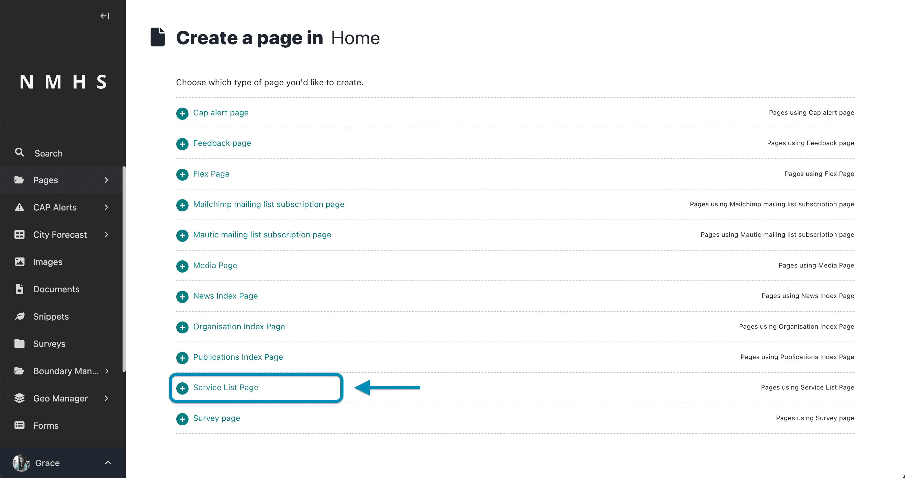
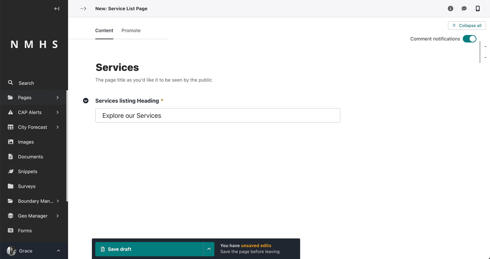

# Services

## Creation of Services

The creation of services follows the steps below:

1. Create a service category
2. Create a service listing page
3. Create a service page

## Service Creation Example Scenario

Assume you would like to have Agrometeorology Service on the website, the practical way to do it using the steps above would be:

### Step 1: Create an 'Agromet Service Category'

To create a service, navigate to the 'Snippets' section on the explorer menu and select 'Servies Categories' as below:


Click on 'Add service category' to create a new service.


Provide service category name and choose an icon and save.


---

### Step 2: Create a Service Listing page

A listing page is a page that holds a list of pages. For example, a Service Listing page would hold an agrometeorology service page, weather forecasting page, etc.


To create this page navigate to the 'pages' item on the explorer menu as shown below and click on the pages item at the top.

```{note}
This option will only appear if no service listing page already exists as there can only be on instance/occurrrence of a service listing page.
```


Hover over the Home item and click 'Add Child Page'


Select Service List Page from the type of pages provided.



Provide a the page title and Heading and either save draft, publish or submit to moderation depending on your previlleges.



---

### Step 3: Create a service page

This will navigate to the list of pages under the home page including the service list page you just created. Hover over the the services listing page and click on 'add child page'.


---


The sections of a service page include:

- **Service Category** - selected from previously prepared service category in step 2.

- **Banner Section** - this contains the banner image, title, subtitle and call to action button.

    

- **Introduction Section** - this contains the introduction title, introduction image, introduction text and button.

    

- **What we do in this Service section** - entails the 'what we do' items and what we do button.

    

- **Projects Section** - This contains a description of the projects linked to the service being edited. Please refer [Manage Projects](./Manage-Projects) to guide on creation of projects and linking them to services.

    

- **Feature Block Items** - this section allows addition of a series of alternating blocks containing an image, title, description and call to action button.

    

- **Youtube playlist** - this section enables selection of an existing youtube playlist with videos related to this service.

- **Applications** - this section enables selection of an existing system applications related to this service.


```{note}
Projects, Events, News and Publications are linked to the service in their respective pages.
```