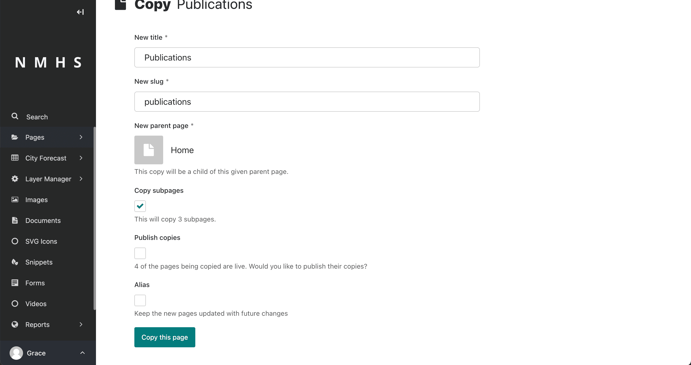
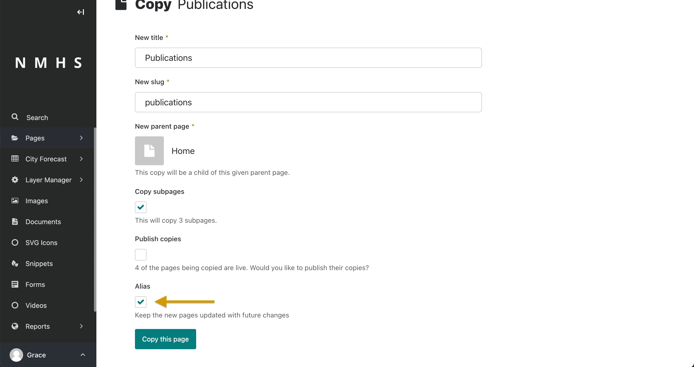

# Pages


The section below gives an overall guide on the concept of a page and managing pages together with their elements. However, if you would prefer a guide to manage specific pages refer to sections listed below.

```{toctree}
---
maxdepth: 2
---
manage_organisation/Manage-Organisation
Manage-Products
Manage-Services
Manage-News
Manage-Publications
Manage-Flex
```

## Creating new pages

To create a new page, click … Actions and select the Add child page option. This creates a child page of the section you are currently in. In this case, a child page of the Breads page. The **Home Page** is the top most page in the hierarchy.


## Edit Existing pages

You can access an existing page's edit screen in three ways.

- First, by clicking … **Actions** and then select the Edit option from the dropdown. 
- Second, by clicking the page's title if you are accessing the page from its **parent's Explorer page** or in search results. 
- Last, if you are accessing the page from the Explorer page of its parent, you can **hover over the page** and then click Edit.

On the edit screen, you can find the title of the page you are editing at the top of the page. If the page is already published, then you can find a link to the live version of the page at the top right of the page. To change the title of the page, click the title field and enter a new title.


While on the edit screen, you can perform several actions, such as copying, moving, or deleting a page. To perform any of these actions, click … Actions at the top of the edit screen and select the applicable option from the dropdown.

## Search Engine Optimization
To promote your page for search engine optimization, using the promote tab set the title tag and meta description. This will ecnourage web crawlers to correctly index your page and rank it higher in search results for related topics. Under the promote tab, the slug is created automatically from the page's initial title


## Create and edit comments

To toggle on commenting mode, click Comments at the top of the edit screen page. Once commenting mode is on, you can create a new comment or reply to a comment by hovering over any commentable field to reveal the add comment icon.


If there is no pre-existing comment in the field, click the add comment icon to create a new comment. However, if there is an existing comment, clicking either the field button or the comment brings the comment thread into focus. This allows you to add new replies.


The arrow to the right of the comments icon shows the comment notifications
panel, where you can enable or disable email notifications for other users' comments on the page.


```{note}
You will always receive email notifications for threads you are part of, unless you opt out of all comment notifications in your account settings. All participants in a thread will receive email notifications for new replies, even if they no longer have permission to edit the page.
```


## Manage Page History

it is possible to retrieve a version of the content you previously saved as a draft or published. You can do this by hovering over a page on the Explorer page and clicking More from the resulting dropdown options. Alternatively, you can access the page history screen by clicking the History icon in the top-right corner when editing a page.


On the page's history screen, you can see all the actions previously done on that particular page and the users that carried out the actions. Also, you can see the date or time that the action occurred.

You can also search for specific versions of your content on the page history screen by applying a filter.


If you want to compare different draft versions, hover over the draft and click Compare with previous version or Compare with current version.

To replace the current version of the draft with a previous version, hover over the preferred version of your draft on the page history screen and click Review this version. Then click Replace current version located at the bottom of the screen. This action appears as a Revert action on the page history screen and you can always go back to review it.


## Workflow

If the page is currently in a workflow, then you can see an additional indicator underneath the title showing the current workflow task. Clicking this shows more information about the page's progress through the workflow and any comments left by reviewers.

If you have permission to perform moderation actions, for example, approval or requesting changes on the current task. In that case, you can see additional options in the action bar at the bottom of the page

## Copy pages

Sometimes, you don't need to create a new page from scratch. For example, you may have several pages that are similar in terms of structure but differ in content. In that case, you can copy an existing page and only change the required parts.


To copy an existing page, hover over a page in an Explorer page, then click More and select Copy. Selecting Copy from the dropdown takes you to a form where you can enter the title and slug of the copy and also choose its parent page. You then get the option to publish the copy right away and an option to mark the copy as an alias of the original page. Once you have completed the form, click Copy this page.



Congratulations, you just copied a page. You can now find your copied page on the Explorer page.

## Alias pages

When copying a page, you have the option to mark it as an alias. The content of an aliased page always stays in sync with the original.

This is useful when you want a page to be available in multiple places. For example, if you have a page about Publications as a child page of Home, and you want to make the Publications page available in the Pastries section. 

Creating an alias for an existing page is similar to creating a copy. Hover over a page in the Explorer page, click More, and then select Copy. Selecting Copy takes you to the copy page form. On the copy page form, choose another page as the parent page by clicking Choose another page.


Then, click the Alias checkbox and click Copy this page to complete the aliasing.



Congratulations, you just aliased a page. You can now find your aliased page on the Explorer page of the parent page.

If you try to edit the aliased page, you get a notification that it's an alias of another page. To edit an aliased page, you have two options:

- Edit the original page. This option changes both the original page and the aliased page.
- Convert the alias page to an ordinary page, which is a copy of the original. If you choose this option, you must make manual changes to the alias page in order for it to be in sync with the original page.