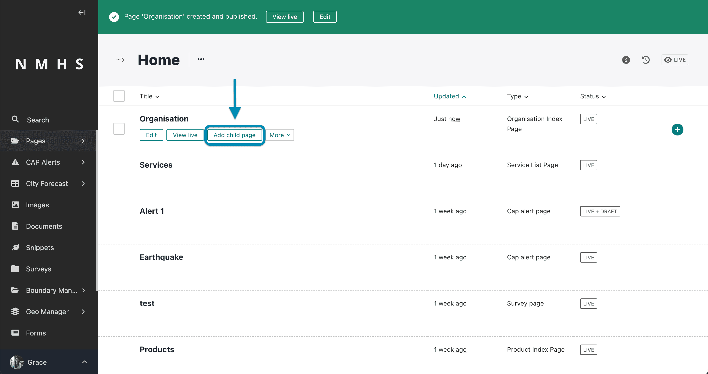
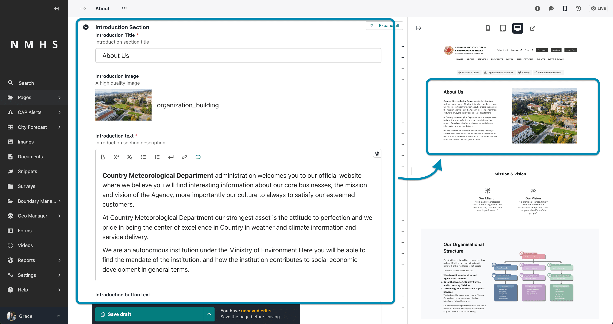
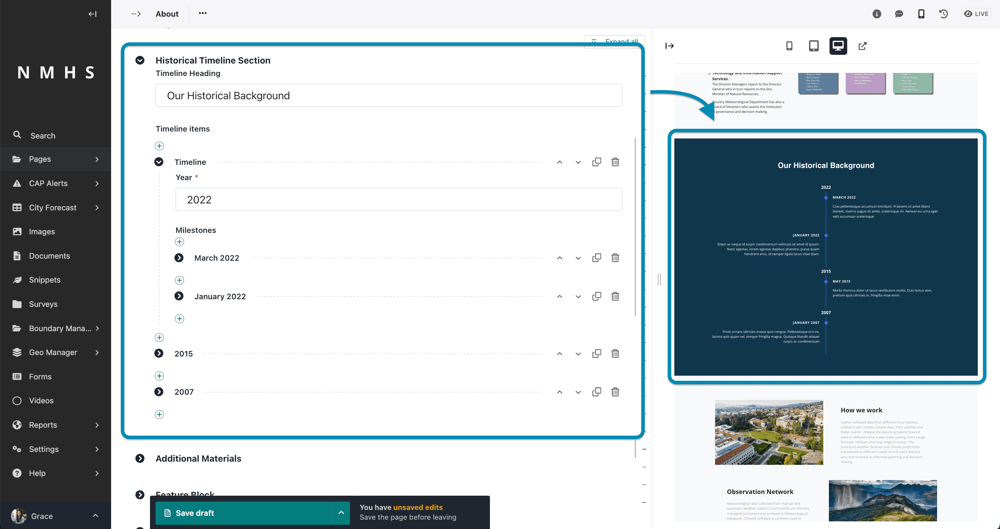
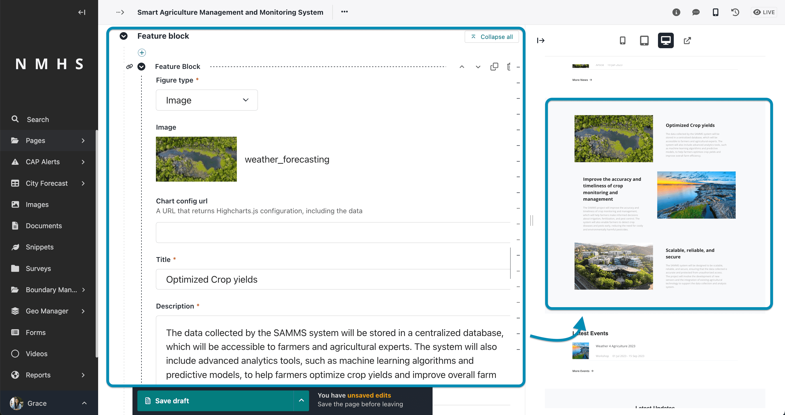

# About Page

## Create an About Page

The creation of this page assumes you have already created an organisation index page which is the parent page of this page. To create an organisation index page, please refer to [Managing Organisation Page](./Manage-Organisation).

To create an about page, navigate to organisation page and create a child page from it selecting the about page.

The About page is divided into various sections.

The sections include:

- **Banner Section** - this contains the banner image, title, subtitle and call to action button. If no banner image is provided then this section will not be displayed

    

    ---

- **Introduction Section** - this contains the introduction title, introduction image, introduction text and button.

    

    ---

- **Mission and Vision Section** - this is the organisation's mission and vision

    

    ---

- **Organisation Structure Section** - this contains a heading description and image of the organisational structure.

    

    ---

- **Historical Timeline Section** - the historical timeline section allows for narration of the history of the organisation grouping the milestones on an yearly basis.

    

    ---

- **Additional Materials** - any additional material including documents or images relating to the organisation can be added here for download.

    

    ---

- **Feature Block Items** - this section allows addition of a series of alternating blocks containing an image, title, description and call to action button.

    

    ---

- **Bottom Call to action Section** - call to action button at the bottom of the page. 

    