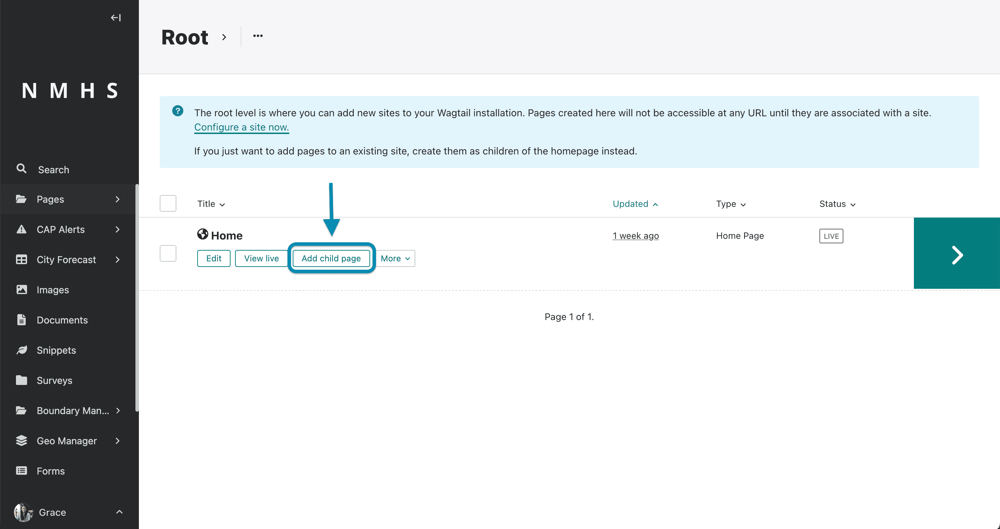

# Organisation Pages


The Organisational Index page lists the pages below:

```{toctree}
---
maxdepth: 1
---
Manage-About
Manage-Partners
Manage-Projects
Manage-Tenders
Manage-Vacancies
```

---

To create the overall organisation page that houses the pages above, begin by adding a child page to the home page and selecting 'Organisation Index Page'. 




Populate the form with page title and listing heading as below:


```{note}
This option will only appear if an 'Organisation Index Page' does not already exist as only one instance of this page is allowed. If it already exists proceed to prepare the other pages listed above.
```