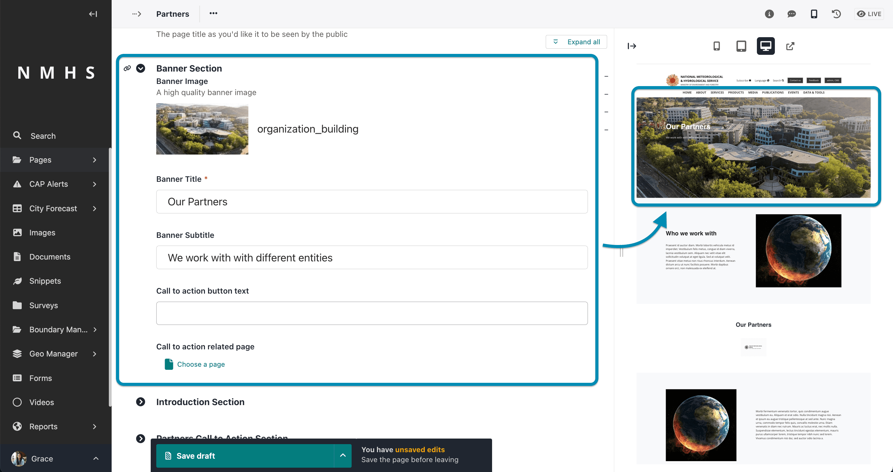

# Partners Page

The steps to create a partners page are:

1. Create a list of partners
2. Create a partners page

## 1. Create a list of partners

To list partners begin by accessing the partners menu from snippets as shown below.


Click on add partners


Provide the partner name, logo, link to website and any other relevant info in the form.


Repeat this process to list more partners

## 2. Create a partners page

The creation of this page assumes you have already created an organisation index page which is the parent page of this page. To create an organisation index page, please refer to [Managing Organisation Page](./Manage-Organisation).

To create a partner page, navigate to organisation page and create a child page from it selecting the about page.


The Partners page contains the sections below:


- **Banner Section** - this contains the banner image, title, subtitle and call to action button. If no banner image is provided then this section will not be displayed

    

- **Introduction Section** - this contains the introduction title, introduction image, introduction text and button.

    

- **Partners Call to Action Section**

    


```{note}
All listed partners in step 1 will be displayed automatically on the partners page.
```