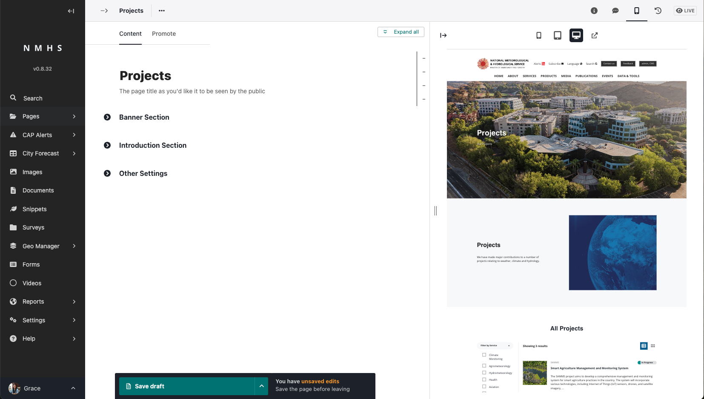
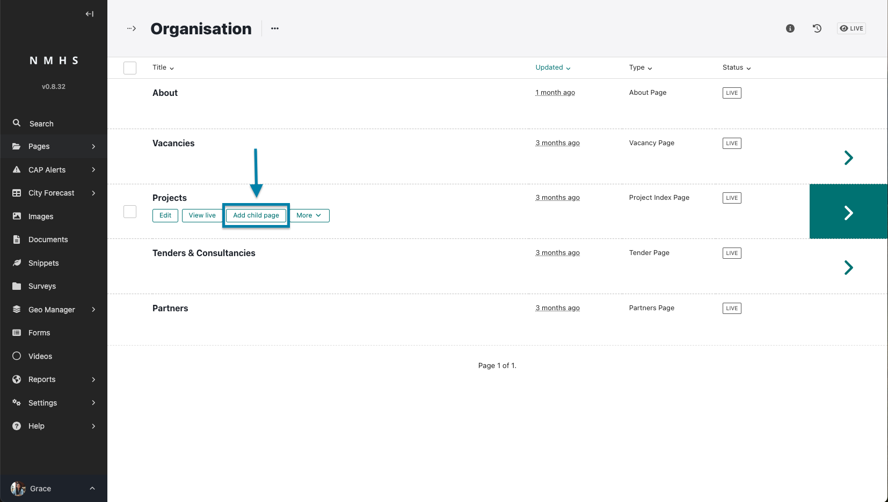
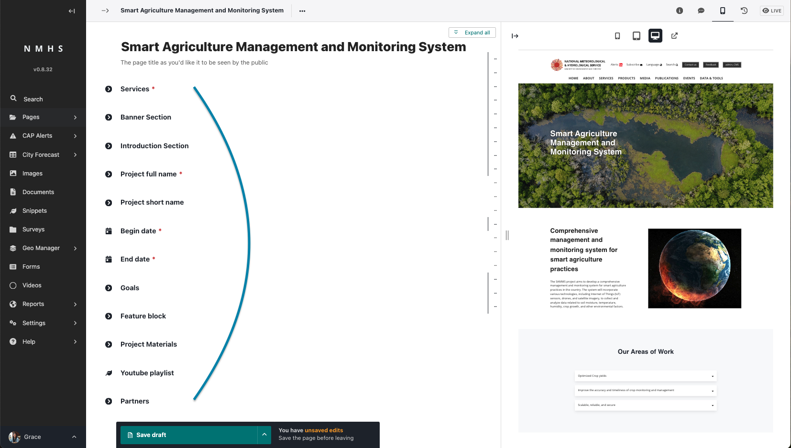
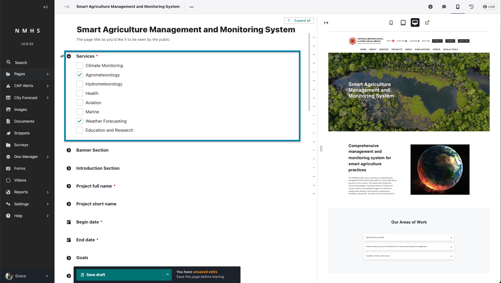
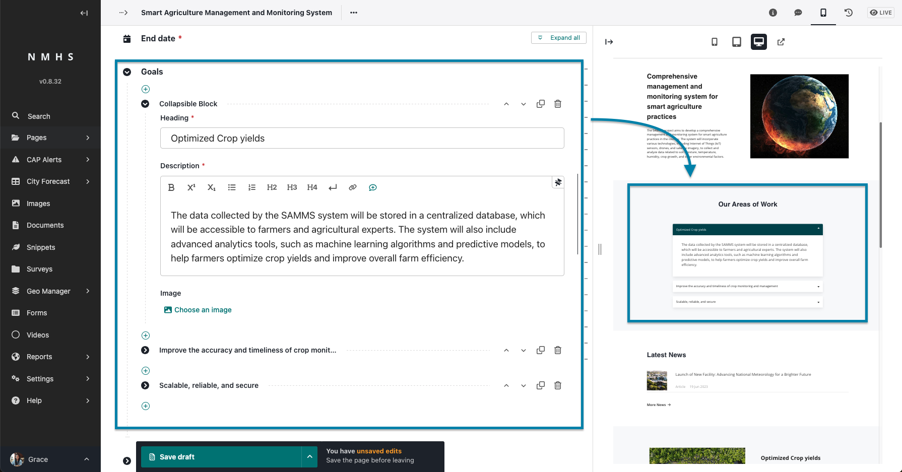
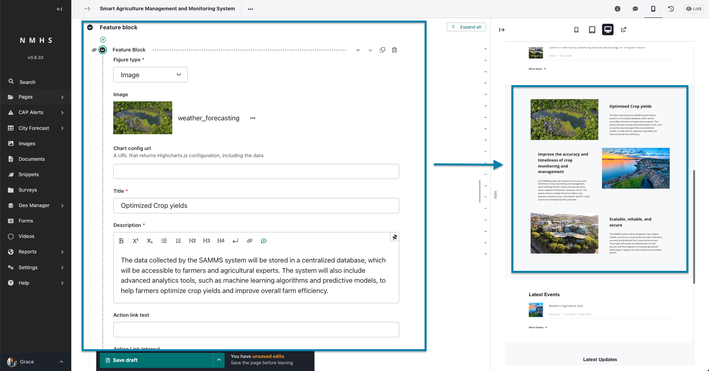
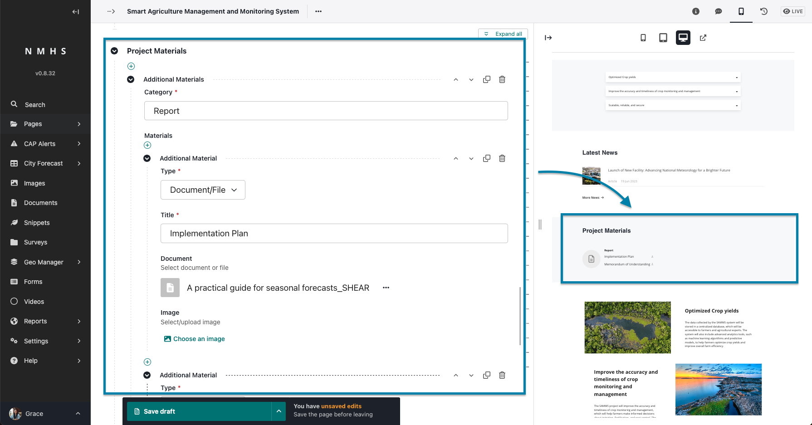
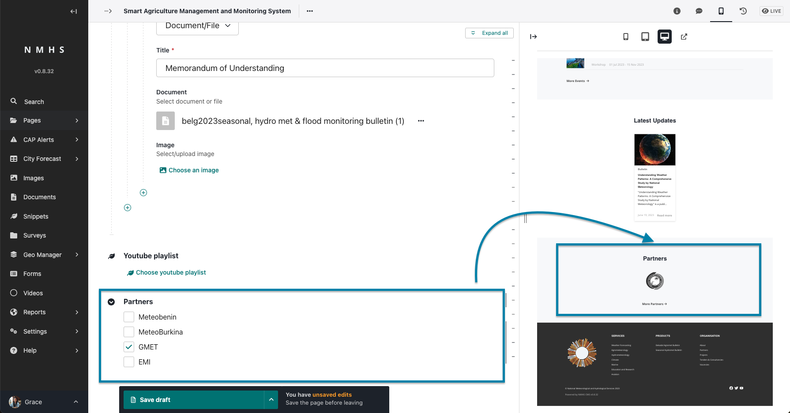

# Projects

## Create a Projects Listing Page

The creation of this page assumes you have already created an organisation index page which is the parent page of this page. To create an organisation index page, please refer to [Managing Organisation Page](./Manage-Organisation).

To create a project listing page, navigate to organisation page and create a child page from it selecting the projects listing page.

The Projects Listing page is divided into various sections.

The sections include:

- **Banner Section** - this contains the banner image, title, subtitle and call to action button. If no banner image is provided then this section will not be displayed

- **Introduction Section** - this contains the introduction title, introduction image, introduction text and button.

- **Other Settings** - this holds information on Projects per page.

## Create a Projects Page

To create a project page, navigate to project listing page and create a child page.

The Projects Listing page is divided into various sections.

The sections include:

- **Services** - this is a list of services linked to the project.
    

- **Banner Section** - this contains the banner image, title, subtitle and call to action button. If no banner image is provided then this section will not be displayed

- **Introduction Section** - this contains the introduction title, introduction image, introduction text and button.

- **Projects full name, short name, begin and end date**

- **Goals** - includes a heading, descripiton and optional image of one or more goals

    

- **Feature Block** - includes a heading, descripiton, call to action link and text and optional image of one or more features

    
    
- **Youtube Playlist**

- **Project Materials** - section for adding document or image for materials relating to the project.

    

- **Partners** - list of partners related to the project.

    