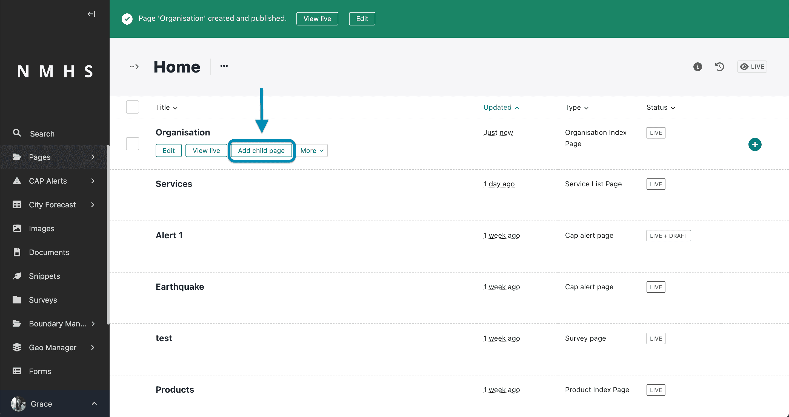
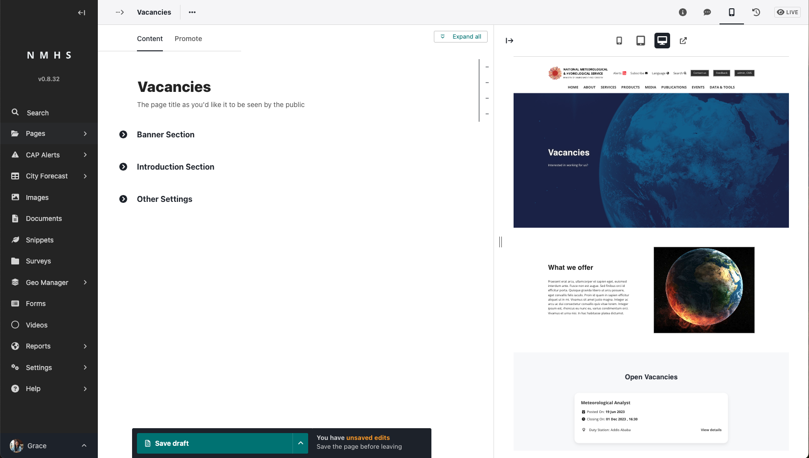
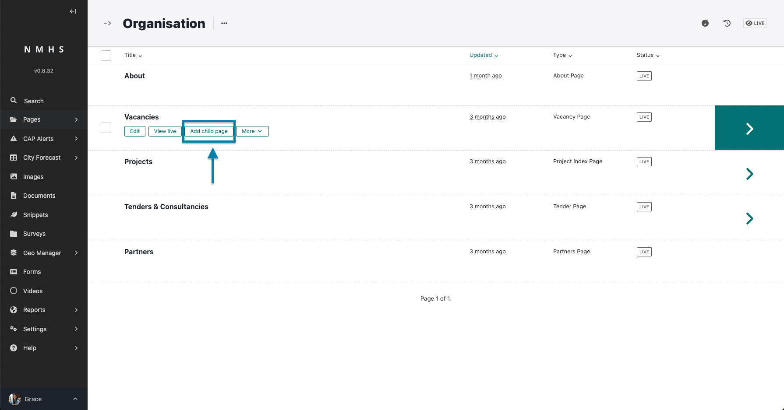
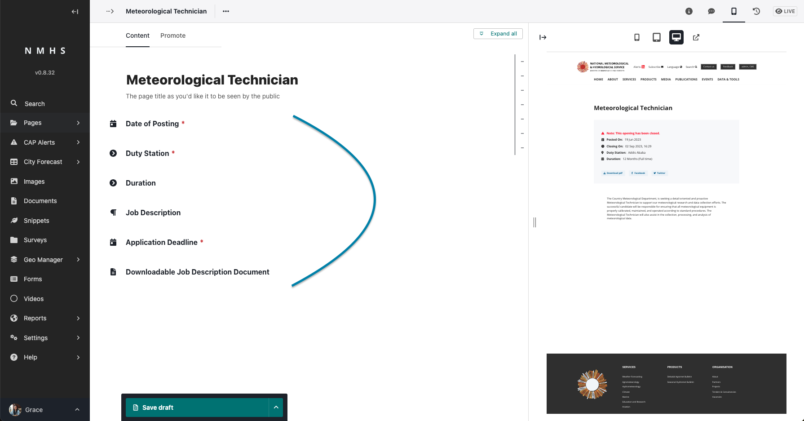

# Vacancies

## Create a Vacancy Listing Page

The creation of this page assumes you have already created an organisation index page which is the parent page of this page. To create an organisation index page, please refer to [Managing Organisation Page](./Manage-Organisation).

To create a vacancy page, navigate to organisation page and create a child page from it selecting the vacancies page.

The Vacancies List page is divided into various sections.

The sections include:

- **Banner Section** - this contains the banner image, title, subtitle and call to action button. If no banner image is provided then this section will not be displayed

- **Introduction Section** - this contains the introduction title, introduction image, introduction text and button.

- **Other Settings** - this holds information on vacancies per page and text to appear when no vacancy is open.

## Create a Vacancies Page

To create a vacancies page, navigate to vacancies listing page and create a child page.

The Projects Listing page is divided into various sections.

The sections include:

- **Date of Posting** - the date the vacancy was posted on

- **Duty Station** - the duty station for the vacancy

- **Duration** - the work duration of the job

- **Job Description** - long text describing the job

- **Application Deadline** - when the application closes

- **Downloadable Job Description Document** - Optional downloadable job description document 

