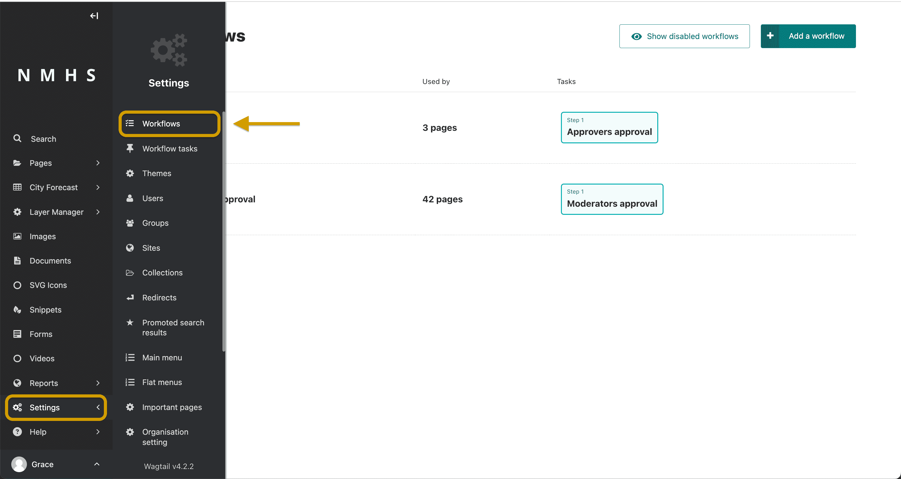
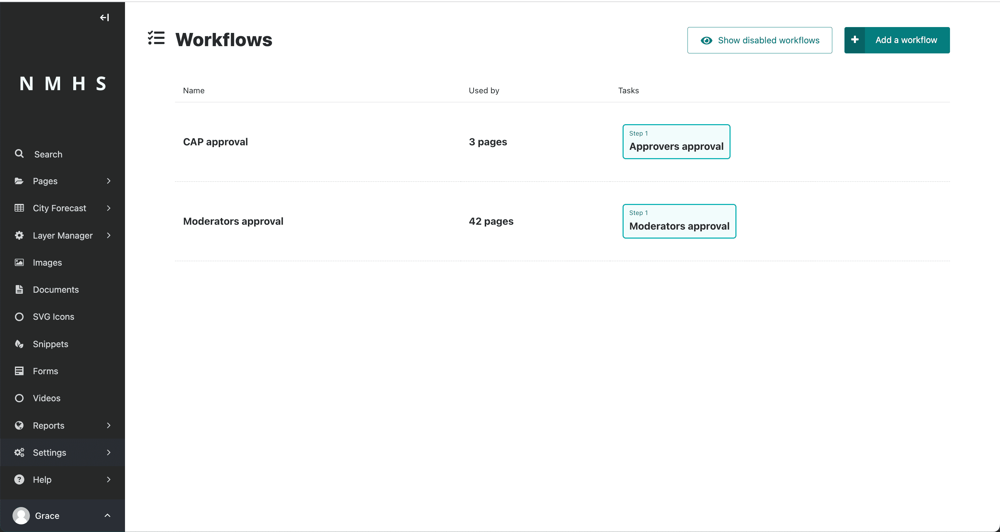
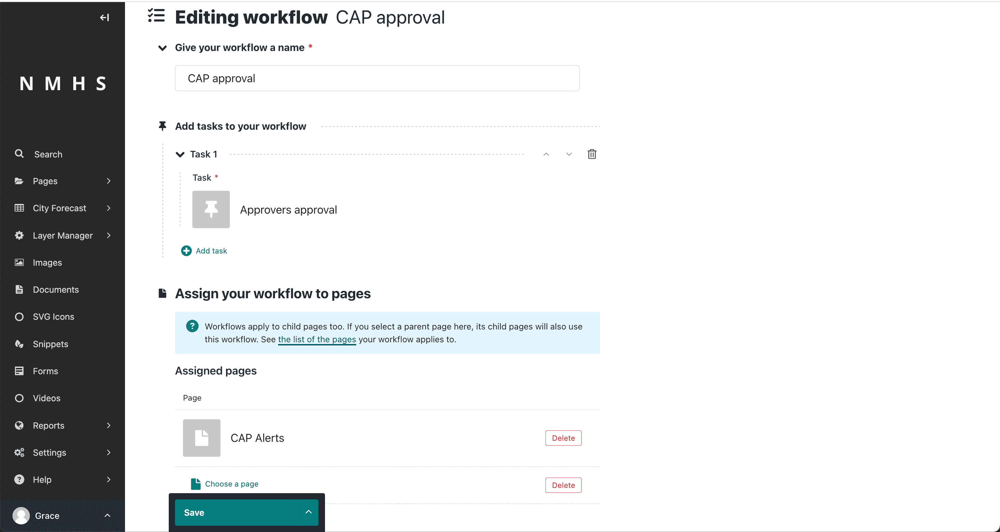
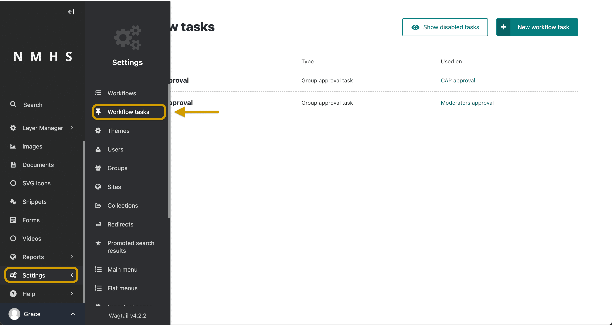
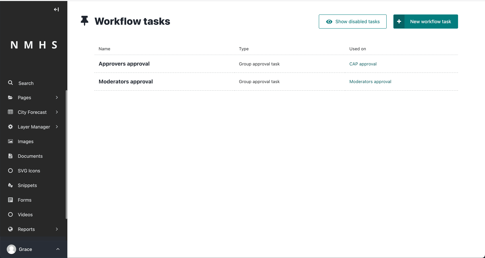
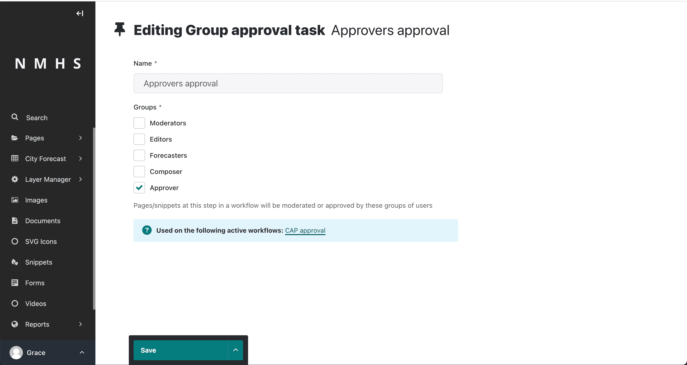

# Workflows

## About workflows

Workflows allow you to configure how moderation works on your site. Workflows are sequences of tasks that require approval before completion. A completed workflow usually results in the publication of a page, depending on your website's settings.

To access the Workflow interface, go to **Settings > Workflows** from the left Sidebar. 

From the Workflow interface, you can see all of the workflows on your site and the order of tasks in each. To create a new workflow, click Add a workflow from the Workflow interface.

Furthermore, the Workflow interface shows how many pages each workflow covers. If you click the number of pages, you can see a list of all the pages a workflow applies to.

## Edit workflows

In the Workflow interface, click on the name of a workflow to edit it or to assign it to a part of the page tree.

Click **Add task** under **Add tasks to your workflow** to add a task. When adding a task to a workflow, you can create a new task or reuse an existing one.

To change a task in the workflow, hover over the task under **Add tasks to your workflow** and select **Choose another task** from the pop-up options.

You can also reorder tasks in a workflow by hovering over a task under the **Add tasks to your workflow** and then clicking the up and down arrow.

Under **Assign your workflow to pages**, you can see a list of the pages assigned to a workflow. All child pages take the same workflow as their parents. So if the root page of your site gets assigned to a workflow, it becomes the default workflow. You may remove a page from the workflow by clicking **Delete** at the right of each entry. Also, you can change the page in an entry to another by clicking **Choose another page.**

The action menu at the bottom allows you to save your changes, or disable the workflow. Disabling a workflow cancels all pages currently in moderation in that workflow, and prevents others from starting it. If the workflow was previously disabled, then you get the option to enable it in the action menu.

## Create and edit tasks

To create a task, go to Settings > Workflows tasks from the Sidebar. This takes you to the Tasks interface, where you can see a list of the currently available tasks and which workflows use each task. Similar to workflows, you can click the name of an existing task to edit it. To add a new task, click Add a task.

---

When creating a task, if you have multiple task types available, then they are offered to you as options. By default, only group approval tasks are available. By creating a group approval task, you are able to select one or multiple groups. Members of any of these, as well as administrators, will be able to approve or reject moderation for this task.

When editing a task, you may find that some fields, such as the name field, are uneditable. This is to ensure workflow history remains consistent. If you need to change the name of a task, then disable the old task, and create a new one with the name you need. Disabling a task causes any pages currently in moderation on that task to skip to the next task.