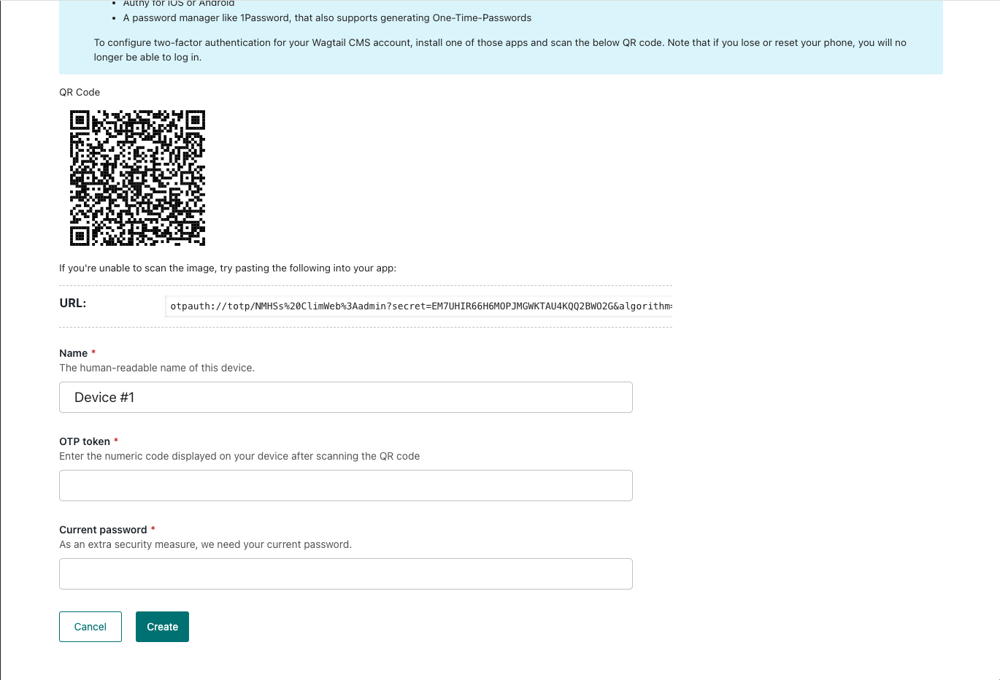
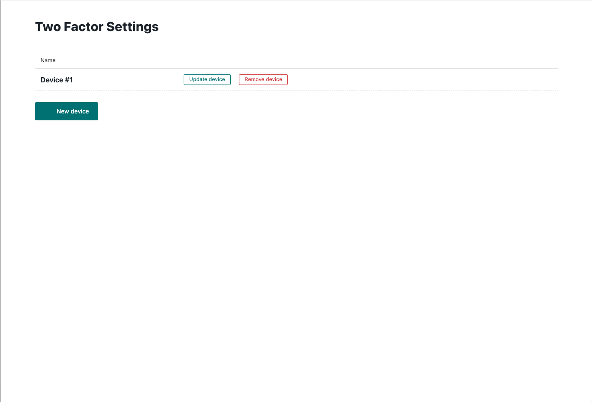

# Two-Factor Authentication (2FA)

## Setting Up Two-Factor Authentication (2FA) in Wagtail

Two-Factor Authentication (2FA) adds an extra layer of security to your Wagtail admin account. It requires both your password and a unique code generated by an authenticator app, making it harder for unauthorized users to access your account.

### Step 1: Log in to the Wagtail Admin Panel

1. Open your web browser and navigate to your Wagtail admin login page.
2. Enter your username and password, then click **Log in**.

### Step 2: Set Up an Authenticator App on your phone

To complete 2FA setup, you will need an authenticator app such as:

- Google Authenticator (Android/iOS)
- Authy (Android/iOS)
- Microsoft Authenticator (Android/iOS)

#### Linking Your Authenticator App

1. Open your preferred authenticator app.
2. Select the option to **Add a new account**.
3. Scan the QR code displayed on your Wagtail admin screen upon login. 

   - If you cannot scan the QR code, manually enter the provided setup key.
4. Your authenticator app will generate a six-digit code.

### Step 3: Verify and Complete Setup

1. Enter the six-digit code from your authenticator app into the **Verification Code** field on Wagtail.
2. Optionally change the device name "Device #1"
3. Enter your current password
4. Click **Create** and your device should be added to the list.

## Logging in with 2FA

1. Next time you log in, enter your username and password as usual.
2. After entering your password, Wagtail will prompt you for a **two-factor authentication code**.
3. Open your authenticator app, retrieve the latest code, and enter it in the provided field.
4. Click **Verify** to complete the login process.

---

By enabling 2FA, you add an extra layer of security to your Wagtail admin account, protecting your data from unauthorized access.

