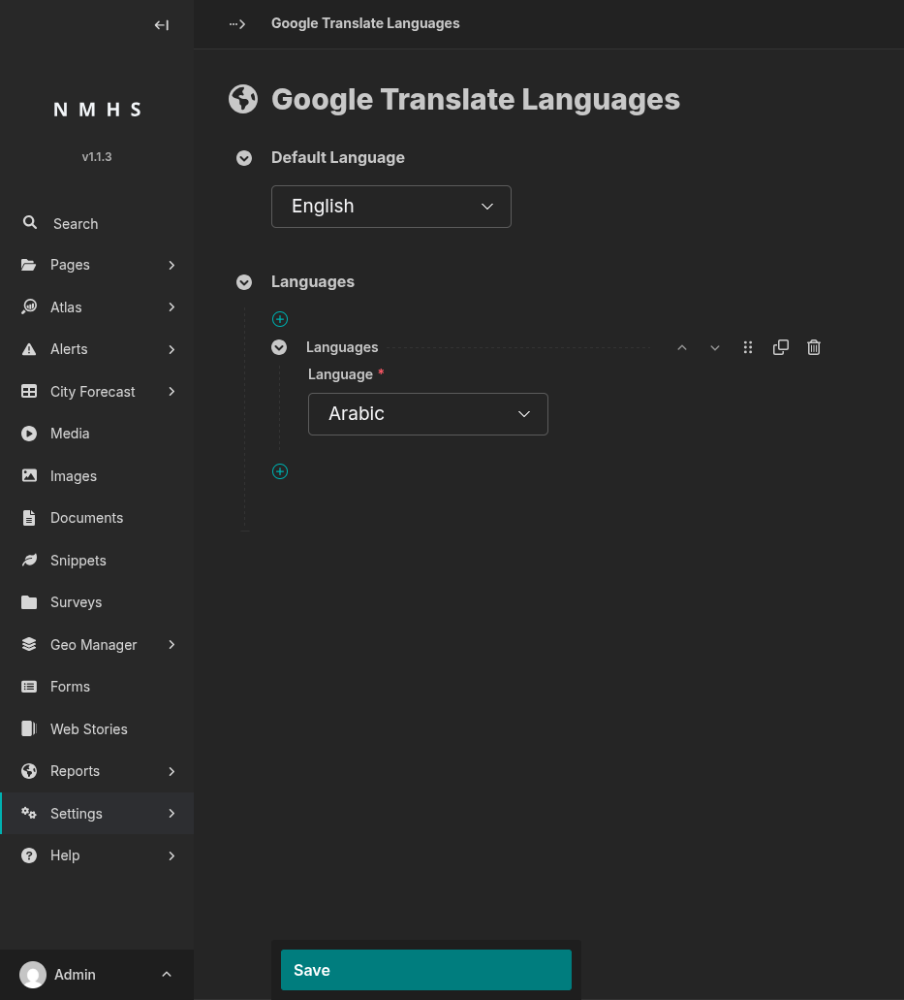

# Google Translate Languages

## Purpose

This panel sets the site's default language and the list of languages shown in the public Google Translate dropdown.

A visitor picks a language from the dropdown, and Google Translate instantly translates the text on screen for them. This happens live, in the visitor's own browser. The original content stored in the CMS is never changed — there is only ever one saved copy of each page, in the **Default Language**. Translation is just how that one copy is displayed to a visitor who chose a different language.

Google Translate covers the whole page at once — navigation, page content, footer, CAP alerts.

To open it: **Settings → Google Translate Languages**.

## Screenshot

## Field Reference

| Field | Type | Required | Description |
|---|---|---|---|
| Default Language | Choice (single language code) | No (defaults to English) | The language the site is written in. Google Translate uses this as the source language. It is automatically included in the dropdown, so you do not need to add it again under **Languages**. |
| Languages | Repeatable block, one **Language** choice each | No | Each block adds one language to the public translate dropdown. Drag to reorder — the order here is the order shown in the dropdown. Click **×** to remove a language. |

