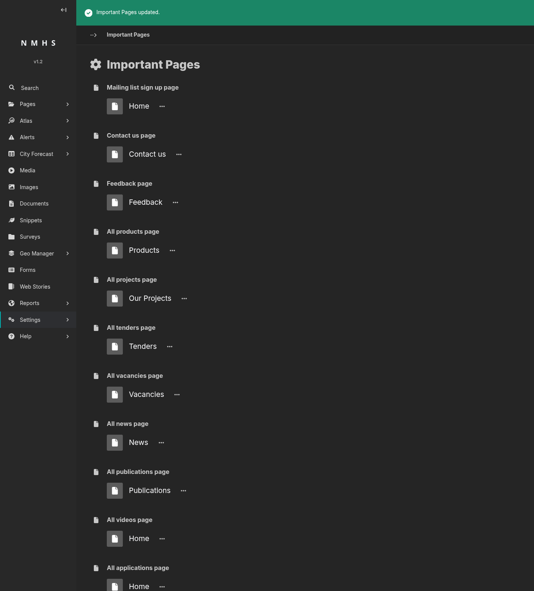

# Important Pages

## Purpose

This panel tells ClimWeb where "well-known" pages live in the page tree (the News index, the Contact Us page, and so on).

To open it: **Settings → Important Pages**.

## Screenshot

## Field Reference

| Field | Type | Required | Description |
|---|---|---|---|
| Mailing list sign up page | Page chooser | No | Newsletter sign-up CTAs. |
| Contact us page | Page chooser | No | "Contact us" links in headers, footers, and forms. |
| Feedback page | Page chooser | No | Feedback links and prompts. |
| All products page | Page chooser | No | Unused. |
| All projects page | Page chooser | No | "See all projects" links from project detail pages. |
| All tenders page | Page chooser | No | Unused. |
| All vacancies page | Page chooser | No | Unused. |
| All news page | Page chooser | No | "See all news" links from news article pages. |
| All publications page | Page chooser | No | "See all publications" links from publication detail pages. |
| All videos page | Page chooser | No | Unused. |
| All applications page | Page chooser | No | Unused. |
| All events page | Page chooser | No | "See all events" links from event detail pages. |
| All partners page | Page chooser | No | "Our partners" links and partner listing CTAs. |
| CAP Warnings List page | Page chooser | No | Adds a link to your alert listing page in the site navigation and the home page weather section. Only shown when the site is configured as a meteorological service. |

All fields are optional. A blank field means the corresponding link won't render on the public site.
