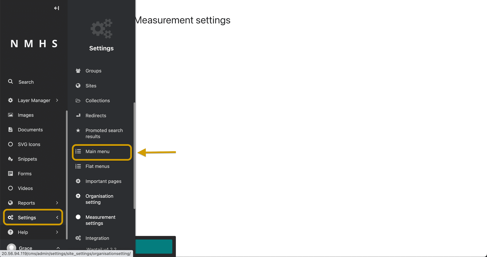
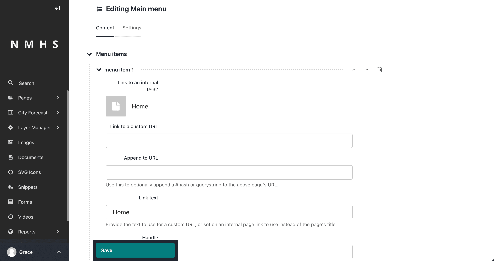
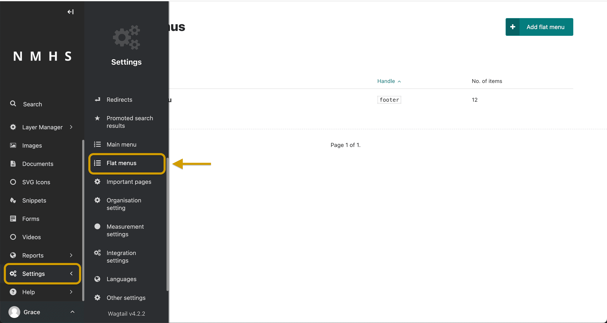
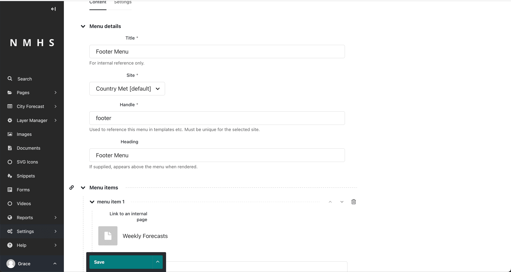

# Menus

## Managing Top Navigation

The menu items of the top navigation of the website can be added/edited or removed. to access the menu configurations in the CMS, click on the settings and main menu on the left sidebar.

Depending on whether a child page allows for sub menu items or not the navbar dropdown will be displayed. Each menu item takes in a:
- link to an internal page / link to a custom URL
- Option to append a value to the url
- The link display text
- Handle (Use this field to optionally specify an additional value for each menu item, which you can then reference in custom menu templates.)
- Submenu visibility option

## Managing Footer Navigation

Similarly, to configure the footer, select settings on the left sidebar and select flat menus instead. 

Edit footer menu and add menu items. You can group pages by giving them the same handler name. For example, weekly forecast and monthly forecasts can be grouped in 'Products' handler.

