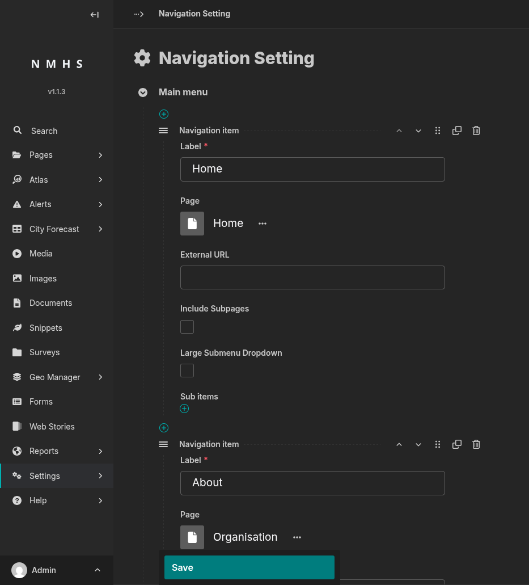

# Navigation Settings

## Purpose

This panel defines the public site's top **main menu** and **footer menu**.

To open it: **Settings → Navigation Setting**.

## Screenshot

## Field Reference

### Navigation item (main menu and footer menu)

| Field | Type | Required | Description |
|---|---|---|---|
| Label | Text | Yes | Text shown for this menu entry. |
| Page | Page chooser | No | Internal page to link to. Leave blank to use an external URL instead. |
| External URL | URL | No | External link target, used only if **Page** is blank. |
| Include Subpages | Boolean | No | If checked and **Page** is set, that page's children are automatically rendered as a dropdown (children must be live and have **Show in menus** checked to appear). |
| Large Submenu Dropdown | Boolean | No | Renders the dropdown as a wide multi-column panel instead of a compact list. |
| Sub items | Repeatable block | No | Manually curated children of this menu item (fields below). |

In the **footer menu**, an item only appears on the site if it has sub-items (from this field or from **Include Subpages**) — a footer item with just a Label and a link, and no sub-items, will not show up.

### Sub item

| Field | Type | Required | Description |
|---|---|---|---|
| Label | Text | Yes | Display text for the sub-item. |
| Page | Page chooser | No | Internal page to link to. |
| External URL | URL | No | External link target, used only if **Page** is blank. |
| Show as action button | Boolean | No | Footer menu only: renders as a visually distinct call-to-action button instead of a plain link (e.g. "Open Mapviewer"). No effect in the main menu. |

An item needs either **Page** or **External URL** to link anywhere.
