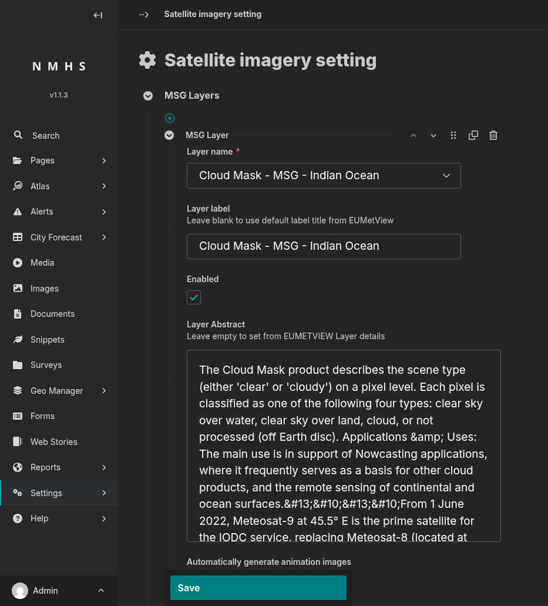

# Satellite Imagery Settings

## Purpose

This panel controls which satellite imagery layers appear on your website's public Satellite Imagery page, sourced live from EUMETSAT's Meteosat Second Generation (MSG) satellites. You can add up to **5 layers**.

To open it: **Settings → Satellite imagery setting**.

## Screenshot

## Field Reference — MSG Layer (one block per layer)

| Field | Type | Required | Description |
|---|---|---|---|
| Layer name | Choice | Yes | Pick the satellite layer to show, from the list EUMETSAT currently publishes. |
| Layer label | Text | No | The name shown to visitors on the public site. Leave blank and ClimWeb will fill in EUMETSAT's own title for the layer once you save. |
| Enabled | Boolean | No (default: on) | Turn off to temporarily hide this layer from the public site without losing its settings. |
| Layer Abstract | Text (multi-line) | No | A short description shown alongside the layer. Leave blank and ClimWeb will fill in EUMETSAT's description once you save, where one is available. |
| Automatically generate animation images | Boolean | No (default: off) | Builds a looping animation from this layer's imagery throughout the day, shown to visitors as an optional playback on the layer's map. |

