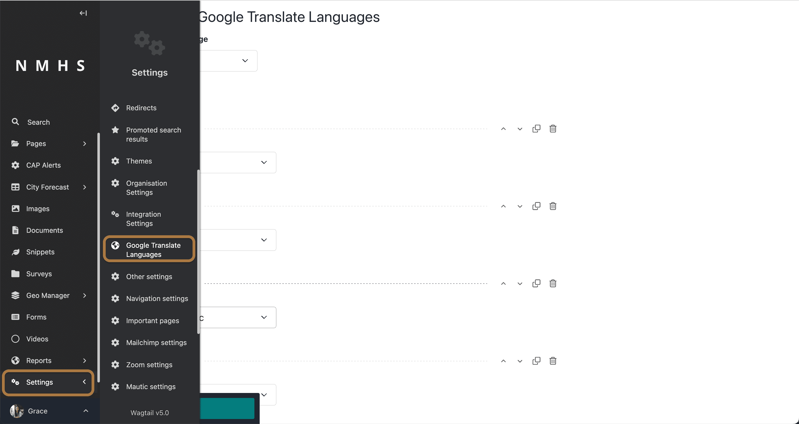

# Base Settings

All settings can be found at the settings menu on the left side-bar. *Scroll down if settings menu is not visible*. 

This section covers:
- Managing Organisation Settings
- Managing Themes
- Managing Integrations
- Managing Languages
- Managing Measurement Units

## Managing Organisation Settings

Organisation settings include the logo, country, address, contact information and social media address (Twitter, Facebook, Youtube and Instagram)

## Managing Themes

The ClimWeb allows you to create/edit/delete a theme. You can also set a default theme which will be applied to all pages of the website. 

The theme configurations include theme name, theme colors, borders and shadows.

## Managing Integrations

The ClimWeb supports integrations with 3rd party softwares including Recaptcha, YouTube API, Mailchimp, Mautic, Zoom and Google analytics.

## Managing Website Languages

Multiple languages can be configured inorder to allow translation of the website by users to their prefered language. A language prefix and name is required and default state to specify the primary language the website is published in.

## Managing ClimWeb Languages

To change the language of the ClimWeb UI, this setting can be configured from the user account settings.

