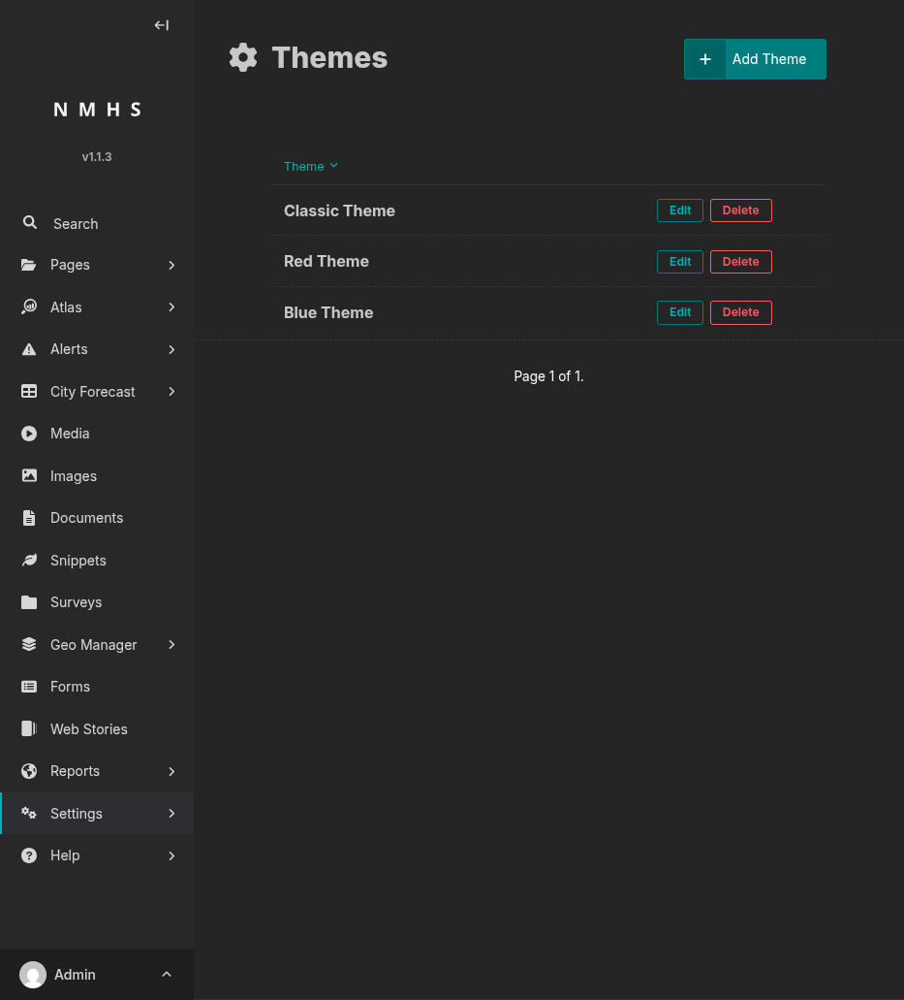
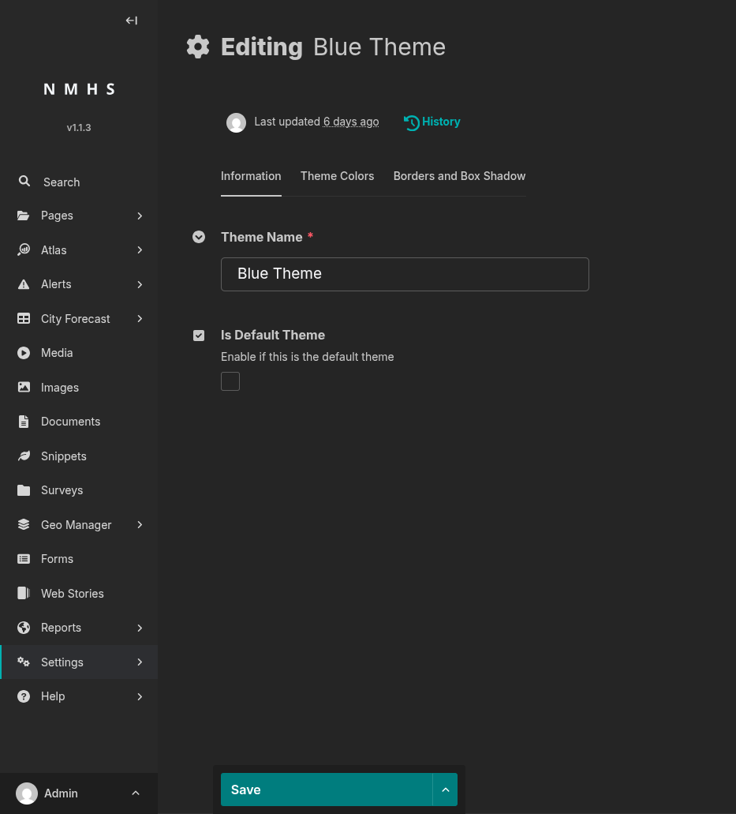
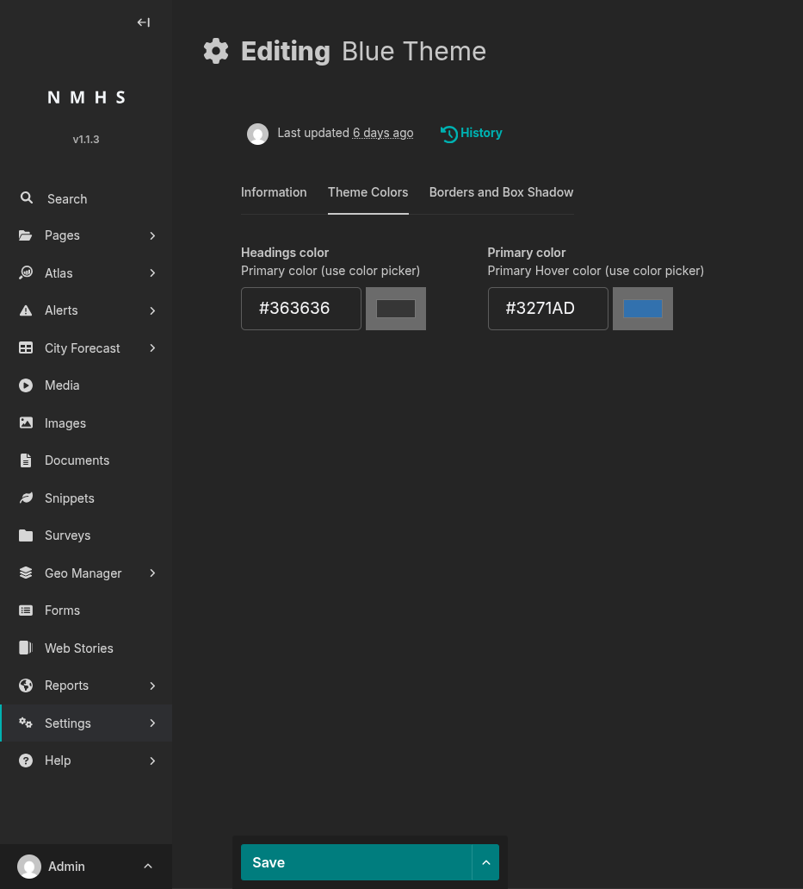
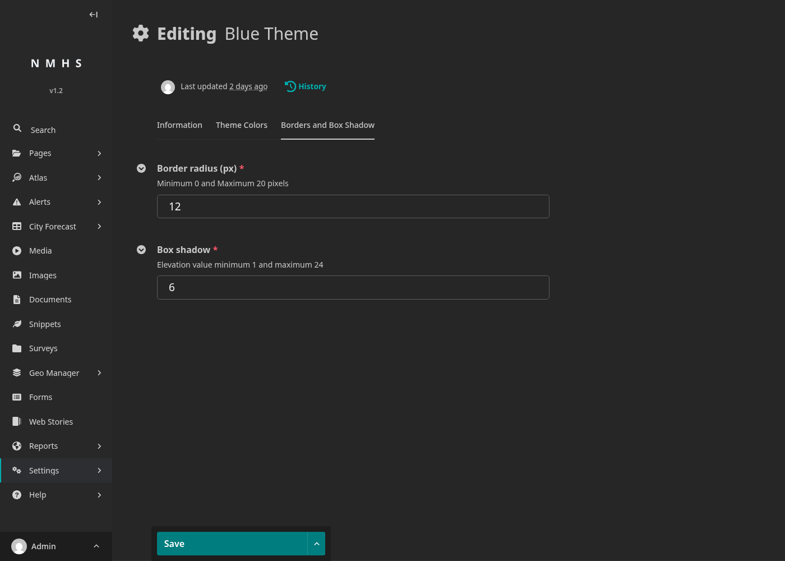
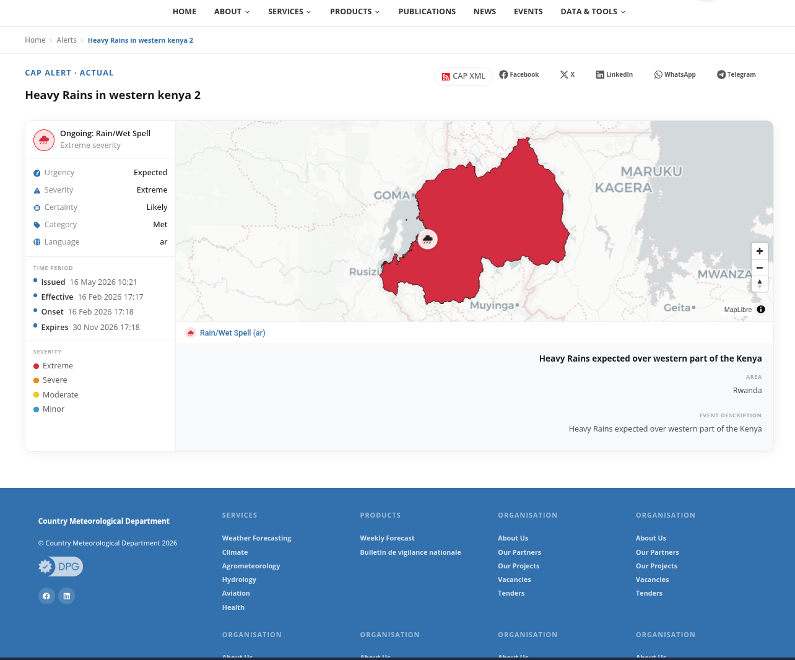
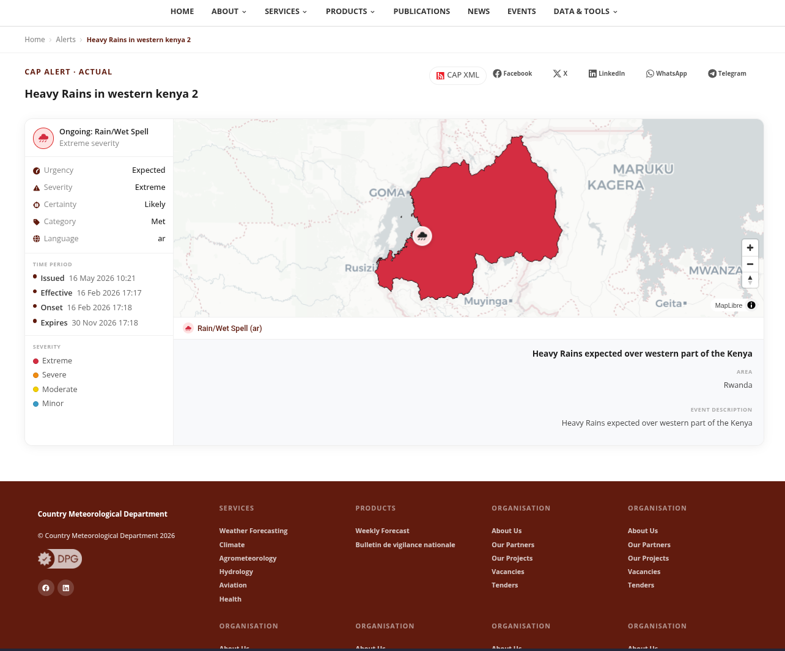

# Themes

## Purpose

The Themes panel controls the public site's visual identity.

To open it: **Settings → Themes**. The list view shows every theme, with edit and delete actions per row and an **Add Theme** button.

## Screenshot

## Field Reference

### Information tab

| Field | Type | Required | Description |
|---|---|---|---|
| Theme Name | Text | Yes | Display name in the theme list (e.g. "Default", "Blue"). |
| Is Default Theme | Boolean | No | Makes this the active site-wide theme; unsets the flag on all other themes when saved. |

### Theme Colors tab

| Field | Type | Required | Default | Description |
|---|---|---|---|---|
| Headings color | Colour picker (hex) | No | `#363636` | Colour of headings on the public site. |
| Primary color | Colour picker (hex) | No | `#176c9c` | Primary brand colour — links, buttons, hover states. |

### Borders and Box Shadow tab

| Field | Type | Required | Default | Range | Description |
|---|---|---|---|---|---|
| Border radius (px) | Integer | Yes (default fills it) | 12 | 0–20 | Corner roundness of cards and buttons. Lower = sharper. |
| Box shadow | Integer | Yes (default fills it) | 6 | 1–24 | Elevation of cards and surfaces, on a Material-style scale. |

## Before / after on the public CAP alert page

The same published CAP alert with two different default themes — only the theme changed between screenshots.

The footer and link accents follow the theme's primary colour, while the alert map shading and severity legend stay governed by CAP semantics (red for Extreme, orange for Severe, yellow for Moderate, blue for Minor).

