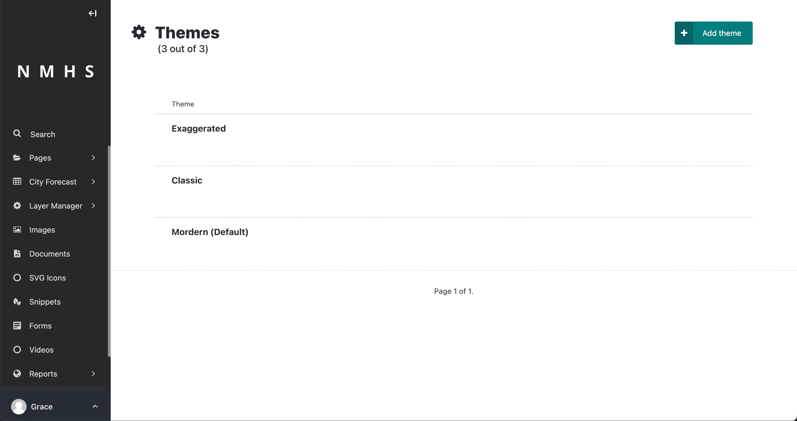
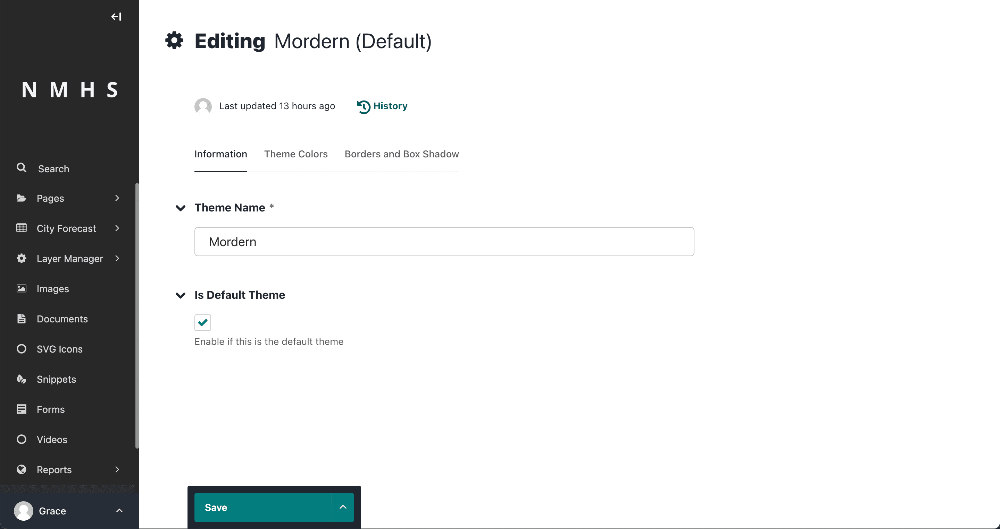
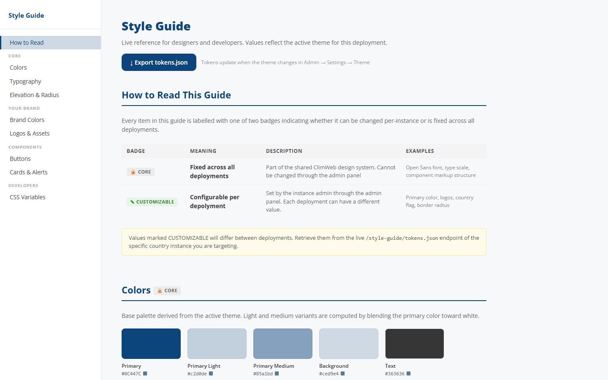
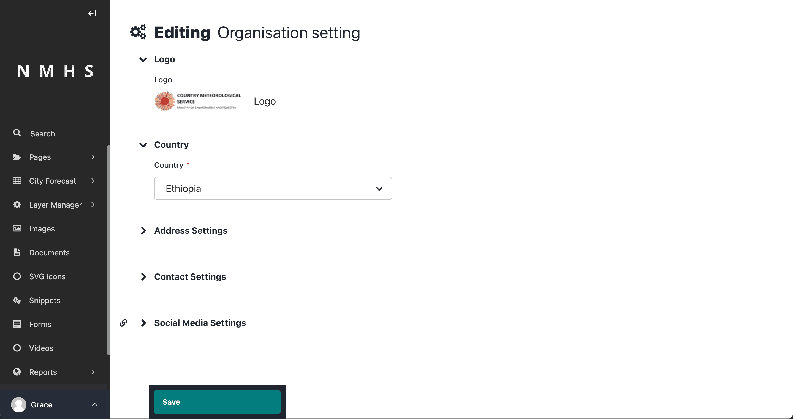

# Themes

Themes set how your website looks. Each theme controls the colour scheme, corner rounding, and shadow depth across the whole site. You can create multiple themes and switch between them.

> **Note:** You need staff-level admin access to manage themes. If you do not see **Settings** in the left sidebar, contact your site administrator.

## Accessing Themes

To open the Themes list, click **Settings** (the gear icon in the left sidebar), then click **Themes**.

The theme marked **Default** is live on your site.

## Creating a Theme

To create a new theme, click **Add theme** in the top-right corner. The editor has three tabs: **Information**, **Theme Colors**, and **Borders and Box Shadow**.

### Information Tab

| Field | Description |
|---|---|
| **Name** (required) | A name visible only to admin staff. It does not appear on the public website. Use something descriptive, like "WMO Blue" or "High Contrast". To rename a theme later, open it from the list, edit this field, and save. |
| **Is default** | Makes this theme live on your website. Tick before saving if you want it active immediately. Nothing on your live site changes until you click **Save**. |

To activate the theme later, see [Activating a Theme](#activating-a-theme).

### Theme Colors Tab

| Admin Label | What it controls | Default |
|---|---|---|
| **Primary color** | Links, buttons, and interactive elements. ClimWeb also automatically creates lighter shades of this colour for section backgrounds and content block backgrounds across the page. | `#176c9c` (blue) |
| **Headings color** | Page heading text (the large and medium-sized titles on your pages). | `#363636` (dark grey) |

Set **Primary color** to your organisation's main brand colour. Because ClimWeb uses **Primary color** to generate section and content block background colours, very light colours (near white) will make those backgrounds hard to see against the page, and very dark colours will make the page look heavy. Open the style guide after saving to check how the colours look (see [Previewing a Theme](#previewing-a-theme)).

Set **Headings color** to your secondary brand colour, or leave it at the default dark grey (`#363636`). If your organisation has only one brand colour, leave **Headings color** at the default.

To change a colour, click the coloured square (swatch) next to the field to open the colour picker. You can also type a hex code directly in the text box. A hex code is a short colour code starting with `#`. Hex codes are usually listed in your organisation's brand guidelines. If you are not sure, ask your communications or IT team.

> **Note:** Choose colours with enough contrast so that text is easy to read against the background. A good rule of thumb: dark text on a light background works better than two similar colours. To check, search online for "colour contrast checker" and enter your two hex codes. The tool will tell you if the combination is readable. This matters especially for users with visual impairments.

### Borders and Box Shadow Tab

The Borders and Box Shadow tab controls corner rounding and shadow depth for cards, buttons, and content blocks.

| Field | Description | Range | Default |
|---|---|---|---|
| **Border Radius** | Corner rounding on cards, buttons, and content blocks. `0` gives sharp corners; `20` gives more rounded corners. | 0 – 20 | `12` |
| **Box Shadow** | Shadow depth around cards and content blocks. On most ClimWeb templates, changing this has little visible effect on your live site. Leave it at the default unless your IT team advises otherwise. | 1 – 24 | `6` |

The default **Border Radius** of `12` matches the WMO reference design. If you are not sure, leave it at `12` and adjust after previewing.

Click **Save**. If you did not tick **Is default**, the theme is saved but inactive until you activate it.

## Activating a Theme

1. In the **Themes** list, click the theme you want to activate.
2. On the **Information** tab, tick the **Is default** checkbox.
3. Click **Save**.

The change is saved as soon as you click **Save**. ClimWeb only allows one active theme at a time. When you save a theme with **Is default** ticked, the system automatically unticks it on any other theme.

If the new colours do not appear in your browser straight away, try refreshing the page (press F5 or Ctrl+R). This is normal. Your browser may be showing a stored copy of the previous page. The change may take a few minutes to appear for visitors to your site as well.

To restore your previous theme, click it in the **Themes** list, tick **Is default**, and save.

If no theme is marked as default, the site uses the built-in WMO colour scheme as a backup. The site continues to work, but your organisation's colours will not appear until you activate a theme. The built-in values are `#0C447C` (blue), `#363636` (text), and `#E6F1FB` (background).

## Previewing a Theme

To preview your active theme, go to `/style-guide/` on your site (e.g. `https://your-site-address/style-guide/`). The page shows colours, text styles, buttons, and content blocks.

Check that your primary colour appears on buttons and links, your heading colour appears on page titles, and that text is easy to read against all backgrounds.

> **Note:** The only way to preview a theme is to activate it. To check a new theme, activate it first, then open `/style-guide/` to see the result. You can restore your previous theme straight away if you are not happy with the result (see [Activating a Theme](#activating-a-theme)).

## Deleting a Theme

1. In the **Themes** list, tick the checkbox to the left of the theme you want to remove.
2. At the top of the list, click the **Action** dropdown and choose **Delete selected themes**.
3. Click **Go**, then click **Yes, I'm sure** to permanently delete the theme, or **Cancel** to go back.

You can also delete a theme from inside the editor: open the theme and click **Delete** in the action bar, then confirm.

> **Warning:** Deleting the active (default) theme removes it immediately. Your website will revert to the built-in WMO colours (see [Activating a Theme](#activating-a-theme)) until you set another theme as default. To keep your site looking correct, activate a different theme before deleting the current default.

Deleting a theme only affects the colours and appearance of your site. No pages, content, or images are deleted.

ClimWeb does not have a theme duplication feature. To create a variant of an existing theme, create a new theme and re-enter the values manually.

## Uploading Logos and Branding

ClimWeb manages logos separately from themes. Click **Settings**, then click **Organisation**.

The Organisation settings page has these image fields:

| Field | Where it appears |
|---|---|
| **Logo** | Main header of every page. |
| **Footer Logo** | Footer area. |
| **Favicon** | Browser tab icon. |
| **ClimWeb Admin Logo** | Admin interface login screen and sidebar. |
| **Country Flag** | Alongside the organisation name in some templates. |

For Organisation fields such as country, contact details, and social media, see [Base Settings](Manage-Settings.md#managing-organisation-settings).

Use PNG format for most logos. If your designer has provided an SVG file (`.svg` extension), use that instead. SVG logos stay perfectly sharp at any size. The file extension is the letters after the dot in the filename (for example, `logo.png` has the extension `.png`).

Recommended sizes: upload **Logo** and **Footer Logo** at minimum 80 px tall (e.g. 320 x 80 px); use 200 x 50 px for the **ClimWeb Admin Logo**. For the favicon, use a square PNG, minimum 32 x 32 px. To check an image's dimensions, right-click the file and choose **Properties** (Windows) or **Get Info** (Mac). Smaller images will still upload, but may look blurry on screen.

If your site header has a background colour (set by your active theme's **Primary color**), use a logo with a transparent background. Otherwise the logo will appear inside a white box. To check, open the file in an image viewer. If you see a white rectangle behind the logo, the background is not transparent. Ask your designer for a version with a transparent background if needed.

To upload an image:

1. Click the upload button below the field name (e.g. below **Logo**).
2. Select your file.
3. Click **Save**.
