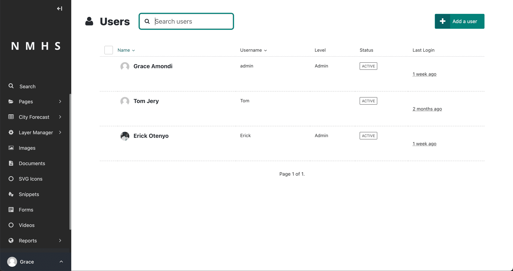
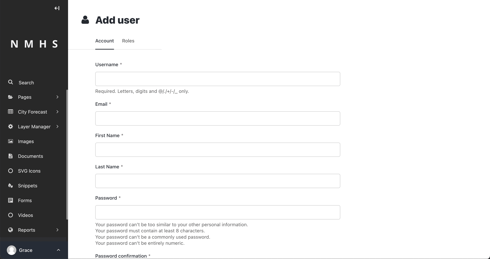
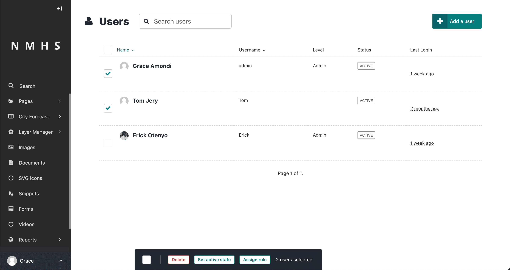
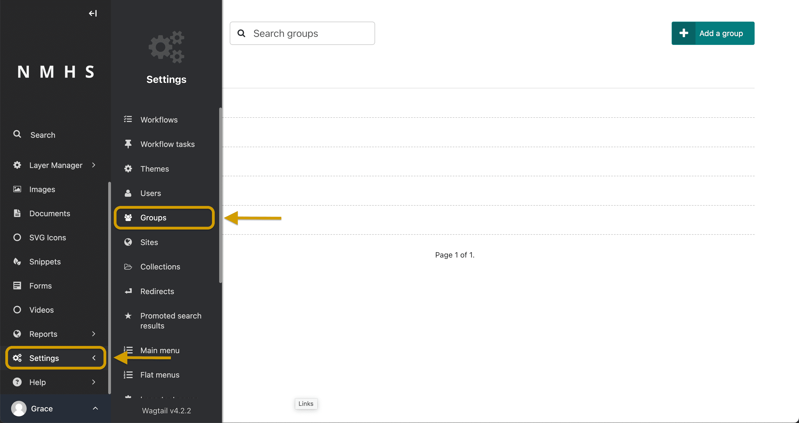
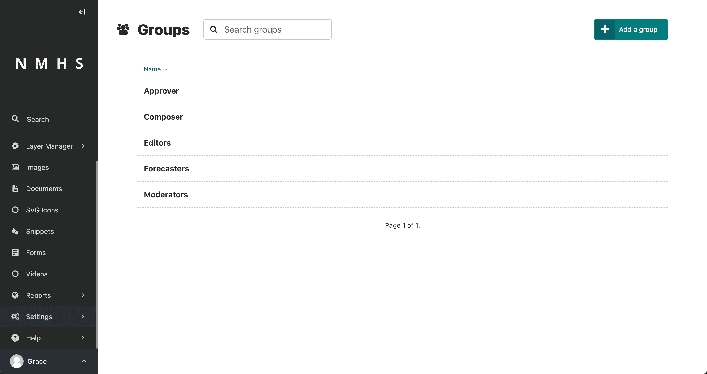
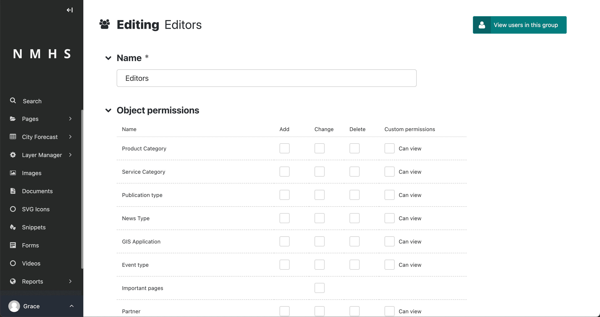

# Users & Roles

## Manage Users
The ClimWeb allows several users to manage content in the admin interface. These users have roles, which determine the access rights they can exercise.

By default, there are 5 roles:
- **Administrator** - This role has complete control over the ClimWeb and can perform tasks such as managing user accounts, creating and deleting pages, and modifying site settings.
- **Moderator** - A moderator has the next level of access after an administrator. A moderator has access to creating drafts and publishing them.
- **Editor** -  This role has the ability to create and edit content on the website. They can add and remove pages, modify existing content, and publish new content.
- **Forecaster** - This role provides accurate and timely weather forecasts for the region or area that the website serves.
- **CAP Composer** - role are authorized to view and create draft CAP alerts, but not to
approve nor to publish final CAP alerts;
- **CAP Approver** - role are authorized to view and create draft CAP alerts, and approve and publish CAP final alerts

### Administrator

An administrator has the highest level of access to the admin interface, and are able to perform all actions in the Admin interface. A common task of an administrator is to add, modify, or remove user profiles. As an administrator, you can add, modify, and remove users via the Users interface. To access the Users interface, go to Settings > Users from the Wagtail Sidebar.

In the Users interface, you can see all of your users, their usernames, roles, and status. The status of a user can either be active or inactive. You can sort this listing either by Name or Username.

You can add a new user, using the 'add a user' button at the top right and assign them an email, username, first name, last name, password and role. Once the ClimWeb user logs in to their account they will be able to edit this information to their preference.

Select multiple users by checking the checkbox to the left of each user row, then use the bulk action bar at the bottom to perform an action on all selected users.

Clicking on a user’s name opens their profile in an edit screen. From here, you can then edit that user's details. It is also possible to change users’ passwords from their edit screen, but it is worth encouraging your users to use the Forgotten password link on the login screen instead. This should save you some time!

## Managing Roles

To manage (add, edit, delete) roles, select from settings, groups as below. Each group corresponds to a role with permissions.

To edit a role and assign different permissions, click on the group. This will navigate to a seperate page where you can manage the permissions of the role.

