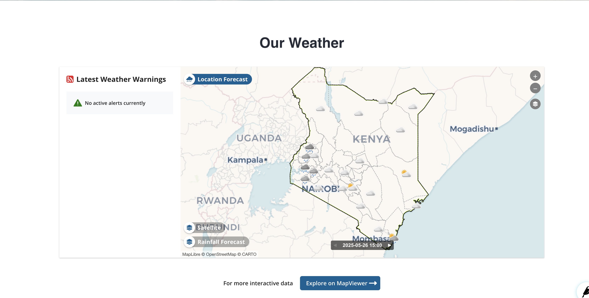
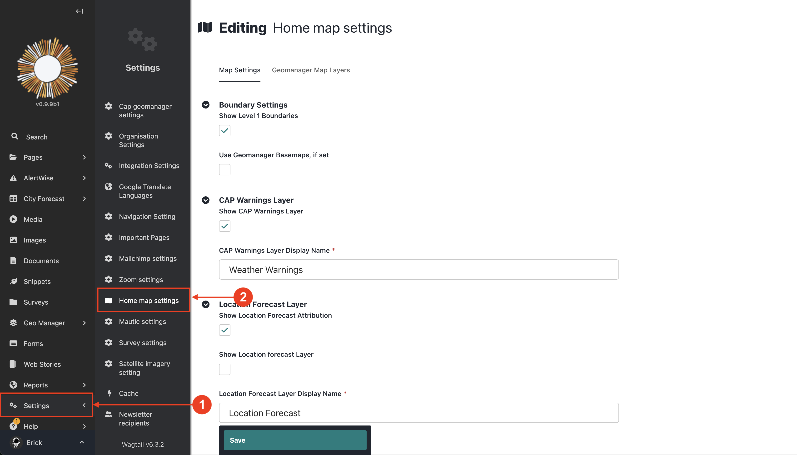
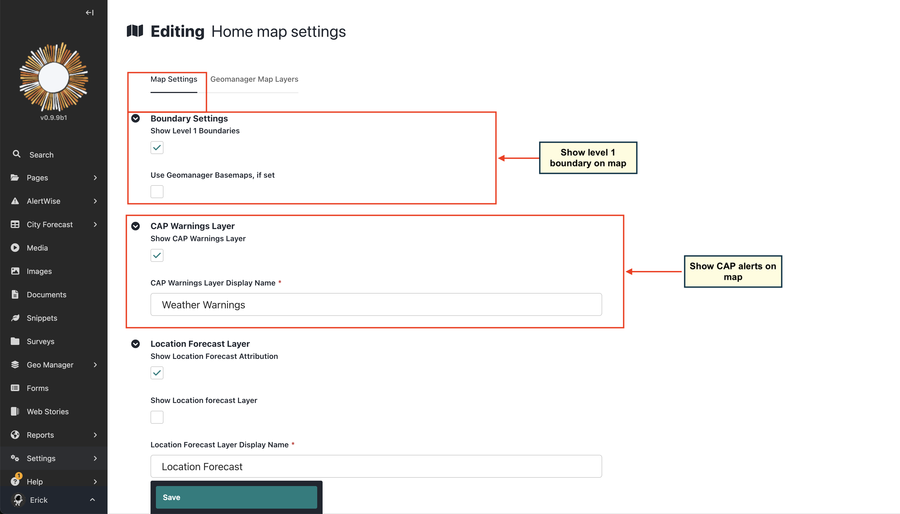
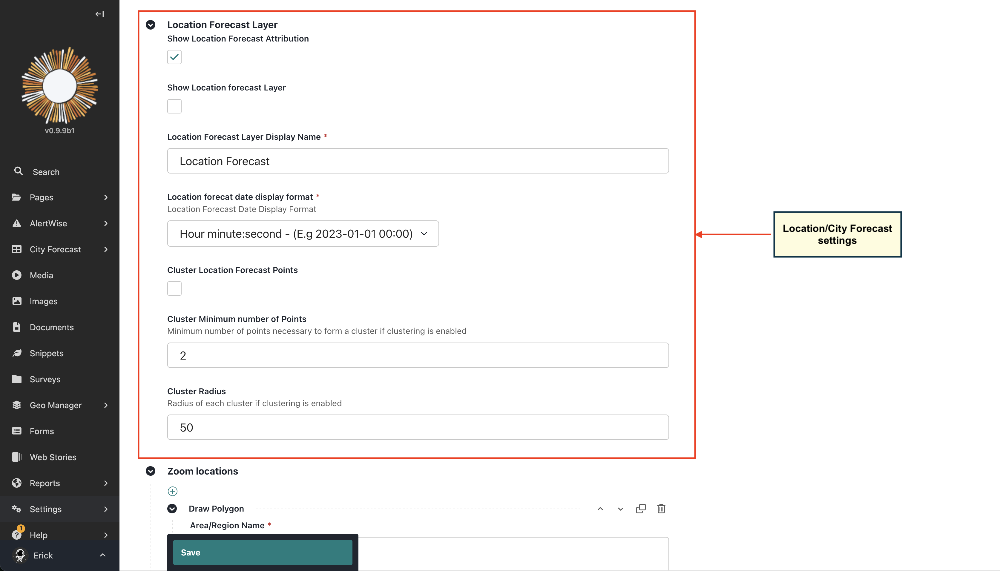
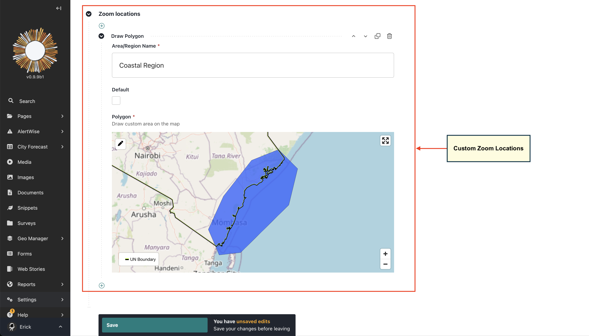
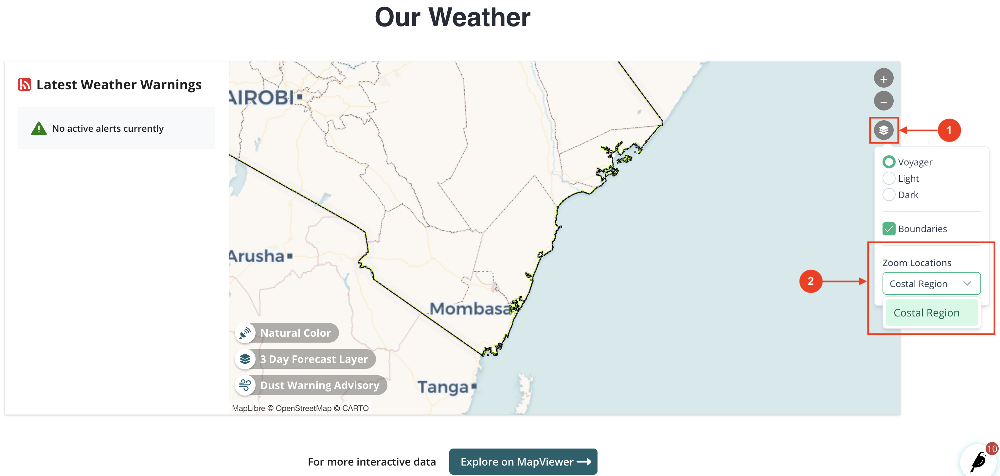
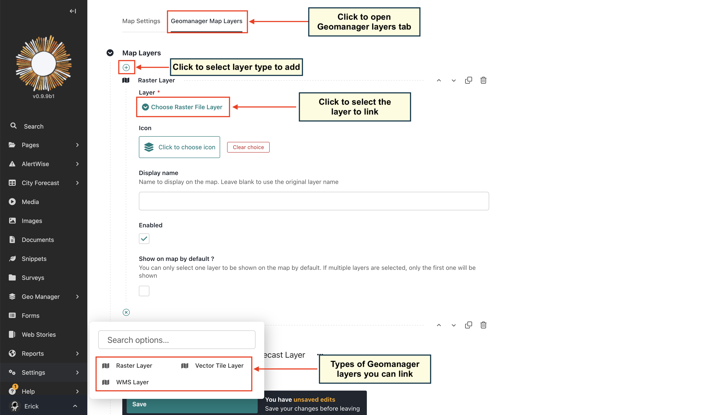

# Homepage Map Settings

The homepage map enables to visualize the following information:

- Location/City Forecast
- Currently active Weather Warnings,
- Up to 5 Geomanager/MapViewer Layers (if enabled)

## Settings

You can modify the homepage map settings from the settings menu on the left side-bar of the Admin interface. *Scroll
down if settings menu is not visible*.

Click on (1)Settings > (2) Homepage map settings

### Boundary Settings

- **Show Level 1 Boundaries**: Check this box to show the level 1 boundaries on the map. By default, this is disabled to
  reduce the bandwidth required to load the map.
- **Use Geomanager Basemaps**: Check this box to use the Geomanager basemaps instead of the default basemaps. This is
  useful if you have configured custom basemaps in Geomanager.

### CAP Warnings Settings

- **Show CAP Warnings Layer**: Check this box to show the currently active CAP warnings on the map. Checked by default.
  This layer is only shown on the map when there is at least one active CAP warning.
- **CAP Warnings Layer Display Name**: This is the name of the CAP warnings layer that will be displayed on the map. By
  default, it is set to `Weather Warnings`. You can change it, for example, to the corresponding language of your
  Climweb
  Instance.

### Location Forecast Layer

- **Show Location Forecast Layer**: Check this box to show the location forecast layer on the map. This layer shows the
  forecast for different cities as set in the system. By default, this is enabled.
- **Location Forecast Layer Display Name**: This is the name of the location forecast layer that will be displayed on
  the map. By default, it is set to `Location Forecast`. You can change it, for example, to the corresponding language
  of your Climweb Instance.
- **Show Location Forecast Attribution**: Check this box to show the attribution for the location forecast data, if you
  are pulling forecast data from [YR.no](https://yr.no/) api. By default, this is disabled.
- **Location Forecast date display format**: This is the format in which the date will be displayed on the map for the
  location forecast layer. You can select the correct format from the dropdown list.
- **Cluster Location Forecast Points**: Check this box to cluster the location forecast points on the map. This is
  useful if you have a large number of location forecast points and want to reduce the clutter on the map. By default,
  this is disabled.
- **Cluster Minimum number of points**: This is the minimum number of points required to cluster the location forecast
  points on the map. By default, it is set to `2`. You can change it to a value that works best for your number of
  locations.
- **Cluster Radius**: This is the radius in pixels for clustering the location forecast points on the map. By default,
  it is set to `50`. You can change it to a value that works best for your number of locations.

> Clustering is a technique used to group similar points together on the map to reduce clutter and
> improve the user experience. When clustering is enabled, the map will show a single point for a group of points that
> are close to each other. When the user zooms in, the points will be expanded to show the individual points.
> This is useful when you have a large number of points on the map and want to reduce the clutter. However, it can also
> make it difficult to see individual points when zoomed out. You can experiment with the clustering settings to find
> the best configuration for your map, by adjusting the minimum number of points and the radius for clustering. Continue
> adjusting these settings until you find a balance between clustering and showing individual points that works best for
> your map.

### Zoom Locations

Zoom locations are predefined locations on the map that the user can zoom to. This is useful for quickly navigating to
common locations on the map, such as the capital city or other important locations. You can add, edit or delete zoom
locations, as shown below:

This will be displayed as a dropdown on the map, allowing the user to quickly zoom to the selected location.

### Geomanager Layers

You can add up to five (5) Geomanager layers to the homepage map. Geomanager layers are custom layers added to Climweb
using the Geomanager Module. Once you add layers on Geomanager, they can be added to the homepage map.

To access the Geomanager layers settings, click on the `Geomanager Layers` tab in the homepage map settings.

Clicking on the Plus (+) button will open a popup where you can select the type of Geomanager layer you want to add.

Currently, you can add the following types of Geomanager layers:

- Raster Layer
- Vector Tile Layer
- WMS Layer

Once you select the type of layer, you will be prompted to enter the required information for that layer.

- **Choose Layer**: You can click to select the layer you want to add from the list of available layers in Geomanager.
- **Icon**: You can select an icon for the layer that will be displayed on the map
- **Display Name**: This is the name of the layer that will be displayed on the map. By default, it is set to the name
  of the layer in Geomanager. You can change it, for example, to the corresponding language of your Climweb Instance.
- **Enabled**: Check this box to show the layer on the homepage map. By default, this is enabled.
- **Show on map by default**: Check this box to show the layer on the map by default. If this is not checked, the layer
  will not be shown on the map until the user selects it from the layer list. If multiple layers are selected, only the
  first one will be shown.

> If you mark a layer as `Show on map by default`, it will be only shown when `Show Location Forecast Layer` or `Show
> CAP Warnings Layer` are disabled.

